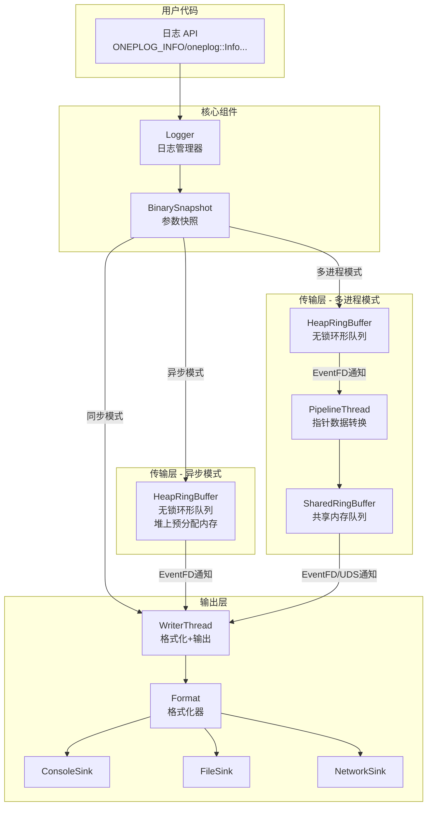

# 设计文档

## 概述

onePlog 是一个高性能 C++17 多进程聚合日志系统，设计目标是提供零拷贝、低延迟的日志记录能力。系统支持操作模式：

1. **同步模式**：Source 线程内直接调用 Sink 完成格式化和输出
2. **异步模式**：Source线程 → HeapRingBuffer（二进制数据）→ Writer线程（调用Sink）
3. **多进程模式**：Source → HeapRingBuffer（二进制数据）→ Pipeline线程（指针转换、添加进程ID）→ SharedRingBuffer → Writer线程（调用Sink）

### 设计原则

- **零拷贝**：使用 BinarySnapshot 捕获参数，静态字符串仅存储指针
- **零分配**：使用预分配内存池，避免运行时堆分配
- **低延迟**：使用无锁环形队列，采用抢占索引再写入的方式
- **防伪共享**：控制用原子变量独占缓存行
- **可扩展**：支持自定义格式化器和输出目标
- **编译时优化**：自动识别系统 cacheline 大小，支持编译时禁用低级别日志

## 架构

### 系统架构图



### 工作流程

#### 1. 同步模式
```
Source线程 → Sink（直接调用，数据引用传入）
```

#### 2. 异步模式
```
Source线程 → HeapRingBuffer（二进制数据）→ [EventFD通知] → WriterThread（格式化+输出）
```

#### 3. 多进程模式
```
Source线程 → HeapRingBuffer（二进制数据）→ [EventFD通知] → PipelineThread（指针转数据，加入进程ID）→ SharedRingBuffer → [EventFD/UDS通知] → WriterThread
```

### 模式对比

| 特性 | 同步模式 | 异步模式 | 多进程模式 |
|------|---------|---------|-----------|
| 线程模型 | Source 内完成 | Source + Writer | Source + Pipeline + Writer |
| 队列类型 | 无 | HeapRingBuffer (MPSC) | HeapRingBuffer + SharedRingBuffer |
| 通知机制 | 无 | EventFD | EventFD + UDS |
| 延迟 | 高 | 低 | 中 |
| 吞吐量 | 低 | 高 | 高 |
| WFC 支持 | 原生支持 | 状态位监控 | Pipeline 阻塞 |

## 组件和接口

### 1. Logger（日志管理器）

```cpp
namespace oneplog {

// 日志级别（参照 spdlog）
enum class Level : uint8_t {
    Trace = 0,     // SPDLOG_LEVEL_TRACE
    Debug = 1,     // SPDLOG_LEVEL_DEBUG
    Info = 2,      // SPDLOG_LEVEL_INFO
    Warn = 3,      // SPDLOG_LEVEL_WARN
    Error = 4,     // SPDLOG_LEVEL_ERROR
    Critical = 5,  // SPDLOG_LEVEL_CRITICAL
    Off = 6        // SPDLOG_LEVEL_OFF
};

// 运行模式
enum class Mode : uint8_t {
    Sync = 0,      // 同步模式
    Async = 1,     // 异步模式
    MProc = 2      // 多进程模式
};

class Logger {
public:
    // 构造时确定模式，默认异步模式
    Logger(const std::string& name = "", Mode mode = Mode::Async);
    ~Logger();
    
    // 名称和模式
    const std::string& Name() const;
    Mode GetMode() const;
    
    // 初始化（多进程模式下同时初始化消费者和生产者）
    void Init();
    
    // 配置（参照 spdlog）
    void SetLevel(Level level);
    void SetSink(std::shared_ptr<Sink> sink);
    void AddSink(std::shared_ptr<Sink> sink);
    
    // 日志级别管理
    Level GetLevel() const;
    
    // 日志记录（参照 spdlog 风格）
    template<typename... Args>
    void Log(Level level, const char* fmt, Args&&... args);
    
    template<typename... Args>
    void Trace(const char* fmt, Args&&... args);
    
    template<typename... Args>
    void Debug(const char* fmt, Args&&... args);
    
    template<typename... Args>
    void Info(const char* fmt, Args&&... args);
    
    template<typename... Args>
    void Warn(const char* fmt, Args&&... args);
    
    template<typename... Args>
    void Error(const char* fmt, Args&&... args);
    
    template<typename... Args>
    void Critical(const char* fmt, Args&&... args);
    
    // WFC 日志记录（等待完成后返回）
    template<typename... Args>
    void TraceWFC(const char* fmt, Args&&... args);
    
    template<typename... Args>
    void DebugWFC(const char* fmt, Args&&... args);
    
    template<typename... Args>
    void InfoWFC(const char* fmt, Args&&... args);
    
    template<typename... Args>
    void WarnWFC(const char* fmt, Args&&... args);
    
    template<typename... Args>
    void ErrorWFC(const char* fmt, Args&&... args);
    
    template<typename... Args>
    void CriticalWFC(const char* fmt, Args&&... args);
    
    // 生命周期
    void Flush();
    void Shutdown();
    
private:
    std::string m_name;
    Mode m_mode;
    Level m_level{Level::Info};
    std::vector<std::shared_ptr<Sink>> m_sinks;
    std::unique_ptr<HeapRingBuffer<LogEntry>> m_heapRingBuffer;
    std::unique_ptr<PipelineThread> m_pipeline;
    std::unique_ptr<WriterThread> m_writerThread;
};

// 默认 Logger（参照 spdlog::default_logger）
std::shared_ptr<Logger> DefaultLogger();
void SetDefaultLogger(std::shared_ptr<Logger> logger);

// 便捷函数（参照 spdlog 全局函数，支持 oneplog::info 调用）
template<typename... Args>
void Trace(const char* fmt, Args&&... args);

template<typename... Args>
void Debug(const char* fmt, Args&&... args);

template<typename... Args>
void Info(const char* fmt, Args&&... args);

template<typename... Args>
void Warn(const char* fmt, Args&&... args);

template<typename... Args>
void Error(const char* fmt, Args&&... args);

template<typename... Args>
void Critical(const char* fmt, Args&&... args);

// 仅用于多进程模式初始化生产者（子进程调用）
void InitProducer(const std::string& shmName, size_t shmOffset);

// 全局设置
void SetProcessName(const std::string& name);
void SetModuleName(const std::string& name);
void SetLevel(Level level);
void SetPattern(const std::string& pattern);
void Flush();
void Shutdown();

} // namespace oneplog
```

### 2. BinarySnapshot（二进制快照）

```cpp
namespace oneplog {

// 类型标签（无需 RTTI 或虚函数）
enum class TypeTag : uint8_t {
    Int32 = 0x01,
    Int64 = 0x02,
    UInt32 = 0x03,
    UInt64 = 0x04,
    Float = 0x05,
    Double = 0x06,
    Bool = 0x07,
    StringView = 0x10,  // 静态字符串，仅存储指针+长度
    StringCopy = 0x11,  // 动态字符串，内联拷贝
    Pointer = 0x20      // 指针类型（多进程模式需转换）
};

class BinarySnapshot {
public:
    static constexpr size_t kDefaultBufferSize = 256;
    
    BinarySnapshot();
    
    // 变参模板捕获
    template<typename... Args>
    void Capture(Args&&... args);
    
    // 混合存储策略
    // 静态字符串（string_view/字面量）：零拷贝，仅存储指针+长度
    void CaptureStringView(std::string_view sv);
    
    // 动态字符串（std::string/char*）：内联拷贝到缓冲区
    void CaptureString(const std::string& str);
    void CaptureString(const char* str);
    
    // 基本类型
    void CaptureInt32(int32_t value);
    void CaptureInt64(int64_t value);
    void CaptureUInt32(uint32_t value);
    void CaptureUInt64(uint64_t value);
    void CaptureFloat(float value);
    void CaptureDouble(double value);
    void CaptureBool(bool value);
    
    // 序列化（用于跨进程传输）
    size_t SerializedSize() const;
    void SerializeTo(uint8_t* buffer) const;
    static BinarySnapshot Deserialize(const uint8_t* data, size_t size);
    
    // 格式化输出
    std::string Format(const char* fmt) const;
    
    // 指针转换（Pipeline 线程调用）
    void ConvertPointersToData();
    
private:
    std::array<uint8_t, kDefaultBufferSize> m_buffer;
    size_t m_offset{0};
    uint16_t m_argCount{0};
};

} // namespace oneplog
```

### 3. LogEntry（日志条目）

```cpp
namespace oneplog {

struct SourceLocation {
    const char* file;      // 源文件名（Debug 模式）
    uint32_t line;         // 行号（Debug 模式）
    const char* function;  // 函数名（Debug 模式）
};

// Debug 模式日志条目（优化内存布局，无不必要填充）
struct LogEntryDebug {
    uint64_t timestamp;           // 纳秒级时间戳 (8B)
    const char* file;             // 文件名 (8B)
    const char* function;         // 函数名 (8B)
    uint32_t threadId;            // 线程 ID (4B)
    uint32_t processId;           // 进程 ID (4B)
    uint32_t line;                // 行号 (4B)
    Level level;                  // 日志级别 (1B)
    uint8_t reserved[3];          // 保留字节 (3B)
    BinarySnapshot snapshot;      // 参数快照 (256B)
};  // 总计: 8+8+8+4+4+4+1+3+256 = 296B

// Release 模式日志条目（精简版，优化内存布局）
struct LogEntryRelease {
    uint64_t timestamp;           // 纳秒级时间戳 (8B)
    uint32_t threadId;            // 线程 ID (4B)
    uint32_t processId;           // 进程 ID (4B)
    Level level;                  // 日志级别 (1B)
    uint8_t reserved[7];          // 保留字节 (7B)
    BinarySnapshot snapshot;      // 参数快照 (256B)
};  // 总计: 8+4+4+1+7+256 = 280B

// 编译时选择
#ifdef NDEBUG
    using LogEntry = LogEntryRelease;
#else
    using LogEntry = LogEntryDebug;
#endif

// 编译时源位置捕获
#define ONEPLOG_CURRENT_LOCATION \
    oneplog::SourceLocation{__FILE__, __LINE__, __FUNCTION__}

} // namespace oneplog
```

### 4. HeapRingBuffer（堆上无锁环形队列）

HeapRingBuffer 参照 SharedRingBuffer 设计，用于异步模式下的日志传输。非多进程模式下，Logger 配置参数和进程/线程名称-ID 对照表不需要存入队列，仅作为全局可见的数据结构，由系统分配存储位置。

```cpp
namespace oneplog {

// 缓存行大小（编译时自动识别）
#if defined(__cpp_lib_hardware_interference_size)
    constexpr size_t kCacheLineSize = std::hardware_destructive_interference_size;
#else
    constexpr size_t kCacheLineSize = 64;
#endif

// 防伪共享：原子变量独占缓存行
template<typename T>
struct alignas(kCacheLineSize) CacheLineAligned {
    T value;
    char padding[kCacheLineSize - sizeof(T)];
};

// 槽位状态（4 种状态 + WFC 标志）
enum class SlotState : uint8_t {
    Empty = 0,    // 空闲
    Writing = 1,  // 正在写入
    Ready = 2,    // 数据就绪
    Reading = 3   // 正在读取
};

struct SlotStatus {
    std::atomic<SlotState> state{SlotState::Empty};  // 槽位状态
    std::atomic<bool> wfc{false};                     // WFC 标志
};

template<typename T>
class HeapRingBuffer {
public:
    explicit HeapRingBuffer(size_t capacity);
    ~HeapRingBuffer();
    
    // 生产者操作（抢占索引，再写入）
    int64_t AcquireSlot();
    void CommitSlot(int64_t slot, T&& item);
    
    // 简化接口
    bool TryPush(T&& item);
    bool TryPushWFC(T&& item);  // Wait For Completion
    
    // 消费者操作
    bool TryPop(T& item);
    size_t TryPopBatch(std::vector<T>& items, size_t maxCount);
    
    // WFC 支持
    void MarkWFCComplete(int64_t slot);
    bool WaitForCompletion(int64_t slot, std::chrono::milliseconds timeout);
    
    // 状态查询
    bool IsEmpty() const;
    bool IsFull() const;
    size_t Size() const;
    size_t Capacity() const;
    
    // 通知机制
    int GetEventFD() const;
    void NotifyConsumer();
    void WaitForData(std::chrono::microseconds pollInterval, 
                     std::chrono::milliseconds pollTimeout);
    
private:
    // 防伪共享：控制变量独占缓存行
    CacheLineAligned<std::atomic<size_t>> m_head;
    CacheLineAligned<std::atomic<size_t>> m_tail;
    
    std::vector<T> m_buffer;
    std::vector<SlotStatus> m_slotStatus;
    size_t m_capacity;
    int m_eventFd{-1};
};

} // namespace oneplog
```

### 5. SharedRingBuffer（共享内存队列）

SharedRingBuffer 用于多进程模式下的日志传输。共享内存布局包含：
- Header：队列控制信息（head、tail、capacity 等）
- Logger 配置参数
- 进程/线程名称-ID 对照表
- 日志数据缓冲区

```cpp
namespace oneplog {

// 进程/线程名称映射
struct NameIdMapping {
    uint32_t id;
    char name[32];
};

// 共享内存 Header
struct alignas(kCacheLineSize) SharedHeader {
    // 队列控制（独占缓存行）
    std::atomic<size_t> head;
    char pad1[kCacheLineSize - sizeof(std::atomic<size_t>)];
    std::atomic<size_t> tail;
    char pad2[kCacheLineSize - sizeof(std::atomic<size_t>)];
    
    // 配置信息
    size_t capacity;
    uint32_t version;
    Level logLevel;
    
    // 名称-ID 对照表
    uint32_t processCount;
    uint32_t threadCount;
    NameIdMapping processes[64];   // 最多 64 个进程
    NameIdMapping threads[256];    // 最多 256 个线程
};

// 槽位状态（4 种状态 + WFC 标志）
struct SharedSlotStatus {
    std::atomic<SlotState> state{SlotState::Empty};  // 槽位状态
    std::atomic<bool> wfc{false};                     // WFC 标志
};

class SharedRingBuffer {
public:
    // 主进程创建
    static std::unique_ptr<SharedRingBuffer> Create(
        const std::string& name, size_t capacity);
    
    // 子进程连接
    static std::unique_ptr<SharedRingBuffer> Connect(
        const std::string& name);
    
    ~SharedRingBuffer();
    
    // 进程/线程名称注册
    uint32_t RegisterProcess(const std::string& name);
    uint32_t RegisterThread(const std::string& name);
    const char* GetProcessName(uint32_t id) const;
    const char* GetThreadName(uint32_t id) const;
    
    // 生产者操作（Pipeline 线程调用）
    int64_t AcquireSlot();
    void CommitSlot(int64_t slot, const LogEntry& entry);
    bool TryPush(const LogEntry& entry);
    bool TryPushWFC(const LogEntry& entry);
    
    // 消费者操作（Writer 线程调用）
    bool TryPop(LogEntry& entry);
    size_t TryPopBatch(std::vector<LogEntry>& entries, size_t maxCount);
    
    // WFC 支持
    void MarkWFCComplete(int64_t slot);
    bool WaitForCompletion(int64_t slot, std::chrono::milliseconds timeout);
    
    // 状态
    bool IsEmpty() const;
    bool IsFull() const;
    size_t Size() const;
    
    // 通知机制
    void NotifyConsumer();  // fork 模式用 EventFD，非 fork 用 UDS
    
private:
    SharedRingBuffer(const std::string& name, bool isOwner);
    
    std::string m_name;
    bool m_isOwner;
    void* m_memory{nullptr};
    SharedHeader* m_header{nullptr};
    LogEntry* m_buffer{nullptr};
    SharedSlotStatus* m_slotStatus{nullptr};
    int m_notifyFd{-1};  // EventFD 或 UDS socket
};

} // namespace oneplog
```

### 6. PipelineThread（管道线程 - 仅多进程模式）

PipelineThread 负责：
1. 从 HeapRingBuffer 读取日志
2. 将指针数据转换为实际数据（跨进程传输需要）
3. 添加进程 ID 到日志条目
4. 将转换后的数据写入 SharedRingBuffer

```cpp
namespace oneplog {

class PipelineThread {
public:
    PipelineThread(HeapRingBuffer<LogEntry>& heapRingBuffer, 
                   SharedRingBuffer& sharedRingBuffer);
    ~PipelineThread();
    
    // 生命周期
    void Start();
    void Stop();
    bool IsRunning() const;
    
    // 配置
    void SetPollInterval(std::chrono::microseconds interval);  // 默认 1us
    void SetPollTimeout(std::chrono::milliseconds timeout);    // 默认 10ms
    
private:
    void ThreadFunc();
    
    // 工作流程：
    // 1. 尝试读取日志（有数据则直接处理）
    // 2. 读取完一条自动读取下一条
    // 3. 下一条为空或正在写入，则轮询等待
    // 4. 超过轮询时间，进入等待通知状态
    void ProcessEntry(LogEntry& entry);
    
    // 指针数据转换（将无法跨进程共享的数据转换）
    void ConvertPointers(LogEntry& entry);
    
    // 添加进程 ID
    void AddProcessId(LogEntry& entry);
    
    HeapRingBuffer<LogEntry>& m_heapRingBuffer;
    SharedRingBuffer& m_sharedRingBuffer;
    std::thread m_thread;
    std::atomic<bool> m_running{false};
    
    std::chrono::microseconds m_pollInterval{1};
    std::chrono::milliseconds m_pollTimeout{10};
};

} // namespace oneplog
```

### 7. WriterThread（输出线程）

```cpp
namespace oneplog {

class WriterThread {
public:
    explicit WriterThread(std::shared_ptr<Sink> sink);
    ~WriterThread();
    
    // 设置数据源
    void SetHeapRingBuffer(HeapRingBuffer<LogEntry>* buffer);    // 异步模式
    void SetSharedRingBuffer(SharedRingBuffer* buffer);          // 多进程模式
    
    // 生命周期
    void Start();
    void Stop();
    void Flush();
    bool IsRunning() const;
    
    // 配置
    void SetPollInterval(std::chrono::microseconds interval);
    void SetPollTimeout(std::chrono::milliseconds timeout);
    
private:
    void ThreadFunc();
    
    // 工作流程同 PipelineThread
    void ProcessEntry(const LogEntry& entry);
    
    std::shared_ptr<Sink> m_sink;
    HeapRingBuffer<LogEntry>* m_heapRingBuffer{nullptr};
    SharedRingBuffer* m_sharedRingBuffer{nullptr};
    std::thread m_thread;
    std::atomic<bool> m_running{false};
    
    std::chrono::microseconds m_pollInterval{1};
    std::chrono::milliseconds m_pollTimeout{10};
};

} // namespace oneplog
```

### 8. Format（格式化器）

```cpp
namespace oneplog {

// 日志级别名称格式
enum class LevelNameStyle {
    Full,      // "trace", "debug", "info", "warn", "error", "critical"
    Short4,    // "TRAC", "DBUG", "INFO", "WARN", "ERRO", "CRIT"
    Short1     // "T", "D", "I", "W", "E", "C"
};

class Format {
public:
    virtual ~Format() = default;
    
    // 格式化日志条目
    virtual std::string FormatEntry(const LogEntry& entry) = 0;
    
    // 日志级别格式化
    static const char* LevelToString(Level level, LevelNameStyle style);
    
    // 绑定到 Sink
    void BindSink(std::shared_ptr<Sink> sink);
    
protected:
    std::vector<std::shared_ptr<Sink>> m_sinks;
};

// 模式格式化器
class PatternFormat : public Format {
public:
    // 模式说明：
    // %t - 时间戳
    // %l - 日志级别
    // %f - 文件名
    // %n - 行号
    // %F - 函数名
    // %T - 线程 ID
    // %P - 进程 ID
    // %N - 进程名
    // %M - 模块名
    // %m - 消息内容
    explicit PatternFormat(const std::string& pattern);
    
    std::string FormatEntry(const LogEntry& entry) override;
    
    void SetLevelStyle(LevelNameStyle style);
    void SetTimestampFormat(const std::string& format);
    
private:
    std::string m_pattern;
    LevelNameStyle m_levelStyle{LevelNameStyle::Short4};
    std::string m_timestampFormat{"%Y-%m-%d %H:%M:%S"};
};

// JSON 格式化器
class JsonFormat : public Format {
public:
    std::string FormatEntry(const LogEntry& entry) override;
    
    void SetPrettyPrint(bool enable);
    void SetIncludeLocation(bool enable);
    
private:
    bool m_prettyPrint{false};
    bool m_includeLocation{true};
};

} // namespace oneplog
```

### 9. Sink（输出目标）

Sink 支持多线程运行，一个 Logger 可以绑定多个 Sink，每个 Sink 可以在独立的线程中运行。例如：WriterThread 下可以有一个 ConsoleSink 输出到控制台，同时有一个 FileSink 在另一个线程写入文件。

```cpp
namespace oneplog {

class Sink {
public:
    virtual ~Sink() = default;
    
    // 绑定格式化器
    void SetFormat(std::shared_ptr<Format> format);
    
    // 写入日志
    virtual void Write(const std::string& message) = 0;
    virtual void WriteBatch(const std::vector<std::string>& messages);
    
    // 刷新缓冲区
    virtual void Flush() = 0;
    
    // 关闭
    virtual void Close() = 0;
    
    // 错误处理
    virtual bool HasError() const = 0;
    virtual std::string GetLastError() const = 0;
    
    // 多线程支持：每个 Sink 可以在独立线程运行
    void StartThread();
    void StopThread();
    bool IsThreadRunning() const;
    
protected:
    std::shared_ptr<Format> m_format;
    std::thread m_thread;
    std::atomic<bool> m_threadRunning{false};
};

// 控制台输出
class ConsoleSink : public Sink {
public:
    enum class Stream { StdOut, StdErr };
    
    explicit ConsoleSink(Stream stream = Stream::StdOut);
    
    void Write(const std::string& message) override;
    void Flush() override;
    void Close() override;
    bool HasError() const override;
    std::string GetLastError() const override;
    
    void SetColorEnabled(bool enable);
    
private:
    Stream m_stream;
    bool m_colorEnabled{true};
};

// 文件输出
class FileSink : public Sink {
public:
    explicit FileSink(const std::string& filename);
    
    void Write(const std::string& message) override;
    void Flush() override;
    void Close() override;
    bool HasError() const override;
    std::string GetLastError() const override;
    
    // 文件轮转
    void SetMaxSize(size_t bytes);
    void SetMaxFiles(size_t count);
    void SetRotateOnOpen(bool enable);
    
private:
    std::string m_filename;
    std::ofstream m_file;
    size_t m_maxSize{0};
    size_t m_maxFiles{0};
    size_t m_currentSize{0};
    std::string m_lastError;
};

// 网络输出
class NetworkSink : public Sink {
public:
    enum class Protocol { TCP, UDP };
    
    NetworkSink(const std::string& host, uint16_t port, 
                Protocol protocol = Protocol::TCP);
    
    void Write(const std::string& message) override;
    void Flush() override;
    void Close() override;
    bool HasError() const override;
    std::string GetLastError() const override;
    
    void SetReconnectInterval(std::chrono::seconds interval);
    void SetMaxRetries(size_t count);
    
private:
    std::string m_host;
    uint16_t m_port;
    Protocol m_protocol;
    int m_socket{-1};
    std::string m_lastError;
};

} // namespace oneplog
```

### 10. 日志 API

```cpp
namespace oneplog {

// 便捷日志函数
template<typename... Args>
void Trace(const char* fmt, Args&&... args);

template<typename... Args>
void Debug(const char* fmt, Args&&... args);

template<typename... Args>
void Info(const char* fmt, Args&&... args);

template<typename... Args>
void Warning(const char* fmt, Args&&... args);

template<typename... Args>
void Error(const char* fmt, Args&&... args);

template<typename... Args>
void Critical(const char* fmt, Args&&... args);

// 日志宏定义
#define ONEPLOG_TRACE(...) \
    ONEPLOG_LOG_IMPL(oneplog::Level::Trace, __VA_ARGS__)

#define ONEPLOG_DEBUG(...) \
    ONEPLOG_LOG_IMPL(oneplog::Level::Debug, __VA_ARGS__)

#define ONEPLOG_INFO(...) \
    ONEPLOG_LOG_IMPL(oneplog::Level::Info, __VA_ARGS__)

#define ONEPLOG_WARNING(...) \
    ONEPLOG_LOG_IMPL(oneplog::Level::Warning, __VA_ARGS__)

#define ONEPLOG_ERROR(...) \
    ONEPLOG_LOG_IMPL(oneplog::Level::Error, __VA_ARGS__)

#define ONEPLOG_CRITICAL(...) \
    ONEPLOG_LOG_IMPL(oneplog::Level::Critical, __VA_ARGS__)

// 条件日志
#define ONEPLOG_IF(condition, level, ...) \
    do { \
        if (condition) { \
            ONEPLOG_LOG_IMPL(level, __VA_ARGS__); \
        } \
    } while(0)

// 内部实现宏
#define ONEPLOG_LOG_IMPL(level, fmt, ...) \
    do { \
        if (oneplog::Logger::Instance().ShouldLog(level)) { \
            oneplog::Logger::Instance().Log( \
                level, ONEPLOG_CURRENT_LOCATION, fmt, ##__VA_ARGS__); \
        } \
    } while(0)

// 编译时禁用日志级别
#ifdef ONEPLOG_DISABLE_TRACE
    #undef ONEPLOG_TRACE
    #define ONEPLOG_TRACE(...) ((void)0)
#endif

#ifdef ONEPLOG_DISABLE_DEBUG
    #undef ONEPLOG_DEBUG
    #define ONEPLOG_DEBUG(...) ((void)0)
#endif

// 同步模式编译
#ifdef ONEPLOG_SYNC_ONLY
    // 仅编译同步模式代码
#endif

} // namespace oneplog
```

### 11. 内存池

```cpp
namespace oneplog {

template<typename T>
class MemoryPool {
public:
    explicit MemoryPool(size_t initialSize);
    ~MemoryPool();
    
    // 分配和释放（无锁）
    T* Allocate();
    void Deallocate(T* ptr);
    
    // 状态
    size_t AvailableCount() const;
    size_t TotalCount() const;
    
private:
    struct alignas(kCacheLineSize) Block {
        T data;
        std::atomic<Block*> next;
    };
    
    CacheLineAligned<std::atomic<Block*>> m_freeList;
    std::vector<std::unique_ptr<Block[]>> m_blocks;
    size_t m_blockSize;
};

} // namespace oneplog
```

## 数据模型

### 日志级别枚举

| 级别 | 值 | 全称 | 4字符 | 1字符 | 说明 |
|------|-----|------|-------|-------|------|
| Trace | 0 | trace | TRAC | T | 最详细的跟踪信息 |
| Debug | 1 | debug | DBUG | D | 调试信息 |
| Info | 2 | info | INFO | I | 一般信息 |
| Warn | 3 | warn | WARN | W | 警告信息 |
| Error | 4 | error | ERRO | E | 错误信息 |
| Critical | 5 | critical | CRIT | C | 严重错误 |
| Off | 6 | off | OFF | - | 关闭日志 |

### Debug 模式 LogEntry 内存布局（优化后）

```
+------------------+
| timestamp (8B)   |  纳秒级时间戳
+------------------+
| file* (8B)       |  文件名指针
+------------------+
| function* (8B)   |  函数名指针
+------------------+
| threadId (4B)    |  线程 ID
+------------------+
| processId (4B)   |  进程 ID
+------------------+
| line (4B)        |  行号
+------------------+
| level (1B)       |  日志级别
+------------------+
| reserved (3B)    |  保留字节
+------------------+
| snapshot (256B)  |  BinarySnapshot 数据
+------------------+
总计: 296 字节
```

### Release 模式 LogEntry 内存布局（优化后）

```
+------------------+
| timestamp (8B)   |  纳秒级时间戳
+------------------+
| threadId (4B)    |  线程 ID
+------------------+
| processId (4B)   |  进程 ID
+------------------+
| level (1B)       |  日志级别
+------------------+
| reserved (7B)    |  保留字节
+------------------+
| snapshot (256B)  |  BinarySnapshot 数据
+------------------+
总计: 280 字节
```

### BinarySnapshot 编码格式

```
+------------------+
| argCount (2B)    |  参数数量
+------------------+
| type[0] (1B)     |  第一个参数类型标签
+------------------+
| data[0] (var)    |  第一个参数数据
+------------------+
| type[1] (1B)     |  第二个参数类型标签
+------------------+
| data[1] (var)    |  第二个参数数据
+------------------+
| ...              |
+------------------+
```

类型编码：
- 0x01: int32_t (4B)
- 0x02: int64_t (8B)
- 0x03: uint32_t (4B)
- 0x04: uint64_t (8B)
- 0x05: float (4B)
- 0x06: double (8B)
- 0x07: bool (1B)
- 0x10: StringView (指针8B + 长度4B) - 零拷贝，需保证生命周期
- 0x11: StringCopy (长度2B + 数据) - 内联拷贝
- 0x20: Pointer (8B) - 需要 Pipeline 转换

### 混合存储策略

| 字符串类型 | 存储方式 | 说明 |
|-----------|---------|------|
| string_view / 字面量 | StringView | 零拷贝，仅存储指针+长度 |
| std::string | StringCopy | 内联拷贝到缓冲区 |
| const char* (临时) | StringCopy | 内联拷贝到缓冲区 |
| const char* (静态) | StringView | 用户保证生命周期 |

### WFC (Wait For Completion) 机制

WFC 日志用于确保日志在返回前已被完全写入目标，适用于关键日志（如崩溃前的错误日志）。

槽位状态转换：
- Empty → Writing（生产者获取槽位）
- Writing → Ready（生产者提交数据）
- Ready → Reading（消费者开始读取）
- Reading → Empty（消费者完成，WFC 时通知生产者）

#### 同步模式
```
Source线程 → Sink.Write() → 返回
原生支持，日志写入完成后直接返回。
```

#### 异步模式
```
1. Source 调用 TryPushWFC(entry)，获取 slot 索引
2. Source 设置 slot.state = Writing，slot.wfc = true
3. Source 写入数据，设置 slot.state = Ready
4. Source 进入等待状态，监控 slot.state

5. WriterThread 检测到 slot.state == Ready
6. WriterThread 设置 slot.state = Reading
7. WriterThread 调用 Sink.Write() 完成输出
8. WriterThread 设置 slot.state = Empty

9. Source 检测到 slot.state == Empty，返回
```

#### 多进程模式
```
1. Source 获取 heapSlot，设置 state=Writing, wfc=true
2. Source 写入数据，设置 state=Ready
3. Source 监控 heapSlot.state

4. PipelineThread 检测到 heapSlot.state == Ready
5. PipelineThread 设置 heapSlot.state = Reading
6. PipelineThread 转换指针数据，添加进程 ID
7. PipelineThread 获取 sharedSlot，设置 state=Writing, wfc=true
8. PipelineThread 写入数据，设置 sharedSlot.state = Ready
9. PipelineThread 监控 sharedSlot.state

10. WriterThread 检测到 sharedSlot.state == Ready
11. WriterThread 设置 sharedSlot.state = Reading
12. WriterThread 调用 Sink.Write() 完成输出
13. WriterThread 设置 sharedSlot.state = Empty

14. PipelineThread 检测到 sharedSlot.state == Empty
15. PipelineThread 设置 heapSlot.state = Empty

16. Source 检测到 heapSlot.state == Empty，返回

注意：多进程模式下发送 WFC 日志可能导致该进程的日志阻塞，
因为 PipelineThread 需要等待 WriterThread 完成。
```

#### WFC API
```cpp
// Logger 成员方法
template<typename... Args>
void TraceWFC(const char* fmt, Args&&... args);

template<typename... Args>
void DebugWFC(const char* fmt, Args&&... args);

template<typename... Args>
void InfoWFC(const char* fmt, Args&&... args);

template<typename... Args>
void WarnWFC(const char* fmt, Args&&... args);

template<typename... Args>
void ErrorWFC(const char* fmt, Args&&... args);

template<typename... Args>
void CriticalWFC(const char* fmt, Args&&... args);

// 全局便捷函数
template<typename... Args>
void TraceWFC(const char* fmt, Args&&... args);

template<typename... Args>
void DebugWFC(const char* fmt, Args&&... args);

template<typename... Args>
void InfoWFC(const char* fmt, Args&&... args);

template<typename... Args>
void WarnWFC(const char* fmt, Args&&... args);

template<typename... Args>
void ErrorWFC(const char* fmt, Args&&... args);

template<typename... Args>
void CriticalWFC(const char* fmt, Args&&... args);

// 宏定义
#define ONEPLOG_TRACE_WFC(...) oneplog::TraceWFC(__VA_ARGS__)
#define ONEPLOG_DEBUG_WFC(...) oneplog::DebugWFC(__VA_ARGS__)
#define ONEPLOG_INFO_WFC(...) oneplog::InfoWFC(__VA_ARGS__)
#define ONEPLOG_WARN_WFC(...) oneplog::WarnWFC(__VA_ARGS__)
#define ONEPLOG_ERROR_WFC(...) oneplog::ErrorWFC(__VA_ARGS__)
#define ONEPLOG_CRITICAL_WFC(...) oneplog::CriticalWFC(__VA_ARGS__)
```

## 正确性属性

*正确性属性是系统在所有有效执行中应该保持为真的特征或行为——本质上是关于系统应该做什么的形式化陈述。属性作为人类可读规范和机器可验证正确性保证之间的桥梁。*

### Property 1: 日志级别格式化一致性

*对于任意* 日志级别和任意格式化样式（Full/Short4/Short1），LevelToString 函数应该返回对应的正确字符串表示。

**验证: 需求 1.2**

### Property 2: 日志级别过滤正确性

*对于任意* 日志级别 L 和当前设置级别 S，当 L < S 时，ShouldLog(L) 应该返回 false；当 L >= S 时，ShouldLog(L) 应该返回 true。

**验证: 需求 1.3**

### Property 3: 同步模式顺序保证

*对于任意* 日志调用序列 [log1, log2, ..., logN]，在同步模式下输出的日志顺序应该与调用顺序完全一致。

**验证: 需求 2.2**

### Property 4: BinarySnapshot 类型捕获完整性

*对于任意* 支持的类型值（int32_t, int64_t, uint32_t, uint64_t, float, double, bool, string），BinarySnapshot 的 Capture 操作应该成功捕获该值，且 Format 操作应该能够正确还原该值。

**验证: 需求 5.1, 5.2, 5.3**

### Property 5: BinarySnapshot 序列化往返一致性

*对于任意* 有效的 BinarySnapshot 对象 S，Deserialize(Serialize(S)) 应该产生与 S 等价的对象。

**验证: 需求 5.6**

### Property 6: HeapRingBuffer FIFO 顺序保证

*对于任意* 入队元素序列 [e1, e2, ..., eN]，出队顺序应该保持 FIFO 顺序，即先入队的元素先出队。

**验证: 需求 7.5**

### Property 7: LogEntry 格式化非空性

*对于任意* 有效的 LogEntry 对象，Format::FormatEntry 操作应该产生非空字符串。

**验证: 需求 8.7**

### Property 8: 内存池分配重用性

*对于任意* 从内存池分配的对象，释放后该内存块应该能够被后续的分配请求重用。

**验证: 需求 11.4**

### Property 9: 多线程并发安全性

*对于任意* 多线程并发调用 Logger::Log 的场景，所有日志条目应该被正确记录，不产生数据竞争或数据丢失。

**验证: 需求 12.1, 12.2, 12.3, 12.4**

### Property 10: 多进程队列无数据竞争

*对于任意* 多进程并发写入共享内存队列的场景，所有日志条目应该被正确写入，不产生数据竞争或数据损坏。

**验证: 需求 4.2**

### Property 11: Pipeline 指针转换正确性

*对于任意* 包含指针数据的 LogEntry，Pipeline 线程的 ConvertPointers 操作应该将所有指针数据转换为实际数据，使其可以跨进程传输。

**验证: 需求 4.6**

### Property 12: WFC 完成保证

*对于任意* WFC 日志请求，在 Sink 完成输出后，调用方应该能够检测到完成状态并返回。

**验证: 需求 3.3, 4.6**

## 错误处理

### 错误类型

| 错误类型 | 处理策略 | 恢复机制 |
|---------|---------|---------|
| 内存分配失败 | 使用预分配的紧急缓冲区 | 等待内存释放后恢复 |
| 队列满 | 根据策略丢弃或阻塞 | 消费者处理后自动恢复 |
| 文件写入失败 | 记录错误，尝试重新打开 | 定期重试打开文件 |
| 网络连接断开 | 记录错误，缓存日志 | 定期重试连接 |
| 共享内存创建失败 | 回退到异步模式 | 无 |
| 配置解析失败 | 使用默认值 | 记录警告 |

### 错误码定义

```cpp
namespace oneplog {

enum class ErrorCode : int {
    Success = 0,
    
    // 内存错误 (100-199)
    MemoryAllocationFailed = 100,
    MemoryPoolExhausted = 101,
    
    // 队列错误 (200-299)
    QueueFull = 200,
    QueueEmpty = 201,
    QueueSlotBusy = 202,
    
    // 文件错误 (300-399)
    FileOpenFailed = 300,
    FileWriteFailed = 301,
    FileRotateFailed = 302,
    
    // 网络错误 (400-499)
    NetworkConnectFailed = 400,
    NetworkSendFailed = 401,
    NetworkDisconnected = 402,
    
    // 共享内存错误 (500-599)
    SharedMemoryCreateFailed = 500,
    SharedMemoryAttachFailed = 501,
    SharedMemoryCorrupted = 502,
    
    // 配置错误 (600-699)
    ConfigParseError = 600,
    ConfigInvalidValue = 601
};

} // namespace oneplog
```

## 测试策略

### 测试框架

- **单元测试**: Google Test (gtest)
- **属性测试**: RapidCheck
- **可选**: fmt 库支持（用户可选择是否使用）

### 测试分类

#### 1. 单元测试

| 测试类别 | 测试内容 | 示例 |
|---------|---------|------|
| Logger 测试 | 日志级别设置、模式切换 | 设置 Info 级别后 Debug 日志被跳过 |
| BinarySnapshot 测试 | 类型捕获、混合存储 | 捕获 int32_t 值 42，StringView 零拷贝 |
| HeapRingBuffer 测试 | 入队、出队、WFC | 空队列出队返回 false |
| SharedRingBuffer 测试 | 跨进程通信 | 主进程创建，子进程连接 |
| Format 测试 | 模式解析、级别格式化 | "%t %l %m" 格式化输出 |
| Sink 测试 | 文件写入、轮转 | 文件大小超过阈值时轮转 |
| MemoryPool 测试 | 分配、释放、重用 | 分配后释放再分配 |

#### 2. 属性测试

每个属性测试至少运行 100 次迭代：

```cpp
// Feature: oneplog, Property 5: BinarySnapshot 序列化往返一致性
RC_GTEST_PROP(BinarySnapshotTest, RoundTripConsistency, ()) {
    auto original = *rc::gen::arbitrary<BinarySnapshot>();
    auto serialized = std::vector<uint8_t>(original.SerializedSize());
    original.SerializeTo(serialized.data());
    auto deserialized = BinarySnapshot::Deserialize(
        serialized.data(), serialized.size());
    RC_ASSERT(original == deserialized);
}

// Feature: oneplog, Property 6: HeapRingBuffer FIFO 顺序保证
RC_GTEST_PROP(HeapRingBufferTest, FIFOOrder, ()) {
    auto elements = *rc::gen::container<std::vector<int>>(
        rc::gen::inRange(1, 100));
    
    HeapRingBuffer<int> queue(elements.size() + 1);
    for (const auto& e : elements) {
        RC_ASSERT(queue.TryPush(std::move(e)));
    }
    
    std::vector<int> output;
    int item;
    while (queue.TryPop(item)) {
        output.push_back(item);
    }
    
    RC_ASSERT(elements == output);
}

// Feature: oneplog, Property 2: 日志级别过滤正确性
RC_GTEST_PROP(LoggerTest, LevelFiltering, ()) {
    auto logLevel = *rc::gen::inRange<int>(0, 6);
    auto setLevel = *rc::gen::inRange<int>(0, 6);
    
    Logger logger;
    logger.SetLevel(static_cast<Level>(setLevel));
    
    bool shouldLog = logger.ShouldLog(static_cast<Level>(logLevel));
    RC_ASSERT(shouldLog == (logLevel >= setLevel));
}
```

#### 3. 并发测试

```cpp
// 多线程并发写入测试
TEST(ConcurrencyTest, MultiThreadWrite) {
    constexpr int kThreadCount = 8;
    constexpr int kLogsPerThread = 1000;
    
    Logger logger;
    logger.SetMode(Mode::Async);
    logger.Init();
    
    std::vector<std::thread> threads;
    for (int i = 0; i < kThreadCount; ++i) {
        threads.emplace_back([&logger, i]() {
            for (int j = 0; j < kLogsPerThread; ++j) {
                logger.Log(Level::Info, ONEPLOG_CURRENT_LOCATION,
                          "Thread {} Log {}", i, j);
            }
        });
    }
    
    for (auto& t : threads) {
        t.join();
    }
    
    logger.Flush();
    // 验证所有日志都被正确记录
}
```

### 测试覆盖目标

| 组件 | 行覆盖率目标 | 分支覆盖率目标 |
|------|-------------|---------------|
| Logger | 90% | 85% |
| BinarySnapshot | 95% | 90% |
| HeapRingBuffer | 95% | 90% |
| SharedRingBuffer | 90% | 85% |
| Format | 90% | 85% |
| Sink | 85% | 80% |
| MemoryPool | 90% | 85% |
| PipelineThread | 85% | 80% |
| WriterThread | 85% | 80% |
