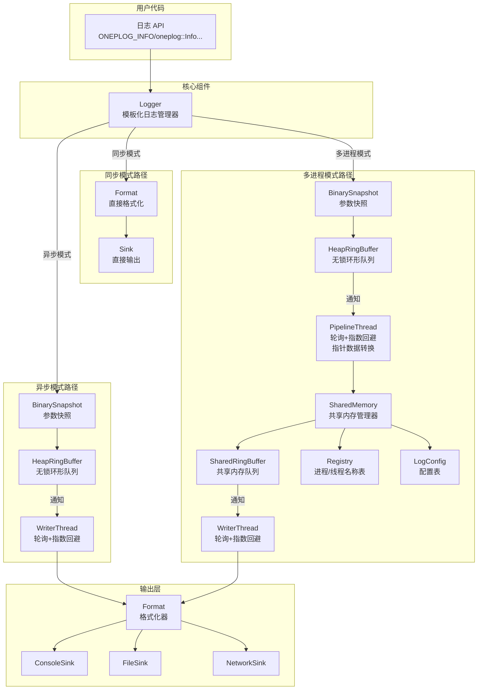
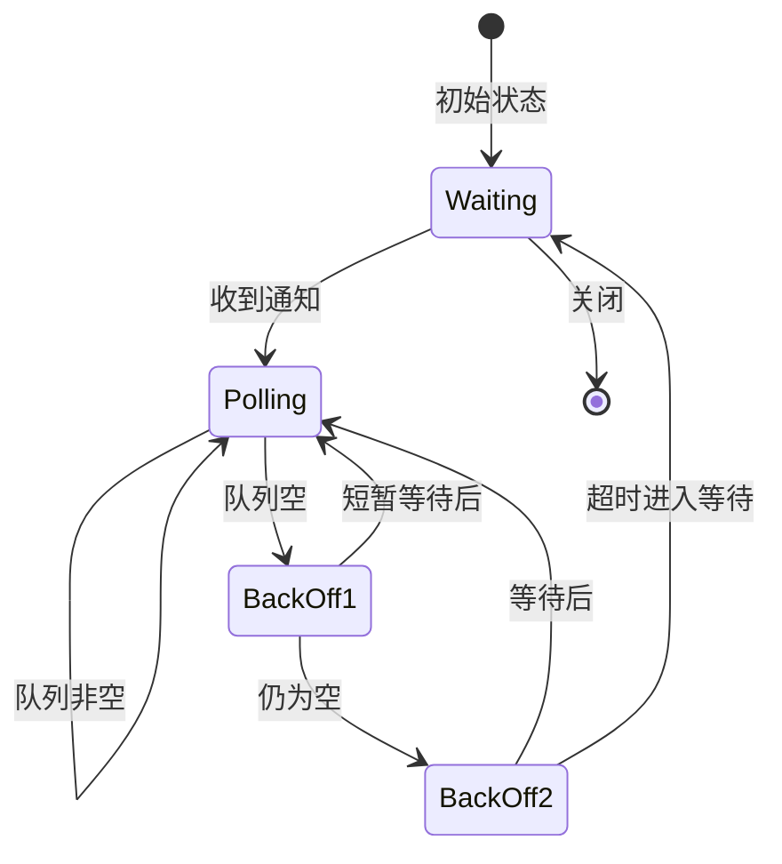

# 设计文档

## 概述

本设计文档描述了 onePlog 高性能 C++17 多进程聚合日志系统的模板化重构方案。通过使用 C++17 模板参数在编译时指定运行模式（Sync/Async/MProc）、最小日志级别和 WFC 功能开关，实现零开销抽象。

核心设计理念：
- **编译时决策**：运行模式、日志级别、WFC 功能在编译时确定
- **零开销抽象**：禁用的功能不产生任何运行时开销
- **接口兼容**：保持简洁易用的公共接口
- **渐进式优化**：使用 `if constexpr` 实现条件编译

## 架构

### 系统架构图



### 工作流程

#### 1. 同步模式
```
Source线程 → Format（直接格式化，无快照）→ Sink（直接输出）
```
注：同步模式下不使用 BinarySnapshot，直接将参数传递给 Format 进行格式化，提升性能。

#### 2. 异步模式
```
Source线程 → HeapRingBuffer（二进制数据）→ [通知] → WriterThread（轮询+指数回避）→ 格式化+输出
```

#### 3. 多进程模式
```
Source线程 → HeapRingBuffer → [通知] → PipelineThread（轮询+指数回避，指针转数据，加入进程ID）→ SharedRingBuffer → [通知] → WriterThread（轮询+指数回避）
```
注：PipelineThread 和 WriterThread 都采用相同的轮询+指数回避策略。

### 通知与轮询策略



## 组件和接口

### 1. Logger 模板类

```cpp
namespace oneplog {

// 默认日志级别：Debug 模式为 Debugging，Release 模式为 Informational
#ifdef NDEBUG
constexpr Level kDefaultLevel = Level::Informational;
#else
constexpr Level kDefaultLevel = Level::Debugging;
#endif

/**
 * @brief 模板化日志器类
 * @brief Templated logger class
 * @tparam M 运行模式（Sync/Async/MProc）/ Operating mode
 * @tparam L 编译时最小日志级别 / Compile-time minimum log level
 * @tparam EnableWFC 是否启用 WFC 功能 / Whether WFC is enabled
 */
template<Mode M = Mode::Async, Level L = kDefaultLevel, bool EnableWFC = false>
class Logger {
public:
    // 编译时常量 / Compile-time constants
    static constexpr Mode kMode = M;
    static constexpr Level kMinLevel = L;
    static constexpr bool kEnableWFC = EnableWFC;
    
    // 构造函数 / Constructor
    explicit Logger(const std::string& name = "");
    ~Logger();
    
    // 禁止复制，允许移动 / Non-copyable, movable
    Logger(const Logger&) = delete;
    Logger& operator=(const Logger&) = delete;
    Logger(Logger&&) noexcept;
    Logger& operator=(Logger&&) noexcept;
    
    // 初始化和关闭 / Initialization and shutdown
    void Init();
    void Init(const LoggerConfig& config);
    void Shutdown();
    bool IsInitialized() const;
    
    // 配置 / Configuration
    void SetSink(std::shared_ptr<Sink> sink);
    void AddSink(std::shared_ptr<Sink> sink);
    void SetFormat(std::shared_ptr<Format> format);
    
    // 名称注册 / Name registration
    void RegisterProcessName(const std::string& name);
    void RegisterModuleName(const std::string& name);
    
    // 日志方法 / Log methods
    template<typename... Args> void Alert(const char* fmt, Args&&... args);
    template<typename... Args> void Critical(const char* fmt, Args&&... args);
    template<typename... Args> void Error(const char* fmt, Args&&... args);
    template<typename... Args> void Warning(const char* fmt, Args&&... args);
    template<typename... Args> void Notice(const char* fmt, Args&&... args);
    template<typename... Args> void Info(const char* fmt, Args&&... args);
    template<typename... Args> void Debug(const char* fmt, Args&&... args);
    template<typename... Args> void Trace(const char* fmt, Args&&... args);
    
    // WFC 方法 / WFC methods
    template<typename... Args> void AlertWFC(const char* fmt, Args&&... args);
    template<typename... Args> void CriticalWFC(const char* fmt, Args&&... args);
    // ... 其他 WFC 方法
    
    // ALO 方法（始终输出）/ ALO methods (Always Log Output)
    template<typename... Args> void AlertALO(const char* fmt, Args&&... args);
    template<typename... Args> void CriticalALO(const char* fmt, Args&&... args);
    // ... 其他 ALO 方法
    
    // 刷新 / Flush
    void Flush();
    
    // 查询 / Query
    const std::string& Name() const;
    static constexpr Mode GetMode() { return kMode; }
    static constexpr Level GetMinLevel() { return kMinLevel; }
    static constexpr bool IsWFCEnabled() { return kEnableWFC; }

private:
    std::string m_name;
    std::atomic<bool> m_initialized{false};
    
    std::vector<std::shared_ptr<Sink>> m_sinks;
    std::shared_ptr<Format> m_format;
    
    // 条件编译的成员 / Conditionally compiled members
    std::unique_ptr<HeapRingBuffer<LogEntry>> m_heapRingBuffer;
    std::unique_ptr<SharedMemory> m_sharedMemory;
    std::unique_ptr<PipelineThread> m_pipelineThread;
    std::unique_ptr<WriterThread> m_writerThread;
};

// 类型别名 / Type aliases
template<Level L = kDefaultLevel, bool EnableWFC = false>
using SyncLogger = Logger<Mode::Sync, L, EnableWFC>;

template<Level L = kDefaultLevel, bool EnableWFC = false>
using AsyncLogger = Logger<Mode::Async, L, EnableWFC>;

template<Level L = kDefaultLevel, bool EnableWFC = false>
using MProcLogger = Logger<Mode::MProc, L, EnableWFC>;

} // namespace oneplog
```

### 2. 编译时级别过滤实现

```cpp
template<Mode M, Level L, bool EnableWFC>
template<typename... Args>
void Logger<M, L, EnableWFC>::Info(const char* fmt, Args&&... args) {
    // 编译时检查：如果 Informational 级别高于最小级别，整个函数体被优化掉
    if constexpr (static_cast<uint8_t>(Level::Informational) <= static_cast<uint8_t>(L)) {
        LogImpl<Level::Informational>(ONEPLOG_CURRENT_LOCATION, fmt, std::forward<Args>(args)...);
    }
    // else: 空函数体，编译器完全优化掉
}

template<Mode M, Level L, bool EnableWFC>
template<Level LogLevel, typename... Args>
void Logger<M, L, EnableWFC>::LogImpl(const SourceLocation& loc, 
                                       const char* fmt, Args&&... args) {
    uint64_t timestamp = GetNanosecondTimestamp();
    
    // 编译时选择处理路径
    if constexpr (M == Mode::Sync) {
        // 同步模式：直接格式化输出，不使用 BinarySnapshot
        ProcessEntrySyncDirect(LogLevel, timestamp, loc, fmt, std::forward<Args>(args)...);
    } else {
        // 异步/多进程模式：使用 BinarySnapshot 捕获参数
        ProcessEntryAsync(LogLevel, timestamp, loc, fmt, std::forward<Args>(args)...);
    }
}

// 同步模式直接格式化（无快照，高性能）
template<Mode M, Level L, bool EnableWFC>
template<typename... Args>
void Logger<M, L, EnableWFC>::ProcessEntrySyncDirect(Level level, uint64_t timestamp,
                                                      const SourceLocation& loc,
                                                      const char* fmt, Args&&... args) {
    // 直接格式化，不经过 BinarySnapshot
    std::string message = FormatMessage(fmt, std::forward<Args>(args)...);
    
    // 直接写入所有 Sink
    for (auto& sink : m_sinks) {
        if (m_format) {
            sink->Write(m_format->FormatDirect(level, timestamp, loc, message));
        } else {
            sink->Write(message);
        }
    }
}
```

### 3. ALO 方法实现（始终输出）

```cpp
template<Mode M, Level L, bool EnableWFC>
template<typename... Args>
void Logger<M, L, EnableWFC>::InfoALO(const char* fmt, Args&&... args) {
    // ALO 方法绕过编译时和运行时级别检查，始终输出
    LogImpl<Level::Informational>(ONEPLOG_CURRENT_LOCATION, fmt, std::forward<Args>(args)...);
}
```

### 4. WFC 功能条件编译

```cpp
template<Mode M, Level L, bool EnableWFC>
template<typename... Args>
void Logger<M, L, EnableWFC>::InfoWFC(const char* fmt, Args&&... args) {
    if constexpr (EnableWFC) {
        // WFC 启用时的完整实现
        if constexpr (static_cast<uint8_t>(Level::Informational) <= static_cast<uint8_t>(L)) {
            LogWFCImpl<Level::Informational>(fmt, std::forward<Args>(args)...);
        }
    } else {
        // WFC 禁用时，降级为普通日志调用
        Info(fmt, std::forward<Args>(args)...);
    }
}
```

### 5. 全局便捷函数

```cpp
namespace oneplog {

// 默认 Logger 实例
inline Logger<>& DefaultLogger() {
    static Logger<> instance;
    return instance;
}

// 初始化函数
inline void Init() { DefaultLogger().Init(); }
inline void Init(const LoggerConfig& config) { DefaultLogger().Init(config); }
inline void InitProducer(const std::string& shmName) { /* 连接共享内存 */ }
inline void Shutdown() { DefaultLogger().Shutdown(); }
inline void Flush() { DefaultLogger().Flush(); }

// 名称注册
inline void RegisterProcessName(const std::string& name) { 
    DefaultLogger().RegisterProcessName(name); 
}
inline void RegisterModuleName(const std::string& name) { 
    DefaultLogger().RegisterModuleName(name); 
}

// 全局日志函数
template<typename... Args>
void Alert(const char* fmt, Args&&... args) { 
    DefaultLogger().Alert(fmt, std::forward<Args>(args)...); 
}
template<typename... Args>
void Info(const char* fmt, Args&&... args) { 
    DefaultLogger().Info(fmt, std::forward<Args>(args)...); 
}
// ... 其他级别

// 全局 WFC 函数
template<typename... Args>
void AlertWFC(const char* fmt, Args&&... args) { 
    DefaultLogger().AlertWFC(fmt, std::forward<Args>(args)...); 
}

// 全局 ALO 函数
template<typename... Args>
void AlertALO(const char* fmt, Args&&... args) { 
    DefaultLogger().AlertALO(fmt, std::forward<Args>(args)...); 
}

} // namespace oneplog
```

### 6. 日志宏定义

```cpp
// 源位置捕获
#define ONEPLOG_CURRENT_LOCATION \
    oneplog::SourceLocation{__FILE__, __LINE__, __FUNCTION__}

// 日志宏
#define ONEPLOG_ALERT(...) \
    oneplog::DefaultLogger().Alert(__VA_ARGS__)
#define ONEPLOG_CRITICAL(...) \
    oneplog::DefaultLogger().Critical(__VA_ARGS__)
#define ONEPLOG_ERROR(...) \
    oneplog::DefaultLogger().Error(__VA_ARGS__)
#define ONEPLOG_WARNING(...) \
    oneplog::DefaultLogger().Warning(__VA_ARGS__)
#define ONEPLOG_NOTICE(...) \
    oneplog::DefaultLogger().Notice(__VA_ARGS__)
#define ONEPLOG_INFO(...) \
    oneplog::DefaultLogger().Info(__VA_ARGS__)
#define ONEPLOG_DEBUG(...) \
    oneplog::DefaultLogger().Debug(__VA_ARGS__)
#define ONEPLOG_TRACE(...) \
    oneplog::DefaultLogger().Trace(__VA_ARGS__)

// WFC 宏
#define ONEPLOG_ALERT_WFC(...) \
    oneplog::DefaultLogger().AlertWFC(__VA_ARGS__)
// ... 其他 WFC 宏

// ALO 宏
#define ONEPLOG_ALERT_ALO(...) \
    oneplog::DefaultLogger().AlertALO(__VA_ARGS__)
// ... 其他 ALO 宏

// 条件日志宏
#define ONEPLOG_IF(condition, level, ...) \
    do { if (condition) { ONEPLOG_##level(__VA_ARGS__); } } while(0)

// 编译时禁用日志级别
#ifdef ONEPLOG_DISABLE_TRACE
    #undef ONEPLOG_TRACE
    #define ONEPLOG_TRACE(...) ((void)0)
#endif

#ifdef ONEPLOG_DISABLE_DEBUG
    #undef ONEPLOG_DEBUG
    #define ONEPLOG_DEBUG(...) ((void)0)
#endif
```

### 7. BinarySnapshot（二进制快照）

```cpp
namespace oneplog {

enum class TypeTag : uint8_t {
    Int32 = 0x01,
    Int64 = 0x02,
    UInt32 = 0x03,
    UInt64 = 0x04,
    Float = 0x05,
    Double = 0x06,
    Bool = 0x07,
    StringView = 0x10,  // 静态字符串，仅存储指针+长度
    StringCopy = 0x11,  // 动态字符串，内联拷贝
    Pointer = 0x20      // 指针类型（多进程模式需转换）
};

class BinarySnapshot {
public:
    static constexpr size_t kDefaultBufferSize = 256;
    
    BinarySnapshot();
    
    // 变参模板捕获
    template<typename... Args>
    void Capture(Args&&... args);
    
    // 混合存储策略
    void CaptureStringView(std::string_view sv);  // 零拷贝
    void CaptureString(const std::string& str);   // 内联拷贝
    void CaptureString(const char* str);          // 内联拷贝
    
    // 基本类型
    void CaptureInt32(int32_t value);
    void CaptureInt64(int64_t value);
    void CaptureFloat(float value);
    void CaptureDouble(double value);
    void CaptureBool(bool value);
    
    // 序列化（用于跨进程传输）
    size_t SerializedSize() const;
    void SerializeTo(uint8_t* buffer) const;
    static BinarySnapshot Deserialize(const uint8_t* data, size_t size);
    
    // 格式化输出
    std::string Format(const char* fmt) const;
    
    // 指针转换（Pipeline 线程调用）
    void ConvertPointersToData();
    
private:
    std::array<uint8_t, kDefaultBufferSize> m_buffer;
    size_t m_offset{0};
    uint16_t m_argCount{0};
};

} // namespace oneplog
```

### 8. LogEntry（日志条目）

```cpp
namespace oneplog {

struct SourceLocation {
    const char* file;
    uint32_t line;
    const char* function;
};

// Debug 模式日志条目
struct LogEntryDebug {
    uint64_t timestamp;           // 纳秒级时间戳 (8B)
    const char* file;             // 文件名 (8B)
    const char* function;         // 函数名 (8B)
    uint32_t threadId;            // 线程 ID (4B)
    uint32_t processId;           // 进程 ID (4B)
    uint32_t line;                // 行号 (4B)
    Level level;                  // 日志级别 (1B)
    uint8_t reserved[3];          // 保留字节 (3B)
    BinarySnapshot snapshot;      // 参数快照 (256B)
};

// Release 模式日志条目
struct LogEntryRelease {
    uint64_t timestamp;           // 纳秒级时间戳 (8B)
    uint32_t threadId;            // 线程 ID (4B)
    uint32_t processId;           // 进程 ID (4B)
    Level level;                  // 日志级别 (1B)
    uint8_t reserved[7];          // 保留字节 (7B)
    BinarySnapshot snapshot;      // 参数快照 (256B)
};

// 编译时选择
#ifdef NDEBUG
    using LogEntry = LogEntryRelease;
#else
    using LogEntry = LogEntryDebug;
#endif

} // namespace oneplog
```

### 9. RingBuffer（环形缓冲区）

```cpp
namespace oneplog::internal {

// 槽位状态
enum class SlotState : uint8_t {
    Empty = 0,   // 空闲
    Writing = 1, // 正在写入
    Ready = 2,   // 数据就绪
    Reading = 3  // 正在读取
};

// WFC 状态
enum class WFCState : uint8_t {
    None = 0,      // 无 WFC
    Enabled = 1,   // WFC 启用
    Completed = 2  // WFC 完成
};

// 队列满策略
enum class QueueFullPolicy : uint8_t {
    Block = 0,      // 阻塞等待
    DropNewest = 1, // 丢弃新日志
    DropOldest = 2  // 丢弃旧日志
};

// 消费者状态
enum class ConsumerState : uint8_t {
    Active,  // 正在处理
    Waiting  // 等待通知
};

// 槽位结构
template <size_t slotSize>
struct alignas(kCacheLineSize) Slot {
    static_assert(slotSize % kCacheLineSize == 0, 
        "SlotSize must be a multiple of kCacheLineSize");
    
    std::atomic<SlotState> m_state{SlotState::Empty};
    std::atomic<WFCState> m_wfc{WFCState::None};
    char m_item[slotSize - sizeof(std::atomic<SlotState>) - sizeof(std::atomic<WFCState>)];
};

// RingBuffer 头部（冷热分离）
struct alignas(kCacheLineSize) RingBufferHeader {
    alignas(kCacheLineSize) std::atomic<size_t> m_head{0};      // 消费者拥有
    alignas(kCacheLineSize) std::atomic<size_t> m_tail{0};      // 生产者拥有
    alignas(kCacheLineSize) std::atomic<ConsumerState> m_consumerState{ConsumerState::Active};
    std::atomic<uint64_t> m_droppedCount{0};
    size_t m_capacity{0};
    QueueFullPolicy m_fullPolicy{QueueFullPolicy::Block};
};

// RingBuffer 类
template <size_t slotSize = 512, size_t slotCount = 1024>
class alignas(kCacheLineSize) RingBuffer {
public:
    void Init();
    
    // 生产者操作
    int64_t AcquireSlot();
    void CommitSlot(int64_t slot);
    bool TryPush(const void* data, size_t size);
    bool TryPushWFC(const void* data, size_t size);
    
    // 消费者操作
    bool TryPop(void* data, size_t& size);
    
    // WFC 支持
    void MarkWFCComplete(int64_t slot);
    bool WaitForCompletion(int64_t slot, std::chrono::milliseconds timeout);
    
    // 状态查询
    bool IsEmpty() const;
    bool IsFull() const;
    size_t Size() const;
    
private:
    RingBufferHeader m_header{};
    Slot<slotSize> m_slots[slotCount];
};

} // namespace oneplog::internal
```

### 10. Registry（进程/线程注册表）

```cpp
namespace oneplog::internal {

#ifdef __linux__
// Linux 平台：直接映射模式
constexpr size_t kLinuxMaxPID = 4194304;  // 可通过 SET_MAX_PID 覆盖

struct alignas(kCacheLineSize) Registry {
    char m_name[kLinuxMaxPID][16];  // PID 作为直接索引
};

#else
// 非 Linux 平台：数组映射模式
constexpr size_t kMaxPID = 32;
constexpr size_t kMaxTID = 1024;

struct alignas(kCacheLineSize) Registry {
    pid_t m_pid[kMaxPID];
    pid_t m_tid[kMaxTID];
    char m_processName[kMaxPID][16];
    char m_threadName[kMaxTID][16];
};
#endif

// 初始化函数
inline Registry* InitRegistry(void* ptr) {
    if (!ptr) return nullptr;
    return new(ptr) Registry();
}

} // namespace oneplog::internal
```

### 11. LogConfig（日志配置）

```cpp
namespace oneplog::internal {

struct alignas(kCacheLineSize) GeneralConfig {
    Mode m_logMode;
    Level m_logLevel;
    uint8_t m_enableWFC;
};

struct alignas(kCacheLineSize) MemoryConfig {
    struct HeapRingBufferConfig {
        size_t m_slotSize;
        size_t m_slotCount;
    } m_heapRingBufferConfig;
    
    struct SharedRingBufferConfig {
        size_t m_slotSize;
        size_t m_slotCount;
    } m_sharedRingBufferConfig;
};

struct alignas(kCacheLineSize) LogConfig {
    GeneralConfig m_generalConfig;
    MemoryConfig m_memoryConfig;
};

} // namespace oneplog::internal
```

### 12. 默认 Logger 参数配置

参照项目根目录文档，默认 Logger 支持两种配置方式：
1. **通过 LoggerConfig 结构体配置**：创建自定义 Logger 实例
2. **通过全局变量配置**：配置默认 Logger 的参数

#### 12.1 LoggerConfig 结构体（完整版）

```cpp
namespace oneplog {

/**
 * @brief 队列满策略
 * @brief Queue full policy
 */
enum class QueueFullPolicy : uint8_t {
    Block = 0,      ///< 阻塞等待 / Block until space available
    DropNewest = 1, ///< 丢弃新日志 / Drop newest log entry
    DropOldest = 2  ///< 丢弃旧日志 / Drop oldest log entry
};

/**
 * @brief Logger 配置结构体
 * @brief Logger configuration structure
 * 
 * 用于配置 Logger 的各项参数，支持编译时和运行时配置。
 * Used to configure Logger parameters, supports compile-time and runtime configuration.
 */
struct LoggerConfig {
    // ========== 通用配置 / General Configuration ==========
    
    /// 运行模式 / Operating mode
    Mode mode{Mode::Async};
    
    /// 运行时日志级别（编译时级别由模板参数控制）
    /// Runtime log level (compile-time level controlled by template parameter)
    Level level{Level::Informational};
    
    /// 是否启用 WFC（编译时由模板参数控制，此处为运行时配置）
    /// Whether WFC is enabled (compile-time controlled by template, this is runtime config)
    bool enableWFC{false};
    
    // ========== 内存配置 / Memory Configuration ==========
    
    /// HeapRingBuffer 槽位数量（必须是 2 的幂）
    /// HeapRingBuffer slot count (must be power of 2)
    size_t heapRingBufferSlotCount{1024};
    
    /// HeapRingBuffer 槽位大小（字节，必须是 CacheLine 的整数倍）
    /// HeapRingBuffer slot size in bytes (must be multiple of CacheLine)
    size_t heapRingBufferSlotSize{512};
    
    /// SharedRingBuffer 槽位数量（必须是 2 的幂）
    /// SharedRingBuffer slot count (must be power of 2)
    size_t sharedRingBufferSlotCount{1024};
    
    /// SharedRingBuffer 槽位大小（字节，必须是 CacheLine 的整数倍）
    /// SharedRingBuffer slot size in bytes (must be multiple of CacheLine)
    size_t sharedRingBufferSlotSize{512};
    
    /// 队列满策略 / Queue full policy
    QueueFullPolicy queueFullPolicy{QueueFullPolicy::DropNewest};
    
    // ========== 多进程配置 / Multi-process Configuration ==========
    
    /// 共享内存名称（MProc 模式必填）
    /// Shared memory name (required for MProc mode)
    std::string sharedMemoryName;
    
    // ========== 轮询配置 / Polling Configuration ==========
    
    /// 轮询间隔（微秒）/ Polling interval (microseconds)
    std::chrono::microseconds pollInterval{1};
    
    /// 轮询超时（毫秒）/ Polling timeout (milliseconds)
    std::chrono::milliseconds pollTimeout{10};
    
    // ========== 名称配置 / Name Configuration ==========
    
    /// 进程名（可选）/ Process name (optional)
    std::string processName;
    
    /// 模块名（可选）/ Module name (optional)
    std::string moduleName;
    
    // ========== 默认值常量 / Default Value Constants ==========
    
    static constexpr size_t kDefaultHeapSlotCount = 1024;
    static constexpr size_t kDefaultHeapSlotSize = 512;
    static constexpr size_t kDefaultSharedSlotCount = 1024;
    static constexpr size_t kDefaultSharedSlotSize = 512;
    static constexpr QueueFullPolicy kDefaultQueuePolicy = QueueFullPolicy::DropNewest;
    
    // ========== 验证方法 / Validation Methods ==========
    
    /**
     * @brief 验证配置是否有效
     * @brief Validate configuration
     * @return true 如果配置有效 / true if configuration is valid
     */
    bool Validate() const {
        // 槽位数量必须是 2 的幂
        if ((heapRingBufferSlotCount & (heapRingBufferSlotCount - 1)) != 0) {
            return false;
        }
        if ((sharedRingBufferSlotCount & (sharedRingBufferSlotCount - 1)) != 0) {
            return false;
        }
        // 槽位大小必须是 CacheLine 的整数倍
        if (heapRingBufferSlotSize % kCacheLineSize != 0) {
            return false;
        }
        if (sharedRingBufferSlotSize % kCacheLineSize != 0) {
            return false;
        }
        // MProc 模式必须指定共享内存名称
        if (mode == Mode::MProc && sharedMemoryName.empty()) {
            return false;
        }
        return true;
    }
    
    /**
     * @brief 检查配置冲突
     * @brief Check configuration conflicts
     * @return 错误信息，空字符串表示无冲突 / Error message, empty if no conflict
     */
    std::string CheckConflicts() const {
        // Sync 模式不需要 RingBuffer 配置
        if (mode == Mode::Sync) {
            // 警告：Sync 模式下 RingBuffer 配置将被忽略
        }
        // Async 模式不需要 SharedRingBuffer 配置
        if (mode == Mode::Async && !sharedMemoryName.empty()) {
            return "Async mode does not use shared memory";
        }
        return "";
    }
};

} // namespace oneplog
```

#### 12.2 默认 Logger 全局配置变量

```cpp
namespace oneplog {

// ============================================================================
// 默认 Logger 全局配置变量
// Default Logger Global Configuration Variables
// ============================================================================

namespace config {

/**
 * @brief 默认运行模式
 * @brief Default operating mode
 * 
 * 用法 / Usage:
 *   oneplog::config::mode = oneplog::Mode::Sync;
 */
inline Mode mode = Mode::Async;

/**
 * @brief 默认日志级别
 * @brief Default log level
 * 
 * 用法 / Usage:
 *   oneplog::config::level = oneplog::Level::Debugging;
 */
#ifdef NDEBUG
inline Level level = Level::Informational;
#else
inline Level level = Level::Debugging;
#endif

/**
 * @brief 默认 HeapRingBuffer 槽位数量
 * @brief Default HeapRingBuffer slot count
 */
inline size_t heapSlotCount = 1024;

/**
 * @brief 默认 HeapRingBuffer 槽位大小
 * @brief Default HeapRingBuffer slot size
 */
inline size_t heapSlotSize = 512;

/**
 * @brief 默认 SharedRingBuffer 槽位数量
 * @brief Default SharedRingBuffer slot count
 */
inline size_t sharedSlotCount = 1024;

/**
 * @brief 默认 SharedRingBuffer 槽位大小
 * @brief Default SharedRingBuffer slot size
 */
inline size_t sharedSlotSize = 512;

/**
 * @brief 默认队列满策略
 * @brief Default queue full policy
 */
inline QueueFullPolicy queueFullPolicy = QueueFullPolicy::DropNewest;

/**
 * @brief 默认共享内存名称
 * @brief Default shared memory name
 */
inline std::string sharedMemoryName;

/**
 * @brief 默认轮询间隔
 * @brief Default polling interval
 */
inline std::chrono::microseconds pollInterval{1};

/**
 * @brief 默认轮询超时
 * @brief Default polling timeout
 */
inline std::chrono::milliseconds pollTimeout{10};

/**
 * @brief 默认进程名
 * @brief Default process name
 */
inline std::string processName;

/**
 * @brief 默认模块名
 * @brief Default module name
 */
inline std::string moduleName;

/**
 * @brief 从全局配置变量构建 LoggerConfig
 * @brief Build LoggerConfig from global configuration variables
 */
inline LoggerConfig BuildConfig() {
    LoggerConfig cfg;
    cfg.mode = mode;
    cfg.level = level;
    cfg.heapRingBufferSlotCount = heapSlotCount;
    cfg.heapRingBufferSlotSize = heapSlotSize;
    cfg.sharedRingBufferSlotCount = sharedSlotCount;
    cfg.sharedRingBufferSlotSize = sharedSlotSize;
    cfg.queueFullPolicy = queueFullPolicy;
    cfg.sharedMemoryName = sharedMemoryName;
    cfg.pollInterval = pollInterval;
    cfg.pollTimeout = pollTimeout;
    cfg.processName = processName;
    cfg.moduleName = moduleName;
    return cfg;
}

} // namespace config

} // namespace oneplog
```

#### 12.3 默认 Logger 初始化接口

```cpp
namespace oneplog {

// ============================================================================
// 默认 Logger 实例管理
// Default Logger Instance Management
// ============================================================================

namespace detail {

/**
 * @brief 获取默认 Logger 实例（内部使用）
 * @brief Get default Logger instance (internal use)
 */
template<Mode M = Mode::Async, Level L = kDefaultLevel, bool EnableWFC = false>
inline Logger<M, L, EnableWFC>& GetDefaultLoggerImpl() {
    static Logger<M, L, EnableWFC> instance("default");
    return instance;
}

} // namespace detail

/**
 * @brief 使用全局配置变量初始化默认 Logger
 * @brief Initialize default Logger using global configuration variables
 * 
 * 用法 / Usage:
 *   // 先设置全局配置
 *   oneplog::config::mode = oneplog::Mode::Async;
 *   oneplog::config::level = oneplog::Level::Debugging;
 *   oneplog::config::heapSlotCount = 2048;
 *   
 *   // 然后初始化
 *   oneplog::Init();
 */
inline void Init() {
    auto cfg = config::BuildConfig();
    detail::GetDefaultLoggerImpl().Init(cfg);
    
    // 设置进程名和模块名
    if (!cfg.processName.empty()) {
        NameManager::SetProcessName(cfg.processName);
    }
    if (!cfg.moduleName.empty()) {
        NameManager::SetModuleName(cfg.moduleName);
    }
}

/**
 * @brief 使用自定义配置初始化默认 Logger
 * @brief Initialize default Logger with custom configuration
 * 
 * 用法 / Usage:
 *   oneplog::LoggerConfig config;
 *   config.mode = oneplog::Mode::Async;
 *   config.heapRingBufferSlotCount = 2048;
 *   oneplog::Init(config);
 */
inline void Init(const LoggerConfig& config) {
    // 验证配置
    if (!config.Validate()) {
        // 使用默认配置
        detail::GetDefaultLoggerImpl().Init();
        return;
    }
    
    // 检查冲突
    auto conflict = config.CheckConflicts();
    if (!conflict.empty()) {
        // 记录警告但继续初始化
    }
    
    detail::GetDefaultLoggerImpl().Init(config);
    
    // 设置进程名和模块名
    if (!config.processName.empty()) {
        NameManager::SetProcessName(config.processName);
    }
    if (!config.moduleName.empty()) {
        NameManager::SetModuleName(config.moduleName);
    }
}

/**
 * @brief 初始化多进程模式的生产者（子进程调用）
 * @brief Initialize producer for multi-process mode (called by child process)
 * 
 * 用法 / Usage:
 *   // 子进程中
 *   oneplog::InitProducer("my_shared_memory");
 */
inline void InitProducer(const std::string& shmName) {
    LoggerConfig config;
    config.mode = Mode::MProc;
    config.sharedMemoryName = shmName;
    
    // 连接到共享内存
    auto sharedMemory = internal::SharedMemory::Connect(shmName);
    if (!sharedMemory) {
        return;
    }
    
    // 初始化 NameManager
    NameManager::Initialize(Mode::MProc, sharedMemory.get());
    
    // 初始化 Logger
    detail::GetDefaultLoggerImpl().Init(config);
}

/**
 * @brief 初始化多进程模式的生产者（带进程名）
 * @brief Initialize producer for multi-process mode with process name
 */
inline void InitProducer(const std::string& shmName, const std::string& processName) {
    InitProducer(shmName);
    
    if (!processName.empty()) {
        NameManager::SetProcessName(processName);
    }
}

/**
 * @brief 关闭默认 Logger
 * @brief Shutdown default Logger
 */
inline void Shutdown() {
    detail::GetDefaultLoggerImpl().Shutdown();
    NameManager::Shutdown();
}

/**
 * @brief 刷新默认 Logger
 * @brief Flush default Logger
 */
inline void Flush() {
    detail::GetDefaultLoggerImpl().Flush();
}

} // namespace oneplog
```

#### 12.4 使用示例

```cpp
// ============================================================================
// 示例 1：使用全局配置变量（编译时配置）
// Example 1: Using global configuration variables (compile-time configuration)
// ============================================================================

// 在 main() 之前或初始化代码中设置
// Set before main() or in initialization code
namespace {
    struct ConfigInitializer {
        ConfigInitializer() {
            oneplog::config::mode = oneplog::Mode::Async;
            oneplog::config::level = oneplog::Level::Debugging;
            oneplog::config::heapSlotCount = 2048;
            oneplog::config::processName = "myapp";
        }
    } configInit;
}

int main() {
    // 使用全局配置初始化
    oneplog::Init();
    
    oneplog::Info("Application started");
    
    oneplog::Shutdown();
    return 0;
}

// ============================================================================
// 示例 2：使用 LoggerConfig 结构体
// Example 2: Using LoggerConfig structure
// ============================================================================

int main() {
    oneplog::LoggerConfig config;
    config.mode = oneplog::Mode::Async;
    config.level = oneplog::Level::Informational;
    config.heapRingBufferSlotCount = 4096;
    config.heapRingBufferSlotSize = 512;
    config.queueFullPolicy = oneplog::QueueFullPolicy::Block;
    config.processName = "myapp";
    config.moduleName = "main";
    
    oneplog::Init(config);
    
    oneplog::Info("Application started with custom config");
    
    oneplog::Shutdown();
    return 0;
}

// ============================================================================
// 示例 3：创建自定义 Logger 实例
// Example 3: Creating custom Logger instance
// ============================================================================

int main() {
    // 创建自定义 Logger
    oneplog::Logger<oneplog::Mode::Sync, oneplog::Level::Debugging, false> myLogger("custom");
    
    oneplog::LoggerConfig config;
    config.processName = "custom_app";
    
    myLogger.Init(config);
    
    // 添加 Sink（编译时绑定 Format）
    auto sink = std::make_shared<oneplog::ConsoleSink<oneplog::PatternFormat>>(
        oneplog::PatternFormat("%t [%l] %N:%M - %m")
    );
    myLogger.AddSink(sink);
    
    myLogger.Info("Custom logger message");
    
    myLogger.Shutdown();
    return 0;
}

// ============================================================================
// 示例 4：多进程模式
// Example 4: Multi-process mode
// ============================================================================

// 主进程
int main_process() {
    oneplog::LoggerConfig config;
    config.mode = oneplog::Mode::MProc;
    config.sharedMemoryName = "oneplog_shm";
    config.processName = "main";
    
    oneplog::Init(config);
    
    // 创建子进程...
    
    oneplog::Info("Main process started");
    
    // 等待子进程...
    
    oneplog::Shutdown();
    return 0;
}

// 子进程
int child_process() {
    oneplog::InitProducer("oneplog_shm", "child");
    
    oneplog::Info("Child process started");
    
    oneplog::Shutdown();
    return 0;
}
```

### 12. SharedMemory（共享内存）

```cpp
namespace oneplog::internal {

struct alignas(kCacheLineSize) ShmHeader {
    uint32_t m_magicNumber{0x4F4E4550};  // "ONEP"
    uint32_t m_version{1};
    uint64_t m_totalSize{};
    
    static constexpr uint64_t Align(const uint64_t value) {
        return (value + kCacheLineSize - 1) & ~(kCacheLineSize - 1);
    }
    
    uint64_t m_offsetConfig{kCacheLineSize};
    uint64_t m_offsetRegistry{Align(m_offsetConfig + sizeof(LogConfig))};
    uint64_t m_offsetRingBuffer{Align(m_offsetRegistry + sizeof(Registry))};
};

class SharedMemory {
public:
    SharedMemory() = default;
    SharedMemory(const SharedMemory&) = delete;
    SharedMemory& operator=(const SharedMemory&) = delete;
    
    // 创建/连接
    static std::unique_ptr<SharedMemory> Create(const std::string& name, size_t size);
    static std::unique_ptr<SharedMemory> Connect(const std::string& name);
    
    // 获取组件
    ShmHeader* GetHeader() { return &m_shmHeader; }
    LogConfig* GetConfig() { return &m_logConfig; }
    Registry* GetRegistry() { return &m_registry; }
    RingBuffer<512, 1024>* GetRingBuffer() { return &m_ringBuffer; }
    
private:
    ShmHeader m_shmHeader{};
    LogConfig m_logConfig{};
    Registry m_registry{};
    RingBuffer<512, 1024> m_ringBuffer{};
};

} // namespace oneplog::internal
```

### 13. WriterThread（输出线程）

```cpp
namespace oneplog {

class WriterThread {
public:
    explicit WriterThread(std::vector<std::shared_ptr<Sink>>& sinks);
    ~WriterThread();
    
    // 设置数据源
    void SetHeapRingBuffer(internal::RingBuffer<>* buffer);
    void SetSharedRingBuffer(internal::RingBuffer<>* buffer);
    
    // 生命周期
    void Start();
    void Stop();
    void Flush();
    bool IsRunning() const;
    
    // 配置
    void SetFormat(std::shared_ptr<Format> format);
    void SetPollInterval(std::chrono::microseconds interval);
    void SetPollTimeout(std::chrono::milliseconds timeout);
    
private:
    void ThreadFunc();
    void ProcessEntry(const LogEntry& entry);
    
    // 指数回避策略
    void ExponentialBackoff();
    
    std::vector<std::shared_ptr<Sink>>& m_sinks;
    std::shared_ptr<Format> m_format;
    internal::RingBuffer<>* m_heapRingBuffer{nullptr};
    internal::RingBuffer<>* m_sharedRingBuffer{nullptr};
    std::thread m_thread;
    std::atomic<bool> m_running{false};
    
    // 轮询配置
    std::chrono::microseconds m_pollInterval{1};
    std::chrono::milliseconds m_pollTimeout{10};
    
    // 指数回避状态
    int m_backoffLevel{0};
    static constexpr int kMaxBackoffLevel = 10;
};

} // namespace oneplog
```

### 14. PipelineThread（管道线程）

```cpp
namespace oneplog {

class PipelineThread {
public:
    PipelineThread(internal::RingBuffer<>& heapRingBuffer, 
                   internal::SharedMemory& sharedMemory);
    ~PipelineThread();
    
    void Start();
    void Stop();
    bool IsRunning() const;
    
    void SetPollInterval(std::chrono::microseconds interval);
    void SetPollTimeout(std::chrono::milliseconds timeout);
    
private:
    void ThreadFunc();
    void ProcessEntry(LogEntry& entry);
    void ConvertPointers(LogEntry& entry);
    void AddProcessId(LogEntry& entry);
    
    // 指数回避策略（与 WriterThread 相同）
    void ExponentialBackoff();
    void ResetBackoff();
    
    internal::RingBuffer<>& m_heapRingBuffer;
    internal::SharedMemory& m_sharedMemory;
    std::thread m_thread;
    std::atomic<bool> m_running{false};
    
    std::chrono::microseconds m_pollInterval{1};
    std::chrono::milliseconds m_pollTimeout{10};
    
    // 指数回避状态
    int m_backoffLevel{0};
    static constexpr int kMaxBackoffLevel = 10;
};

} // namespace oneplog
```

**指数回避策略说明：**

PipelineThread 和 WriterThread 都采用相同的指数回避策略：

1. **Active 状态**：收到通知后，立即进入轮询状态
2. **Polling 状态**：持续读取队列，直到队列为空
3. **BackOff 状态**：队列为空时，等待时间逐步增加
   - Level 0: 1μs
   - Level 1: 2μs
   - Level 2: 4μs
   - ...
   - Level 10: 1024μs (约 1ms)
4. **Waiting 状态**：超过最大回避级别后，进入等待通知状态

```cpp
void ExponentialBackoff() {
    if (m_backoffLevel < kMaxBackoffLevel) {
        auto waitTime = std::chrono::microseconds(1 << m_backoffLevel);
        std::this_thread::sleep_for(waitTime);
        m_backoffLevel++;
    } else {
        // 进入等待通知状态
        WaitForNotification();
        m_backoffLevel = 0;
    }
}

void ResetBackoff() {
    m_backoffLevel = 0;
}
```

### 15. Format（格式化器）

```cpp
namespace oneplog {

class Format {
public:
    virtual ~Format() = default;
    virtual std::string FormatEntry(const LogEntry& entry) = 0;
    static const char* LevelToString(Level level, LevelNameStyle style);
};

class PatternFormat : public Format {
public:
    // 模式说明：%t-时间戳, %l-级别, %f-文件, %n-行号, %F-函数
    // %T-线程ID, %P-进程ID, %N-进程名, %M-模块名, %m-消息
    explicit PatternFormat(const std::string& pattern);
    std::string FormatEntry(const LogEntry& entry) override;
    
    void SetLevelStyle(LevelNameStyle style);
    void SetTimestampFormat(const std::string& format);
    
private:
    std::string m_pattern;
    LevelNameStyle m_levelStyle{LevelNameStyle::Short4};
    std::string m_timestampFormat{"%Y-%m-%d %H:%M:%S"};
};

class JsonFormat : public Format {
public:
    std::string FormatEntry(const LogEntry& entry) override;
    void SetPrettyPrint(bool enable);
    void SetIncludeLocation(bool enable);
    
private:
    bool m_prettyPrint{false};
    bool m_includeLocation{true};
};

} // namespace oneplog
```

### 16. Sink（输出目标）- 编译时 Format 绑定

Sink 采用模板参数绑定 Format，实现编译时类型检查。每个 Sink 必须绑定一个 Format 类型，否则编译失败。

#### 设计理念

- **编译时绑定**：通过模板参数在编译时确定 Sink 与 Format 的绑定关系
- **类型安全**：使用 `static_assert` 确保 Format 类型有效
- **零运行时开销**：Format 类型在编译时确定，无需运行时多态查找

```cpp
namespace oneplog {

// ============================================================================
// Format 概念约束（C++17 使用 SFINAE，C++20 可用 concepts）
// ============================================================================

namespace detail {

// 检查类型是否为有效的 Format 类型
template<typename T, typename = void>
struct IsValidFormat : std::false_type {};

template<typename T>
struct IsValidFormat<T, std::void_t<
    decltype(std::declval<T>().FormatEntry(std::declval<const LogEntry&>()))
>> : std::true_type {};

template<typename T>
constexpr bool IsValidFormatV = IsValidFormat<T>::value;

// 编译时检查 Format 类型
template<typename FormatT>
constexpr void ValidateFormatType() {
    static_assert(IsValidFormatV<FormatT>, 
        "FormatT must be a valid Format type with FormatEntry(const LogEntry&) method");
}

} // namespace detail

// ============================================================================
// Sink 基类模板（带 Format 类型参数）
// ============================================================================

/**
 * @brief 带编译时 Format 绑定的 Sink 基类
 * @brief Sink base class with compile-time Format binding
 * @tparam FormatT 绑定的 Format 类型 / Bound Format type
 */
template<typename FormatT>
class SinkBase {
public:
    // 编译时验证 Format 类型
    static_assert(detail::IsValidFormatV<FormatT>, 
        "FormatT must be a valid Format type");
    
    using FormatType = FormatT;
    
    explicit SinkBase(FormatT format) : m_format(std::move(format)) {}
    virtual ~SinkBase() = default;
    
    // 获取绑定的 Format（编译时类型确定）
    FormatT& GetFormat() { return m_format; }
    const FormatT& GetFormat() const { return m_format; }
    
    // 格式化并写入（使用编译时确定的 Format 类型）
    void WriteEntry(const LogEntry& entry) {
        std::string formatted = m_format.FormatEntry(entry);
        Write(formatted);
    }
    
    virtual void Write(const std::string& message) = 0;
    virtual void WriteBatch(const std::vector<std::string>& messages) {
        for (const auto& msg : messages) {
            Write(msg);
        }
    }
    virtual void Flush() = 0;
    virtual void Close() = 0;
    
    virtual bool HasError() const = 0;
    virtual std::string GetLastError() const = 0;
    
protected:
    FormatT m_format;
};

// ============================================================================
// 具体 Sink 实现（模板化）
// ============================================================================

/**
 * @brief 控制台输出 Sink
 * @brief Console output Sink
 * @tparam FormatT 绑定的 Format 类型 / Bound Format type
 */
template<typename FormatT>
class ConsoleSink : public SinkBase<FormatT> {
public:
    enum class Stream { StdOut, StdErr };
    
    explicit ConsoleSink(FormatT format, Stream stream = Stream::StdOut)
        : SinkBase<FormatT>(std::move(format)), m_stream(stream) {}
    
    void Write(const std::string& message) override {
        if (m_stream == Stream::StdOut) {
            std::cout << message << std::endl;
        } else {
            std::cerr << message << std::endl;
        }
    }
    
    void Flush() override {
        if (m_stream == Stream::StdOut) {
            std::cout.flush();
        } else {
            std::cerr.flush();
        }
    }
    
    void Close() override {}
    bool HasError() const override { return false; }
    std::string GetLastError() const override { return ""; }
    
    void SetColorEnabled(bool enable) { m_colorEnabled = enable; }
    
private:
    Stream m_stream;
    bool m_colorEnabled{true};
};

/**
 * @brief 文件输出 Sink
 * @brief File output Sink
 * @tparam FormatT 绑定的 Format 类型 / Bound Format type
 */
template<typename FormatT>
class FileSink : public SinkBase<FormatT> {
public:
    FileSink(FormatT format, const std::filesystem::path& filename)
        : SinkBase<FormatT>(std::move(format)), m_filename(filename) {
        m_file.open(filename, std::ios::app);
    }
    
    void Write(const std::string& message) override {
        if (m_file.is_open()) {
            m_file << message << '\n';
            m_currentSize += message.size() + 1;
            
            if (m_maxSize > 0 && m_currentSize >= m_maxSize) {
                Rotate();
            }
        }
    }
    
    void Flush() override {
        if (m_file.is_open()) {
            m_file.flush();
        }
    }
    
    void Close() override {
        if (m_file.is_open()) {
            m_file.close();
        }
    }
    
    bool HasError() const override { return !m_lastError.empty(); }
    std::string GetLastError() const override { return m_lastError; }
    
    void SetMaxSize(size_t bytes) { m_maxSize = bytes; }
    void SetMaxFiles(size_t count) { m_maxFiles = count; }
    
private:
    void Rotate();
    
    std::filesystem::path m_filename;
    std::ofstream m_file;
    size_t m_maxSize{0};
    size_t m_maxFiles{0};
    size_t m_currentSize{0};
    std::string m_lastError;
};

/**
 * @brief 网络输出 Sink
 * @brief Network output Sink
 * @tparam FormatT 绑定的 Format 类型 / Bound Format type
 */
template<typename FormatT>
class NetworkSink : public SinkBase<FormatT> {
public:
    enum class Protocol { TCP, UDP };
    
    NetworkSink(FormatT format, const std::string& host, uint16_t port, 
                Protocol protocol = Protocol::TCP)
        : SinkBase<FormatT>(std::move(format))
        , m_host(host), m_port(port), m_protocol(protocol) {}
    
    void Write(const std::string& message) override;
    void Flush() override {}
    void Close() override;
    bool HasError() const override { return !m_lastError.empty(); }
    std::string GetLastError() const override { return m_lastError; }
    
    void SetReconnectInterval(std::chrono::seconds interval) {
        m_reconnectInterval = interval;
    }
    
private:
    std::string m_host;
    uint16_t m_port;
    Protocol m_protocol;
    int m_socket{-1};
    std::string m_lastError;
    std::chrono::seconds m_reconnectInterval{5};
};

// ============================================================================
// 便捷类型别名
// ============================================================================

// 使用 PatternFormat 的 Sink
using PatternConsoleSink = ConsoleSink<PatternFormat>;
using PatternFileSink = FileSink<PatternFormat>;
using PatternNetworkSink = NetworkSink<PatternFormat>;

// 使用 JsonFormat 的 Sink
using JsonConsoleSink = ConsoleSink<JsonFormat>;
using JsonFileSink = FileSink<JsonFormat>;
using JsonNetworkSink = NetworkSink<JsonFormat>;

// ============================================================================
// 工厂函数（简化创建）
// ============================================================================

/**
 * @brief 创建带 PatternFormat 的 ConsoleSink
 * @brief Create ConsoleSink with PatternFormat
 */
inline auto MakePatternConsoleSink(const std::string& pattern, 
                                    ConsoleSink<PatternFormat>::Stream stream = 
                                    ConsoleSink<PatternFormat>::Stream::StdOut) {
    return std::make_shared<ConsoleSink<PatternFormat>>(
        PatternFormat(pattern), stream);
}

/**
 * @brief 创建带 JsonFormat 的 ConsoleSink
 * @brief Create ConsoleSink with JsonFormat
 */
inline auto MakeJsonConsoleSink(bool prettyPrint = false,
                                 ConsoleSink<JsonFormat>::Stream stream = 
                                 ConsoleSink<JsonFormat>::Stream::StdOut) {
    JsonFormat format;
    format.SetPrettyPrint(prettyPrint);
    return std::make_shared<ConsoleSink<JsonFormat>>(std::move(format), stream);
}

/**
 * @brief 创建带 PatternFormat 的 FileSink
 * @brief Create FileSink with PatternFormat
 */
inline auto MakePatternFileSink(const std::string& pattern,
                                 const std::filesystem::path& filename) {
    return std::make_shared<FileSink<PatternFormat>>(
        PatternFormat(pattern), filename);
}

} // namespace oneplog
```

### 17. Logger 与 Sink 的编译时集成

Logger 使用类型擦除技术存储不同 Format 类型的 Sink，同时保持编译时类型安全。

```cpp
namespace oneplog {

// ============================================================================
// Sink 类型擦除包装器
// ============================================================================

/**
 * @brief Sink 接口（类型擦除）
 * @brief Sink interface (type-erased)
 */
class ISink {
public:
    virtual ~ISink() = default;
    virtual void WriteEntry(const LogEntry& entry) = 0;
    virtual void Write(const std::string& message) = 0;
    virtual void Flush() = 0;
    virtual void Close() = 0;
    virtual bool HasError() const = 0;
    virtual std::string GetLastError() const = 0;
};

/**
 * @brief Sink 包装器（保持编译时 Format 类型信息）
 * @brief Sink wrapper (preserves compile-time Format type info)
 */
template<typename FormatT>
class SinkWrapper : public ISink {
public:
    explicit SinkWrapper(std::shared_ptr<SinkBase<FormatT>> sink)
        : m_sink(std::move(sink)) {
        // 编译时验证
        static_assert(detail::IsValidFormatV<FormatT>,
            "Sink must be bound to a valid Format type");
    }
    
    void WriteEntry(const LogEntry& entry) override {
        m_sink->WriteEntry(entry);
    }
    
    void Write(const std::string& message) override {
        m_sink->Write(message);
    }
    
    void Flush() override { m_sink->Flush(); }
    void Close() override { m_sink->Close(); }
    bool HasError() const override { return m_sink->HasError(); }
    std::string GetLastError() const override { return m_sink->GetLastError(); }
    
private:
    std::shared_ptr<SinkBase<FormatT>> m_sink;
};

// ============================================================================
// Logger 的 Sink 管理（编译时检查）
// ============================================================================

template<Mode M, Level L, bool EnableWFC>
class Logger {
public:
    // ... 其他成员 ...
    
    /**
     * @brief 添加 Sink（编译时验证 Format 绑定）
     * @brief Add Sink (compile-time Format binding verification)
     * @tparam FormatT Sink 绑定的 Format 类型 / Format type bound to Sink
     */
    template<typename FormatT>
    void AddSink(std::shared_ptr<SinkBase<FormatT>> sink) {
        // 编译时验证：确保 Sink 绑定了有效的 Format
        static_assert(detail::IsValidFormatV<FormatT>,
            "Cannot add Sink without valid Format binding. "
            "Use ConsoleSink<PatternFormat> or similar.");
        
        m_sinks.push_back(std::make_unique<SinkWrapper<FormatT>>(std::move(sink)));
    }
    
    /**
     * @brief 设置单个 Sink（替换所有现有 Sink）
     * @brief Set single Sink (replaces all existing Sinks)
     */
    template<typename FormatT>
    void SetSink(std::shared_ptr<SinkBase<FormatT>> sink) {
        static_assert(detail::IsValidFormatV<FormatT>,
            "Cannot set Sink without valid Format binding.");
        
        m_sinks.clear();
        AddSink(std::move(sink));
    }
    
private:
    std::vector<std::unique_ptr<ISink>> m_sinks;
};

} // namespace oneplog
```

### 18. 使用示例

```cpp
// 示例 1：创建带 PatternFormat 的 ConsoleSink
auto consoleSink = std::make_shared<ConsoleSink<PatternFormat>>(
    PatternFormat("%t [%l] %m"),
    ConsoleSink<PatternFormat>::Stream::StdOut
);

// 示例 2：创建带 JsonFormat 的 FileSink
JsonFormat jsonFormat;
jsonFormat.SetPrettyPrint(true);
auto fileSink = std::make_shared<FileSink<JsonFormat>>(
    std::move(jsonFormat),
    "/var/log/app.json"
);

// 示例 3：使用工厂函数
auto sink1 = MakePatternConsoleSink("%t [%l] %N:%M - %m");
auto sink2 = MakeJsonFileSink("/var/log/app.json", true);

// 示例 4：添加到 Logger
Logger<Mode::Async> logger;
logger.AddSink(consoleSink);  // 编译时验证 Format 绑定
logger.AddSink(fileSink);     // 编译时验证 Format 绑定

// 示例 5：编译错误示例（未绑定 Format）
// class RawSink { ... };  // 没有 Format
// logger.AddSink(std::make_shared<RawSink>());  // 编译错误！

// 示例 6：使用类型别名
PatternConsoleSink patternSink(PatternFormat("%t %l %m"));
JsonFileSink jsonSink(JsonFormat(), "/var/log/app.json");
```

## 数据模型

### 日志级别枚举

| 级别 | 值 | 全称 | 4字符 | 1字符 | 说明 |
|------|-----|------|-------|-------|------|
| Alert | 0 | Alert | ALER | A | 必须立即采取行动 |
| Critical | 1 | Critical | CRIT | C | 严重情况 |
| Error | 2 | Error | ERRO | E | 运行时错误 |
| Warning | 3 | Warning | WARN | W | 警告信息 |
| Notice | 4 | Notice | NOTI | N | 正常但重要的情况 |
| Informational | 5 | Informational | INFO | I | 普通信息 |
| Debugging | 6 | Debugging | DBUG | D | 调试信息 |
| Trace | 7 | Trace | TRAC | T | 最详细的跟踪信息 |
| Off | 8 | Off | OFF | O | 关闭日志 |

### BinarySnapshot 编码格式

```
+------------------+
| argCount (2B)    |  参数数量
+------------------+
| type[0] (1B)     |  第一个参数类型标签
+------------------+
| data[0] (var)    |  第一个参数数据
+------------------+
| type[1] (1B)     |  第二个参数类型标签
+------------------+
| data[1] (var)    |  第二个参数数据
+------------------+
| ...              |
+------------------+
```

### 混合存储策略

| 字符串类型 | 存储方式 | 说明 |
|-----------|---------|------|
| string_view / 字面量 | StringView | 零拷贝，仅存储指针+长度 |
| std::string | StringCopy | 内联拷贝到缓冲区 |
| const char* (临时) | StringCopy | 内联拷贝到缓冲区 |


## 正确性属性

*正确性属性是在系统所有有效执行中都应保持为真的特征或行为——本质上是关于系统应该做什么的形式化陈述。属性作为人类可读规范和机器可验证正确性保证之间的桥梁。*

基于验收标准的可测试性分析，以下是经过去重和合并后的核心正确性属性：

### Property 1: 编译时级别过滤

*对于任意* Logger 实例化 `Logger<M, L, W>` 和任意日志级别 `LogLevel`，如果 `LogLevel > L`（级别值更高表示优先级更低），则调用该级别的日志方法应该不产生任何输出。

**验证: 需求 1.2, 2.2**

### Property 2: 运行时级别过滤

*对于任意* 运行时设置的日志级别 `RuntimeLevel` 和任意日志调用级别 `LogLevel`，如果 `LogLevel > RuntimeLevel`，则该日志调用应该不产生任何输出。

**验证: 需求 2.3**

### Property 3: 日志级别格式化一致性

*对于任意* 日志级别和任意格式化样式（Full/Short4/Short1），LevelToString 函数应该返回对应的正确字符串表示，且相同输入始终返回相同输出。

**验证: 需求 2.4, 10.3**

### Property 4: 同步模式顺序保证

*对于任意* 日志调用序列 [log1, log2, ..., logN]，在同步模式下输出的日志顺序应该与调用顺序完全一致。

**验证: 需求 3.3**

### Property 5: WFC 禁用降级行为

*对于任意* `Logger<M, L, false>` 实例（WFC 禁用），调用 WFC 方法应该与调用普通日志方法产生相同的输出结果。

**验证: 需求 1.4, 3.4, 12.1, 12.5**

### Property 6: BinarySnapshot 类型捕获完整性

*对于任意* 支持的类型值（int32_t, int64_t, uint32_t, uint64_t, float, double, bool, string），BinarySnapshot 的 Capture 操作应该成功捕获该值，且 Format 操作应该能够正确还原该值。

**验证: 需求 6.1, 6.4**

### Property 7: BinarySnapshot 序列化往返一致性

*对于任意* 有效的 BinarySnapshot 对象 S，Deserialize(Serialize(S)) 应该产生与 S 等价的对象。

**验证: 需求 6.6**

### Property 8: HeapRingBuffer FIFO 顺序保证

*对于任意* 来自同一生产者的入队元素序列 [e1, e2, ..., eN]，出队顺序应该保持 FIFO 顺序，即先入队的元素先出队。

**验证: 需求 7.5**

### Property 9: 队列满策略正确性

*对于任意* 队列满策略配置：
- Block 策略：生产者应阻塞直到有可用空间
- DropNewest 策略：新日志应被丢弃，droppedCount 应增加
- DropOldest 策略：最旧日志应被丢弃，droppedCount 应增加

**验证: 需求 4.6, 18.1, 18.2, 18.3**

### Property 10: SharedRingBuffer 大小计算正确性

*对于任意* slotSize 和 slotCount 配置，SharedRingBuffer 计算的所需共享内存大小应该等于 Header 大小 + slotSize × slotCount（考虑对齐）。

**验证: 需求 8.4**

### Property 11: Format 输出非空性

*对于任意* 有效的 LogEntry 对象，Format::FormatEntry 操作应该产生非空字符串。

**验证: 需求 10.5**

### Property 12: PatternFormat 占位符替换正确性

*对于任意* LogEntry 和包含占位符的模式字符串，PatternFormat 应该正确替换所有占位符为对应的值。

**验证: 需求 10.1**

### Property 13: JsonFormat 输出有效性

*对于任意* 有效的 LogEntry 对象，JsonFormat 应该产生有效的 JSON 字符串。

**验证: 需求 10.2**

### Property 14: FileSink 文件轮转正确性

*对于任意* 配置的最大文件大小和最大文件数量，当文件大小超过阈值时，FileSink 应该正确执行轮转，且文件数量不超过配置的最大值。

**验证: 需求 11.2**

### Property 15: Registry 名称截断正确性

*对于任意* 长度的名称字符串，Registry 应该正确存储最多 15 个字符，超长部分应被截断。

**验证: 需求 13.5**

### Property 16: Registry 名称往返一致性

*对于任意* 有效的名称字符串（最多 15 字符），RegisterModuleName 后调用 GetModuleName 应该返回相同的名称。

**验证: 需求 13.6**

### Property 17: 多线程并发安全性

*对于任意* 多线程并发调用 Logger::Log 的场景，所有日志条目应该被正确记录，不产生数据竞争或数据丢失。

**验证: 需求 17.1, 17.2**

### Property 18: 多进程并发安全性

*对于任意* 多进程并发写入 SharedRingBuffer 的场景，所有日志条目应该被正确写入，不产生数据竞争或数据损坏。

**验证: 需求 17.3**

### Property 19: WFC 完成保证

*对于任意* WFC 日志请求，在 Sink 完成输出后，调用方应该能够检测到完成状态并返回。

**验证: 需求 12.2, 12.3, 12.4**

### Property 20: MemoryPool 内存重用

*对于任意* 从内存池分配的对象，释放后该内存块应该能够被后续的分配请求重用。

**验证: 需求 15.3**

### Property 21: ALO 日志始终输出

*对于任意* 编译时最小级别和运行时级别设置，ALO 日志方法应该始终产生输出，不受任何级别限制。

**验证: 需求 23.4, 23.5**

### Property 22: Pipeline 指针转换正确性

*对于任意* 包含指针数据的 LogEntry，Pipeline 线程的 ConvertPointersToData 操作应该将所有指针数据转换为实际数据，使其可以跨进程传输。

**验证: 需求 5.3, 6.7**

### Property 23: Sink-Format 编译时绑定验证

*对于任意* Sink 类型，如果未绑定有效的 Format 类型，编译器应产生编译错误。

**验证: 需求 24.1, 24.2, 24.6**

### Property 24: Sink Format 类型一致性

*对于任意* 绑定了 Format 类型的 Sink，调用 WriteEntry 时应使用编译时确定的 Format 类型进行格式化，不产生运行时多态开销。

**验证: 需求 24.4, 24.5**

### Property 25: LoggerConfig 验证正确性

*对于任意* LoggerConfig 配置，Validate() 方法应正确验证：槽位数量为 2 的幂、槽位大小为 CacheLine 整数倍、MProc 模式必须指定共享内存名称。

**验证: 需求 25.2**

### Property 26: 全局配置变量与 BuildConfig 一致性

*对于任意* 全局配置变量设置，BuildConfig() 返回的 LoggerConfig 应包含与全局变量相同的值。

**验证: 需求 25.4, 25.5**

### Property 27: Init 配置验证失败回退

*对于任意* 无效的 LoggerConfig 配置，Init(config) 应使用默认配置初始化，不产生崩溃或未定义行为。

**验证: 需求 25.10**


## 错误处理

### 错误类型与处理策略

| 错误类型 | 处理策略 | 恢复机制 |
|---------|---------|---------|
| 内存分配失败 | 使用预分配的紧急缓冲区 | 等待内存释放后恢复 |
| 队列满（Block） | 阻塞等待 | 消费者处理后自动恢复 |
| 队列满（DropNewest） | 丢弃新日志，增加计数 | 无需恢复 |
| 队列满（DropOldest） | 丢弃旧日志，增加计数 | 无需恢复 |
| 文件写入失败 | 记录错误，尝试重新打开 | 定期重试打开文件 |
| 网络连接断开 | 记录错误，缓存日志 | 定期重试连接 |
| 共享内存创建失败 | 回退到异步模式 | 无 |
| 配置解析失败 | 使用默认值 | 记录警告 |

### 错误码定义

参照现有 `common.hpp` 中的 `ErrorCode` 枚举：

```cpp
enum class ErrorCode : int32_t {
    Success = 0,
    
    // 内存错误 (100-199)
    MemoryAllocationFailed = 100,
    MemoryPoolExhausted = 101,
    BufferOverflow = 102,
    BufferUnderflow = 103,
    
    // 队列错误 (200-299)
    QueueFull = 200,
    QueueEmpty = 201,
    QueueSlotBusy = 202,
    QueueTimeout = 203,
    QueueClosed = 204,
    
    // 文件错误 (300-399)
    FileOpenFailed = 300,
    FileWriteFailed = 301,
    FileReadFailed = 302,
    FileRotateFailed = 303,
    
    // 网络错误 (400-499)
    NetworkConnectFailed = 400,
    NetworkSendFailed = 401,
    NetworkDisconnected = 403,
    NetworkTimeout = 404,
    
    // 共享内存错误 (500-599)
    SharedMemoryCreateFailed = 500,
    SharedMemoryAttachFailed = 501,
    SharedMemoryCorrupted = 503,
    SharedMemoryVersionMismatch = 504,
    
    // 配置错误 (600-699)
    ConfigParseError = 600,
    ConfigInvalidValue = 601,
    
    // 线程错误 (700-799)
    ThreadCreateFailed = 700,
    ThreadJoinFailed = 701,
    
    // 通用错误 (900-999)
    InvalidArgument = 900,
    NotInitialized = 901,
    AlreadyInitialized = 902,
    NotSupported = 903,
    InternalError = 999
};
```

## 测试策略

### 测试框架

- **单元测试**: Google Test (gtest)
- **属性测试**: RapidCheck (C++ property-based testing library)

### 双重测试方法

本功能采用单元测试和属性测试相结合的方式：

1. **单元测试**：验证特定示例、边界条件和错误处理
2. **属性测试**：验证跨所有输入的通用属性

### 属性测试配置

- 每个属性测试最少运行 100 次迭代
- 每个属性测试必须引用设计文档中的属性
- 标签格式: **Feature: template-logger-refactor, Property {number}: {property_text}**

### 测试用例分类

#### 单元测试

| 测试类别 | 测试内容 | 示例 |
|---------|---------|------|
| Logger 模板测试 | 模板参数验证、类型别名 | 验证 SyncLogger 类型别名正确 |
| 日志级别测试 | 级别枚举、格式化 | LevelToString(Level::Info, Short4) == "INFO" |
| BinarySnapshot 测试 | 类型捕获、序列化 | 捕获 int32_t 值 42 |
| RingBuffer 测试 | 入队、出队、WFC | 空队列出队返回 false |
| Registry 测试 | 名称注册、查询 | 注册 "myprocess" 后查询返回相同值 |
| Format 测试 | 模式解析、JSON 输出 | "%t %l %m" 格式化输出 |
| Sink 测试 | 文件写入、轮转 | 文件大小超过阈值时轮转 |

#### 属性测试

```cpp
// Feature: template-logger-refactor, Property 7: BinarySnapshot 序列化往返一致性
RC_GTEST_PROP(BinarySnapshotTest, RoundTripConsistency, ()) {
    auto original = *rc::gen::arbitrary<BinarySnapshot>();
    auto serialized = std::vector<uint8_t>(original.SerializedSize());
    original.SerializeTo(serialized.data());
    auto deserialized = BinarySnapshot::Deserialize(
        serialized.data(), serialized.size());
    RC_ASSERT(original == deserialized);
}

// Feature: template-logger-refactor, Property 8: HeapRingBuffer FIFO 顺序保证
RC_GTEST_PROP(HeapRingBufferTest, FIFOOrder, ()) {
    auto elements = *rc::gen::container<std::vector<int>>(
        rc::gen::inRange(1, 100));
    
    RingBuffer<512, 1024> queue;
    queue.Init();
    
    for (const auto& e : elements) {
        RC_ASSERT(queue.TryPush(&e, sizeof(e)));
    }
    
    std::vector<int> output;
    int item;
    size_t size;
    while (queue.TryPop(&item, size)) {
        output.push_back(item);
    }
    
    RC_ASSERT(elements == output);
}

// Feature: template-logger-refactor, Property 3: 日志级别格式化一致性
RC_GTEST_PROP(LevelTest, FormatConsistency, ()) {
    auto level = *rc::gen::inRange<int>(0, 8);
    auto style = *rc::gen::inRange<int>(0, 3);
    
    auto result1 = LevelToString(static_cast<Level>(level), 
                                  static_cast<LevelNameStyle>(style));
    auto result2 = LevelToString(static_cast<Level>(level), 
                                  static_cast<LevelNameStyle>(style));
    
    RC_ASSERT(result1 == result2);
    RC_ASSERT(!result1.empty());
}

// Feature: template-logger-refactor, Property 16: Registry 名称往返一致性
RC_GTEST_PROP(RegistryTest, NameRoundTrip, ()) {
    auto name = *rc::gen::container<std::string>(
        rc::gen::inRange('a', 'z'), rc::gen::inRange(1, 15));
    
    Registry registry;
    // 注册名称
    strncpy(registry.m_name[getpid()], name.c_str(), 15);
    registry.m_name[getpid()][15] = '\0';
    
    // 查询名称
    std::string retrieved = registry.m_name[getpid()];
    
    RC_ASSERT(retrieved == name.substr(0, 15));
}
```

#### 并发测试

```cpp
// 多线程并发写入测试
TEST(ConcurrencyTest, MultiThreadWrite) {
    constexpr int kThreadCount = 8;
    constexpr int kLogsPerThread = 1000;
    
    Logger<Mode::Async> logger;
    logger.Init();
    
    std::vector<std::thread> threads;
    for (int i = 0; i < kThreadCount; ++i) {
        threads.emplace_back([&logger, i]() {
            for (int j = 0; j < kLogsPerThread; ++j) {
                logger.Info("Thread {} Log {}", i, j);
            }
        });
    }
    
    for (auto& t : threads) {
        t.join();
    }
    
    logger.Flush();
    // 验证所有日志都被正确记录
}
```

### 测试覆盖目标

| 组件 | 行覆盖率目标 | 分支覆盖率目标 |
|------|-------------|---------------|
| Logger | 90% | 85% |
| BinarySnapshot | 95% | 90% |
| RingBuffer | 95% | 90% |
| Registry | 90% | 85% |
| Format | 90% | 85% |
| Sink | 85% | 80% |
| WriterThread | 85% | 80% |
| PipelineThread | 85% | 80% |


## 跨平台支持

### 支持的平台

| 平台 | 架构 | 通知机制 | 状态 |
|------|------|---------|------|
| Linux | x86_64, ARM64 | eventfd | 优先实现 |
| macOS | ARM64 | GCD (dispatch_semaphore) | 优先实现 |
| HarmonyOS | ARM64 | eventfd / 条件变量 | 计划支持 |
| OpenHarmony | ARM64 | eventfd / 条件变量 | 计划支持 |
| Windows | x86_64 | Event | 未来支持 |
| Android | ARM64 | eventfd | 未来支持 |
| iOS | ARM64 | GCD | 未来支持 |

### 平台检测宏

```cpp
namespace oneplog::internal {

// 平台检测
#if defined(__linux__) && !defined(__ANDROID__)
    #define ONEPLOG_PLATFORM_LINUX 1
#elif defined(__APPLE__)
    #include <TargetConditionals.h>
    #if TARGET_OS_MAC && !TARGET_OS_IPHONE
        #define ONEPLOG_PLATFORM_MACOS 1
    #elif TARGET_OS_IPHONE
        #define ONEPLOG_PLATFORM_IOS 1
    #endif
#elif defined(__OHOS__) || defined(__HARMONYOS__)
    #define ONEPLOG_PLATFORM_HARMONY 1
#elif defined(__ANDROID__)
    #define ONEPLOG_PLATFORM_ANDROID 1
#elif defined(_WIN32)
    #define ONEPLOG_PLATFORM_WINDOWS 1
#endif

} // namespace oneplog::internal
```

### 通知机制抽象

```cpp
namespace oneplog::internal {

/**
 * @brief 跨平台通知机制抽象
 * @brief Cross-platform notification mechanism abstraction
 */
class Notifier {
public:
    virtual ~Notifier() = default;
    
    /**
     * @brief 发送通知
     * @brief Send notification
     */
    virtual void Notify() = 0;
    
    /**
     * @brief 等待通知
     * @brief Wait for notification
     * @param timeout 超时时间 / Timeout duration
     * @return true 如果收到通知 / true if notified
     */
    virtual bool Wait(std::chrono::milliseconds timeout) = 0;
    
    /**
     * @brief 创建平台特定的通知器
     * @brief Create platform-specific notifier
     */
    static std::unique_ptr<Notifier> Create();
};

#ifdef ONEPLOG_PLATFORM_LINUX
class EventFDNotifier : public Notifier {
public:
    EventFDNotifier();
    ~EventFDNotifier();
    void Notify() override;
    bool Wait(std::chrono::milliseconds timeout) override;
private:
    int m_eventFd{-1};
};
#endif

#ifdef ONEPLOG_PLATFORM_MACOS
class GCDNotifier : public Notifier {
public:
    GCDNotifier();
    ~GCDNotifier();
    void Notify() override;
    bool Wait(std::chrono::milliseconds timeout) override;
private:
    dispatch_semaphore_t m_semaphore;
};
#endif

#ifdef ONEPLOG_PLATFORM_HARMONY
class HarmonyNotifier : public Notifier {
public:
    HarmonyNotifier();
    ~HarmonyNotifier();
    void Notify() override;
    bool Wait(std::chrono::milliseconds timeout) override;
private:
    // HarmonyOS/OpenHarmony 可能使用 eventfd 或条件变量
    #if defined(__linux__)
        int m_eventFd{-1};
    #else
        std::mutex m_mutex;
        std::condition_variable m_cv;
        std::atomic<bool> m_notified{false};
    #endif
};
#endif

} // namespace oneplog::internal
```

### HarmonyOS/OpenHarmony 特殊考虑

1. **构建系统**：需要支持 DevEco Studio 和 hpm 包管理器
2. **ABI 兼容性**：确保与 HarmonyOS NDK 兼容
3. **线程模型**：HarmonyOS 基于 Linux 内核，大部分 POSIX API 可用
4. **共享内存**：需要验证 HarmonyOS 的共享内存支持情况
5. **文件系统**：使用 std::filesystem 确保路径处理兼容
