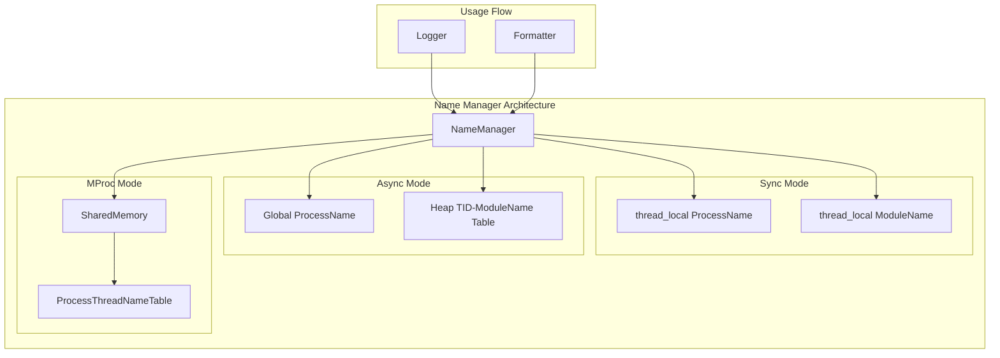
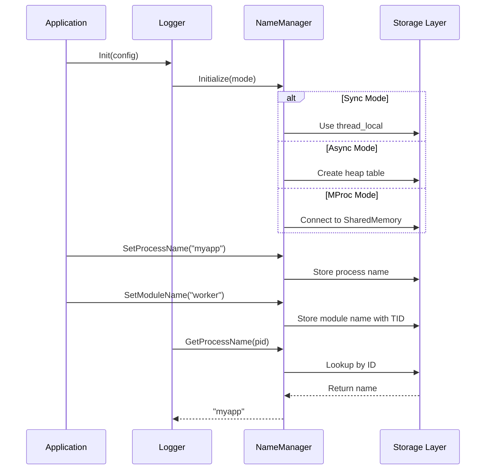
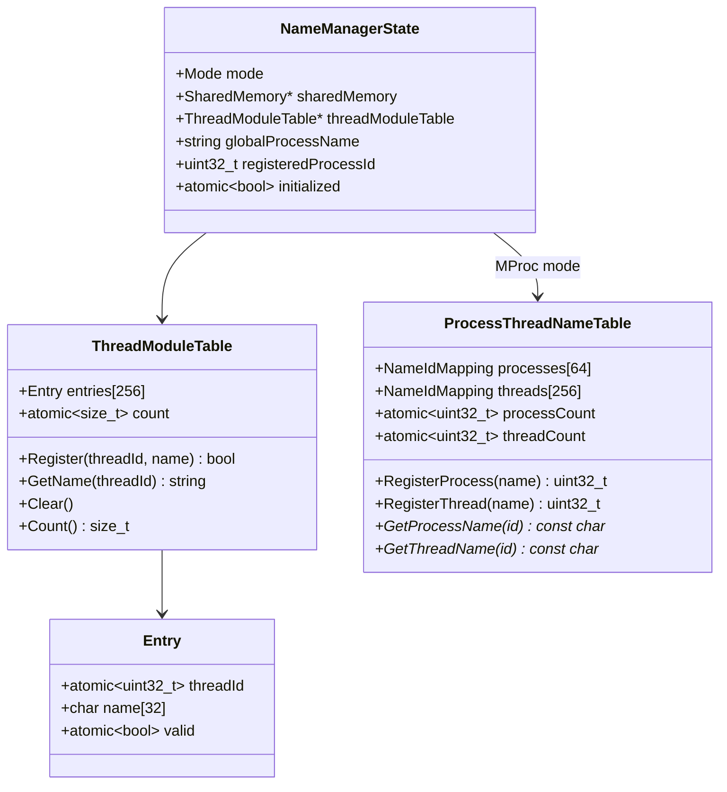

# Design Document: Process/Module Name Management

## Overview

本设计文档描述了 onePlog 日志库中进程名/模块名管理功能的技术实现方案。该功能需要在三种运行模式（Sync、Async、MProc）下提供不同的名称存储和查找机制。

核心设计思想：
- **Sync 模式**：使用 `thread_local` 存储，每个线程独立维护自己的进程名和模块名
- **Async 模式**：进程名使用全局变量，模块名使用堆上的线程安全映射表
- **MProc 模式**：利用现有的 `ProcessThreadNameTable` 共享内存结构

## Architecture



### 模式选择流程



## Components and Interfaces

### 1. NameManager 类

核心名称管理器，根据运行模式选择不同的存储策略。

```cpp
namespace oneplog {

/**
 * @brief Name manager for process and module names
 * @brief 进程名和模块名管理器
 */
class NameManager {
public:
    /**
     * @brief Initialize the name manager
     * @brief 初始化名称管理器
     * @param mode Operating mode / 运行模式
     * @param sharedMemory Shared memory pointer (for MProc mode) / 共享内存指针
     */
    static void Initialize(Mode mode, SharedMemory* sharedMemory = nullptr);
    
    /**
     * @brief Shutdown and cleanup
     * @brief 关闭并清理资源
     */
    static void Shutdown();
    
    /**
     * @brief Set process name
     * @brief 设置进程名
     * @param name Process name / 进程名
     */
    static void SetProcessName(const std::string& name);
    
    /**
     * @brief Get process name by ID
     * @brief 通过 ID 获取进程名
     * @param processId Process ID (used in MProc mode) / 进程 ID
     * @return Process name / 进程名
     */
    static std::string GetProcessName(uint32_t processId = 0);
    
    /**
     * @brief Set module name for current thread
     * @brief 设置当前线程的模块名
     * @param name Module name / 模块名
     */
    static void SetModuleName(const std::string& name);
    
    /**
     * @brief Get module name by thread ID
     * @brief 通过线程 ID 获取模块名
     * @param threadId Thread ID / 线程 ID
     * @return Module name / 模块名
     */
    static std::string GetModuleName(uint32_t threadId = 0);
    
    /**
     * @brief Get current operating mode
     * @brief 获取当前运行模式
     */
    static Mode GetMode();
    
    /**
     * @brief Get registered process ID (for MProc mode)
     * @brief 获取注册的进程 ID（多进程模式）
     */
    static uint32_t GetRegisteredProcessId();
    
    /**
     * @brief Get registered thread ID for current thread (for MProc mode)
     * @brief 获取当前线程注册的线程 ID（多进程模式）
     */
    static uint32_t GetRegisteredThreadId();

private:
    NameManager() = delete;
};

}  // namespace oneplog
```

### 2. ThreadModuleTable 类

用于 Async 模式的线程安全 TID-模块名映射表。

```cpp
namespace oneplog {

/**
 * @brief Thread-safe TID to module name mapping table
 * @brief 线程安全的 TID 到模块名映射表
 */
class ThreadModuleTable {
public:
    static constexpr size_t kMaxEntries = 256;
    static constexpr size_t kMaxNameLength = 31;
    
    ThreadModuleTable();
    ~ThreadModuleTable() = default;
    
    /**
     * @brief Register or update module name for a thread
     * @brief 注册或更新线程的模块名
     * @param threadId Thread ID / 线程 ID
     * @param name Module name / 模块名
     * @return true if successful / 成功返回 true
     */
    bool Register(uint32_t threadId, const std::string& name);
    
    /**
     * @brief Get module name by thread ID
     * @brief 通过线程 ID 获取模块名
     * @param threadId Thread ID / 线程 ID
     * @return Module name, or empty string if not found / 模块名，未找到返回空字符串
     */
    std::string GetName(uint32_t threadId) const;
    
    /**
     * @brief Clear all entries
     * @brief 清空所有条目
     */
    void Clear();
    
    /**
     * @brief Get current entry count
     * @brief 获取当前条目数
     */
    size_t Count() const;

private:
    struct Entry {
        std::atomic<uint32_t> threadId{0};
        char name[kMaxNameLength + 1]{0};
        std::atomic<bool> valid{false};
    };
    
    alignas(64) Entry m_entries[kMaxEntries];
    std::atomic<size_t> m_count{0};
};

}  // namespace oneplog
```

### 3. 全局状态管理

```cpp
namespace oneplog {
namespace detail {

/**
 * @brief Global state for name management
 * @brief 名称管理的全局状态
 */
struct NameManagerState {
    Mode mode{Mode::Async};
    SharedMemory* sharedMemory{nullptr};
    std::unique_ptr<ThreadModuleTable> threadModuleTable;
    std::string globalProcessName{"main"};
    uint32_t registeredProcessId{0};
    std::atomic<bool> initialized{false};
};

inline NameManagerState& GetNameManagerState() {
    static NameManagerState state;
    return state;
}

// Thread-local storage for Sync mode
// 用于存储当前线程的模块名，新线程会继承父线程的值
inline thread_local std::string tls_processName = "main";
inline thread_local std::string tls_moduleName = "main";
inline thread_local uint32_t tls_registeredThreadId = 0;
inline thread_local bool tls_moduleNameInitialized = false;

}  // namespace detail
}  // namespace oneplog
```

### 4. 模块名继承机制

为了支持新线程继承父线程的模块名，需要在创建线程时传递父线程的模块名：

```cpp
namespace oneplog {

/**
 * @brief Thread creation helper that inherits module name
 * @brief 继承模块名的线程创建辅助类
 */
class ThreadWithModuleName {
public:
    template<typename Func, typename... Args>
    static std::thread Create(Func&& func, Args&&... args) {
        // 捕获当前线程的模块名
        std::string parentModuleName = NameManager::GetModuleName();
        
        return std::thread([parentModuleName, 
                           f = std::forward<Func>(func),
                           ... capturedArgs = std::forward<Args>(args)]() mutable {
            // 新线程继承父线程的模块名
            if (!detail::tls_moduleNameInitialized) {
                NameManager::SetModuleName(parentModuleName);
            }
            f(std::forward<Args>(capturedArgs)...);
        });
    }
};

}  // namespace oneplog
```

### 5. LoggerConfig 扩展

```cpp
/**
 * @brief Logger configuration structure (extended)
 * @brief Logger 配置结构（扩展）
 */
struct LoggerConfig {
    Mode mode{Mode::Async};
    Level level{Level::Info};
    size_t heapRingBufferSize{8192};
    size_t sharedRingBufferSize{4096};
    QueueFullPolicy queueFullPolicy{QueueFullPolicy::DropNewest};
    std::string sharedMemoryName;
    std::chrono::microseconds pollInterval{1};
    std::chrono::milliseconds pollTimeout{10};
    
    // 新增：进程名配置
    std::string processName;  ///< Process name (optional) / 进程名（可选）
};
```

### 6. 初始化接口更新

```cpp
namespace oneplog {

/**
 * @brief Initialize the default logger with custom configuration
 * @brief 使用自定义配置初始化默认日志器
 *
 * @param config Logger configuration (including optional processName)
 */
inline void Init(const LoggerConfig& config) {
    // 初始化 NameManager
    NameManager::Initialize(config.mode, nullptr);
    
    // 设置进程名
    if (!config.processName.empty()) {
        NameManager::SetProcessName(config.processName);
    }
    
    // ... 其余初始化逻辑
}

/**
 * @brief Initialize producer for multi-process mode
 * @brief 初始化多进程模式的生产者
 *
 * @param shmName Shared memory name / 共享内存名称
 * @param processName Process name (optional) / 进程名（可选）
 */
inline void InitProducer(const std::string& shmName, 
                         const std::string& processName = "") {
    auto sharedMemory = SharedMemory::Connect(shmName);
    if (!sharedMemory) {
        return;
    }
    
    NameManager::Initialize(Mode::MProc, sharedMemory.get());
    
    if (!processName.empty()) {
        NameManager::SetProcessName(processName);
    }
    
    // ... 其余初始化逻辑
}

}  // namespace oneplog
```

## Data Models

### 名称存储结构



### 各模式数据流

| 模式 | 进程名存储 | 模块名存储 | 查找方式 |
|------|-----------|-----------|---------|
| Sync | thread_local | thread_local | 直接访问 TLS |
| Async | 全局变量 | ThreadModuleTable | 通过 TID 查表 |
| MProc | SharedMemory | SharedMemory | 通过 ID 查共享内存 |


## Correctness Properties

*A property is a characteristic or behavior that should hold true across all valid executions of a system—essentially, a formal statement about what the system should do. Properties serve as the bridge between human-readable specifications and machine-verifiable correctness guarantees.*

### Property 1: Thread Isolation in Sync Mode

*For any* two different threads in Sync mode, setting a module name in one thread SHALL NOT affect the module name in the other thread.

**Validates: Requirements 1.1, 1.2**

### Property 2: SetModuleName/GetModuleName Round-Trip

*For any* valid module name string (up to 31 characters) and any operating mode, calling SetModuleName followed by GetModuleName in the same thread SHALL return the same name (or a truncated version if exceeding 31 characters).

**Validates: Requirements 1.2, 2.3, 5.2, 5.3, 5.4, 5.5, 5.6**

### Property 3: Name Length Invariant

*For any* process name or module name string, the Name_Manager SHALL store and return names up to 31 characters, truncating longer names without error.

**Validates: Requirements 1.5, 1.6**

### Property 4: Process Name Global Accessibility in Async Mode

*For any* process name set in Async mode, GetProcessName called from any thread SHALL return the same process name.

**Validates: Requirements 2.1, 4.2**

### Property 5: Formatter Name Resolution by ID

*For any* registered process ID or thread ID, the Formatter SHALL resolve the corresponding name from the appropriate storage (TLS, heap table, or shared memory) based on the current mode.

**Validates: Requirements 2.4, 3.4, 3.5, 6.1, 6.2**

### Property 6: Unique ID Generation

*For any* sequence of process or thread registrations in MProc mode, each registration SHALL return a unique non-zero ID, and no two different names SHALL receive the same ID.

**Validates: Requirements 3.2, 3.3**

### Property 7: Name Display Width Formatting

*For any* process name or module name, the formatted output SHALL have exactly 6 characters width (padded with spaces if shorter, truncated if longer).

**Validates: Requirements 6.4**

### Property 8: Concurrent Access Safety

*For any* number of threads concurrently calling SetModuleName and GetModuleName, all operations SHALL complete without data races, and each thread's registered name SHALL be correctly retrievable.

**Validates: Requirements 7.1, 7.3, 7.4**

### Property 9: Module Name Inheritance

*For any* parent thread with a set module name, when creating a child thread without explicitly calling SetModuleName, the child thread SHALL inherit the parent thread's module name.

**Validates: Requirements 1.4, 5.7, 5.8**

## Error Handling

### 错误场景与处理策略

| 错误场景 | 处理策略 | 返回值/行为 |
|---------|---------|------------|
| 名称超过 31 字符 | 截断到 31 字符 | 存储截断后的名称 |
| Async 模式表满 (256 条目) | 拒绝新注册 | 返回 false，使用默认名称 |
| MProc 模式进程表满 (64 条目) | 拒绝新注册 | 返回 0，使用数字 ID 显示 |
| MProc 模式线程表满 (256 条目) | 拒绝新注册 | 返回 0，使用数字 ID 显示 |
| 查找不存在的 ID | 返回默认值 | 返回 "main" 或数字 ID |
| 未初始化时调用 | 使用默认行为 | 返回默认名称 "main" |
| 共享内存未连接 | 降级处理 | 使用本地存储 |

### 错误码定义

```cpp
enum class NameManagerError : int {
    Success = 0,
    TableFull = 1,
    NameTooLong = 2,  // Warning, name will be truncated
    NotInitialized = 3,
    SharedMemoryNotAvailable = 4
};
```

## Testing Strategy

### 测试框架选择

- **单元测试**: Google Test (gtest)
- **属性测试**: RapidCheck (C++ property-based testing library)

### 双重测试方法

本功能采用单元测试和属性测试相结合的方式：

1. **单元测试**：验证特定示例、边界条件和错误处理
2. **属性测试**：验证跨所有输入的通用属性

### 属性测试配置

- 每个属性测试最少运行 100 次迭代
- 每个属性测试必须引用设计文档中的属性
- 标签格式: **Feature: process-module-name-management, Property {number}: {property_text}**

### 测试用例分类

#### 单元测试

1. **初始化测试**
    - 各模式下的初始化
    - 默认值验证
    - 重复初始化处理

2. **边界条件测试**
    - 空字符串名称
    - 最大长度名称 (31 字符)
    - 超长名称截断
    - 表满情况

3. **错误处理测试**
    - 未初始化调用
    - 无效 ID 查找
    - 共享内存不可用

#### 属性测试

1. **Property 1 测试**: 多线程设置不同模块名，验证线程隔离
2. **Property 2 测试**: 随机生成名称字符串，验证 set/get 往返一致性
3. **Property 3 测试**: 随机长度名称，验证截断行为
4. **Property 4 测试**: 多线程读取进程名，验证一致性
5. **Property 5 测试**: 随机 ID 和名称组合，验证格式化器解析
6. **Property 6 测试**: 批量注册，验证 ID 唯一性
7. **Property 7 测试**: 随机长度名称，验证输出宽度固定为 6
8. **Property 8 测试**: 并发读写，验证无数据竞争
9. **Property 9 测试**: 父子线程模块名继承，验证新线程继承父线程模块名

### 测试文件结构

```
tests/
├── name_manager_test.cpp       # 单元测试
├── name_manager_property_test.cpp  # 属性测试
└── thread_module_table_test.cpp    # ThreadModuleTable 单元测试
```
