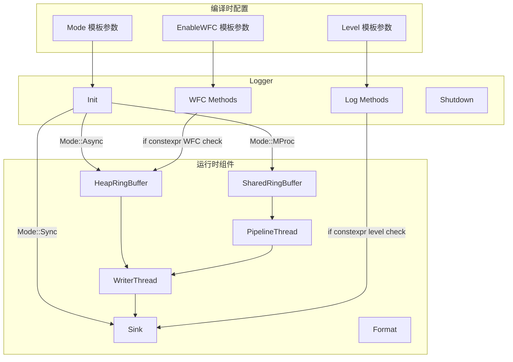
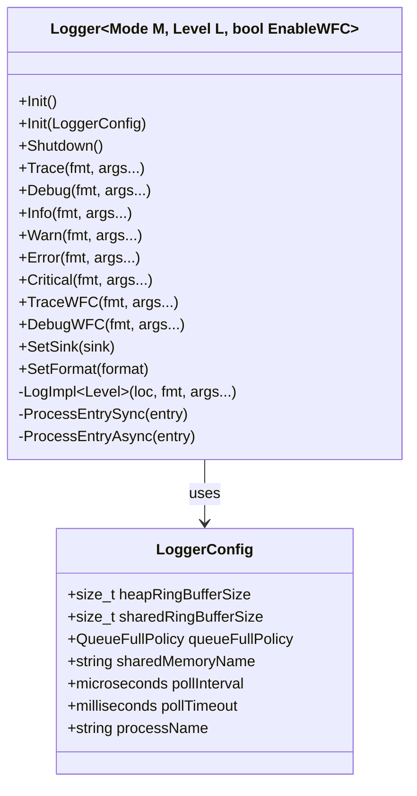

# 设计文档

## 概述

本设计文档描述了 onePlog 日志库的模板化重构方案。通过使用 C++17 模板参数在编译时指定运行模式（Sync/Async/MProc）、最小日志级别和 WFC 功能开关，实现零开销抽象。

核心设计理念：
- **编译时决策**：运行模式、日志级别、WFC 功能在编译时确定
- **零开销抽象**：禁用的功能不产生任何运行时开销
- **接口兼容**：保持与现有 Logger 类相同的公共接口
- **渐进式优化**：使用 `if constexpr` 实现条件编译

## 架构

### 整体架构图



### 模板参数设计



## 组件和接口

### 1. Logger 模板类

```cpp
namespace oneplog {

// 默认日志级别：Debug 模式为 Debug，Release 模式为 Info
#ifdef NDEBUG
constexpr Level kDefaultLevel = Level::Info;
#else
constexpr Level kDefaultLevel = Level::Debug;
#endif

/**
 * @brief 模板化日志器类
 * @tparam M 运行模式（Sync/Async/MProc）
 * @tparam L 编译时最小日志级别
 * @tparam EnableWFC 是否启用 WFC 功能
 */
template<Mode M = Mode::Async, Level L = kDefaultLevel, bool EnableWFC = false>
class Logger {
public:
    // 编译时常量
    static constexpr Mode kMode = M;
    static constexpr Level kMinLevel = L;
    static constexpr bool kEnableWFC = EnableWFC;
    
    // 构造函数
    explicit Logger(const std::string& name = "");
    ~Logger();
    
    // 禁止复制，允许移动
    Logger(const Logger&) = delete;
    Logger& operator=(const Logger&) = delete;
    Logger(Logger&&) noexcept;
    Logger& operator=(Logger&&) noexcept;
    
    // 初始化和关闭
    void Init();
    void Init(const LoggerConfig& config);
    void Shutdown();
    bool IsInitialized() const;
    
    // 配置
    void SetSink(std::shared_ptr<Sink> sink);
    void AddSink(std::shared_ptr<Sink> sink);
    void SetFormat(std::shared_ptr<Format> format);
    
    // 日志方法 - 使用 if constexpr 实现编译时过滤
    template<typename... Args>
    void Trace(const char* fmt, Args&&... args);
    
    template<typename... Args>
    void Debug(const char* fmt, Args&&... args);
    
    template<typename... Args>
    void Info(const char* fmt, Args&&... args);
    
    template<typename... Args>
    void Warn(const char* fmt, Args&&... args);
    
    template<typename... Args>
    void Error(const char* fmt, Args&&... args);
    
    template<typename... Args>
    void Critical(const char* fmt, Args&&... args);
    
    // WFC 方法 - 仅当 EnableWFC 为 true 时可用
    template<typename... Args>
    void TraceWFC(const char* fmt, Args&&... args);
    
    template<typename... Args>
    void DebugWFC(const char* fmt, Args&&... args);
    
    // ... 其他 WFC 方法
    
    // 通用日志方法
    template<typename... Args>
    void Log(Level level, const char* fmt, Args&&... args);
    
    // 刷新
    void Flush();
    
    // 查询
    const std::string& Name() const;
    static constexpr Mode GetMode() { return kMode; }
    static constexpr Level GetMinLevel() { return kMinLevel; }
    static constexpr bool IsWFCEnabled() { return kEnableWFC; }
    
private:
    // 内部实现
    template<Level LogLevel, typename... Args>
    void LogImpl(const SourceLocation& loc, const char* fmt, Args&&... args);
    
    template<Level LogLevel, typename... Args>
    void LogWFCImpl(const char* fmt, Args&&... args);
    
    // 模式特定处理
    template<typename... Args>
    void ProcessEntrySyncDirect(Level level, uint64_t timestamp,
                                const SourceLocation& loc,
                                const char* fmt, Args&&... args);
    
    template<typename... Args>
    void ProcessEntryAsync(Level level, uint64_t timestamp,
                           const SourceLocation& loc,
                           const char* fmt, Args&&... args);
    
    // 成员变量
    std::string m_name;
    bool m_initialized;
    std::mutex m_mutex;
    
    std::vector<std::shared_ptr<Sink>> m_sinks;
    std::shared_ptr<Format> m_format;
    
    // 条件编译的成员 - 使用 std::conditional
    std::unique_ptr<HeapRingBuffer<LogEntry>> m_heapRingBuffer;
    std::unique_ptr<SharedMemory> m_sharedMemory;
    std::unique_ptr<PipelineThread> m_pipelineThread;
    std::unique_ptr<WriterThread> m_writerThread;
};

} // namespace oneplog
```

### 2. 编译时级别过滤实现

```cpp
template<Mode M, Level L, bool EnableWFC>
template<typename... Args>
void Logger<M, L, EnableWFC>::Info(const char* fmt, Args&&... args) {
    // 编译时检查：如果 Info 级别低于最小级别，整个函数体被优化掉
    if constexpr (static_cast<uint8_t>(Level::Info) >= static_cast<uint8_t>(L)) {
        LogImpl<Level::Info>(ONEPLOG_CURRENT_LOCATION, fmt, std::forward<Args>(args)...);
    }
    // else: 空函数体，编译器完全优化掉
}

template<Mode M, Level L, bool EnableWFC>
template<Level LogLevel, typename... Args>
void Logger<M, L, EnableWFC>::LogImpl(const SourceLocation& loc, 
                                       const char* fmt, Args&&... args) {
    uint64_t timestamp = GetNanosecondTimestamp();
    
    // 编译时选择处理路径
    if constexpr (M == Mode::Sync) {
        ProcessEntrySyncDirect(LogLevel, timestamp, loc, fmt, std::forward<Args>(args)...);
    } else {
        ProcessEntryAsync(LogLevel, timestamp, loc, fmt, std::forward<Args>(args)...);
    }
}
```

### 3. WFC 功能条件编译

```cpp
template<Mode M, Level L, bool EnableWFC>
template<typename... Args>
void Logger<M, L, EnableWFC>::InfoWFC(const char* fmt, Args&&... args) {
    if constexpr (EnableWFC) {
        // WFC 启用时的完整实现
        if constexpr (static_cast<uint8_t>(Level::Info) >= static_cast<uint8_t>(L)) {
            LogWFCImpl<Level::Info>(fmt, std::forward<Args>(args)...);
        }
    } else {
        // WFC 禁用时，降级为普通日志调用
        Info(fmt, std::forward<Args>(args)...);
    }
}

template<Mode M, Level L, bool EnableWFC>
template<Level LogLevel, typename... Args>
void Logger<M, L, EnableWFC>::LogWFCImpl(const char* fmt, Args&&... args) {
    // 仅在 EnableWFC 为 true 时编译此代码
    if constexpr (EnableWFC) {
        if constexpr (M == Mode::Sync) {
            // 同步模式：WFC 等同于普通日志
            LogImpl<LogLevel>(ONEPLOG_CURRENT_LOCATION, fmt, std::forward<Args>(args)...);
        } else {
            // 异步/多进程模式：使用 WFC 机制
            LogEntry entry;
            entry.timestamp = GetNanosecondTimestamp();
            entry.level = LogLevel;
            entry.threadId = GetCurrentThreadId();
            entry.processId = GetCurrentProcessId();
            
            // 捕获参数
            if constexpr (sizeof...(Args) == 0) {
                entry.snapshot.CaptureStringView(std::string_view(fmt));
            } else {
                entry.snapshot.CaptureStringView(std::string_view(fmt));
                entry.snapshot.Capture(std::forward<Args>(args)...);
            }
            
            // 推送并等待完成
            if (m_heapRingBuffer) {
                int64_t slot = m_heapRingBuffer->TryPushWFC(std::move(entry));
                if (slot >= 0) {
                    m_heapRingBuffer->WaitForCompletion(slot, std::chrono::milliseconds(1000));
                }
            }
        }
    }
}
```

### 4. 模式特定初始化

```cpp
template<Mode M, Level L, bool EnableWFC>
void Logger<M, L, EnableWFC>::Init(const LoggerConfig& config) {
    std::lock_guard<std::mutex> lock(m_mutex);
    
    if (m_initialized) return;
    
    // 编译时选择初始化路径
    if constexpr (M == Mode::Sync) {
        // 同步模式：无需后台线程
        // 不创建任何缓冲区或线程
    }
    else if constexpr (M == Mode::Async) {
        // 异步模式：创建堆环形缓冲区和写入线程
        m_heapRingBuffer = std::make_unique<HeapRingBuffer<LogEntry>>(
            config.heapRingBufferSize, config.queueFullPolicy);
        
        if (!m_sinks.empty()) {
            m_writerThread = std::make_unique<WriterThread>(m_sinks[0]);
            m_writerThread->SetHeapRingBuffer(m_heapRingBuffer.get());
            m_writerThread->SetPollInterval(config.pollInterval);
            m_writerThread->SetPollTimeout(config.pollTimeout);
            if (m_format) {
                m_writerThread->SetFormat(m_format);
            }
            m_writerThread->Start();
        }
    }
    else if constexpr (M == Mode::MProc) {
        // 多进程模式：创建共享内存和管道
        if (!config.sharedMemoryName.empty()) {
            m_sharedMemory = SharedMemory::Create(
                config.sharedMemoryName,
                config.sharedRingBufferSize,
                config.queueFullPolicy);
        }
        
        m_heapRingBuffer = std::make_unique<HeapRingBuffer<LogEntry>>(
            config.heapRingBufferSize, config.queueFullPolicy);
        
        if (m_sharedMemory) {
            m_pipelineThread = std::make_unique<PipelineThread>(
                *m_heapRingBuffer, *m_sharedMemory);
            m_pipelineThread->SetPollInterval(config.pollInterval);
            m_pipelineThread->SetPollTimeout(config.pollTimeout);
            m_pipelineThread->Start();
            
            if (!m_sinks.empty()) {
                m_writerThread = std::make_unique<WriterThread>(m_sinks[0]);
                m_writerThread->SetSharedRingBuffer(m_sharedMemory->GetRingBuffer());
                m_writerThread->SetPollInterval(config.pollInterval);
                m_writerThread->SetPollTimeout(config.pollTimeout);
                if (m_format) {
                    m_writerThread->SetFormat(m_format);
                }
                m_writerThread->Start();
            }
        }
    }
    
    m_initialized = true;
}
```

### 5. 类型别名

```cpp
namespace oneplog {

// 模式特定别名
template<Level L = kDefaultLevel, bool EnableWFC = false>
using SyncLogger = Logger<Mode::Sync, L, EnableWFC>;

template<Level L = kDefaultLevel, bool EnableWFC = false>
using AsyncLogger = Logger<Mode::Async, L, EnableWFC>;

template<Level L = kDefaultLevel, bool EnableWFC = false>
using MProcLogger = Logger<Mode::MProc, L, EnableWFC>;

// 常用预设
using DebugLogger = Logger<Mode::Async, Level::Debug, false>;
using ReleaseLogger = Logger<Mode::Async, Level::Info, false>;
using DebugLoggerWFC = Logger<Mode::Async, Level::Debug, true>;
using ReleaseLoggerWFC = Logger<Mode::Async, Level::Info, true>;

} // namespace oneplog
```

## 数据模型

### LoggerConfig 结构体

```cpp
struct LoggerConfig {
    size_t heapRingBufferSize{8192};             // 堆环形缓冲区大小
    size_t sharedRingBufferSize{4096};           // 共享环形缓冲区大小
    QueueFullPolicy queueFullPolicy{QueueFullPolicy::DropNewest};  // 队列满策略
    std::string sharedMemoryName;                // 共享内存名称（MProc 模式）
    std::chrono::microseconds pollInterval{1};   // 轮询间隔
    std::chrono::milliseconds pollTimeout{10};   // 轮询超时
    std::string processName;                     // 进程名（可选）
};
```

### 编译时常量

```cpp
// 默认日志级别
#ifdef NDEBUG
constexpr Level kDefaultLevel = Level::Info;
#else
constexpr Level kDefaultLevel = Level::Debug;
#endif

// 编译时级别比较
template<Level LogLevel, Level MinLevel>
constexpr bool ShouldLog = static_cast<uint8_t>(LogLevel) >= static_cast<uint8_t>(MinLevel);
```

## 正确性属性

*正确性属性是在系统所有有效执行中都应保持为真的特征或行为——本质上是关于系统应该做什么的形式化陈述。属性作为人类可读规范和机器可验证正确性保证之间的桥梁。*


### Property 1: 编译时级别过滤

*对于任意* Logger 实例化 `Logger<M, L, W>` 和任意日志级别 `LogLevel`，如果 `LogLevel < L`，则调用该级别的日志方法应该生成空代码（被编译器优化掉）。

**验证: 需求 2.1, 2.4, 4.4**

### Property 2: 日志处理正确性

*对于任意* Logger 实例化 `Logger<M, L, W>` 和任意日志级别 `LogLevel`，如果 `LogLevel >= L`，则调用该级别的日志方法应该产生正确格式化的输出。

**验证: 需求 2.2**

### Property 3: 同步模式线程一致性

*对于任意* `Logger<Mode::Sync, L, W>` 实例，所有日志写入操作应该在调用线程中完成，写入时的线程 ID 应该与调用时的线程 ID 相同。

**验证: 需求 3.1**

### Property 4: 可变参数格式化

*对于任意* 参数类型组合和数量，日志方法应该正确格式化消息，输出应该包含所有提供的参数值。

**验证: 需求 4.2**

### Property 5: WFC 禁用行为

*对于任意* `Logger<M, L, false>` 实例（WFC 禁用），调用 WFC 方法应该降级为普通日志调用，不执行任何 WFC 状态检查代码。

**验证: 需求 11.2, 11.5**

## 错误处理

### 初始化错误

| 错误场景 | 处理方式 |
|---------|---------|
| 重复初始化 | 忽略，返回成功 |
| 共享内存创建失败（MProc 模式） | 记录错误，降级为 Async 模式 |
| 后台线程创建失败 | 记录错误，降级为 Sync 模式 |

### 运行时错误

| 错误场景 | 处理方式 |
|---------|---------|
| 队列满（DropNewest 策略） | 丢弃新日志，增加丢弃计数 |
| 队列满（DropOldest 策略） | 丢弃最旧日志，增加丢弃计数 |
| 队列满（Block 策略） | 阻塞等待直到有空间 |
| Sink 写入失败 | 记录错误，继续处理其他日志 |

### 关闭错误

| 错误场景 | 处理方式 |
|---------|---------|
| 未初始化时调用 Shutdown | 忽略，返回成功 |
| 后台线程停止超时 | 强制终止，记录警告 |

## 测试策略

### 单元测试

1. **模板参数测试**
    - 验证 Mode、Level、EnableWFC 模板参数正确传递
    - 验证默认参数值（Debug/Release 模式）
    - 验证类型别名正确定义

2. **接口兼容性测试**
    - 验证所有公共方法存在且签名正确
    - 验证现有代码可以无修改编译
    - 验证宏定义正常工作

3. **配置测试**
    - 验证 LoggerConfig 所有字段
    - 验证 Sink 和 Format 配置

### 属性测试

属性测试使用 [RapidCheck](https://github.com/emil-e/rapidcheck) 库进行，每个属性测试至少运行 100 次迭代。

1. **Property 1: 编译时级别过滤**
    - 生成随机日志级别组合
    - 验证低于最小级别的日志不产生输出
    - **标签: Feature: template-logger-refactor, Property 1: 编译时级别过滤**

2. **Property 2: 日志处理正确性**
    - 生成随机日志消息和参数
    - 验证输出包含正确的级别、时间戳和消息
    - **标签: Feature: template-logger-refactor, Property 2: 日志处理正确性**

3. **Property 3: 同步模式线程一致性**
    - 从多个线程调用日志方法
    - 验证每个日志的线程 ID 与调用线程匹配
    - **标签: Feature: template-logger-refactor, Property 3: 同步模式线程一致性**

4. **Property 4: 可变参数格式化**
    - 生成随机类型和数量的参数
    - 验证输出包含所有参数值
    - **标签: Feature: template-logger-refactor, Property 4: 可变参数格式化**

5. **Property 5: WFC 禁用行为**
    - 使用 WFC 禁用的 Logger
    - 验证 WFC 方法降级为普通日志
    - **标签: Feature: template-logger-refactor, Property 5: WFC 禁用行为**

### 集成测试

1. **模式切换测试**
    - 测试 Sync、Async、MProc 三种模式的完整流程
    - 验证日志正确写入到 Sink

2. **性能测试**
    - 比较禁用级别的日志调用开销
    - 验证零开销抽象的有效性

3. **兼容性测试**
    - 使用现有示例代码验证接口兼容性
    - 验证宏定义在新实现下正常工作
