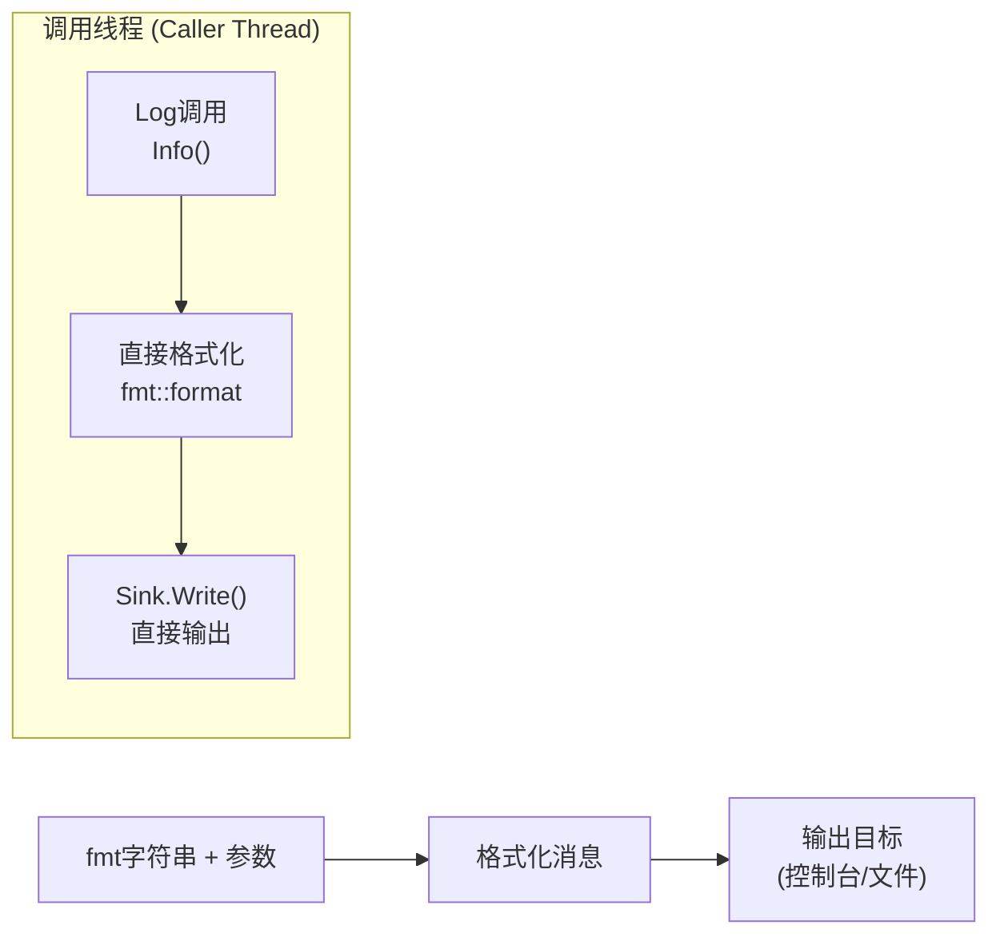
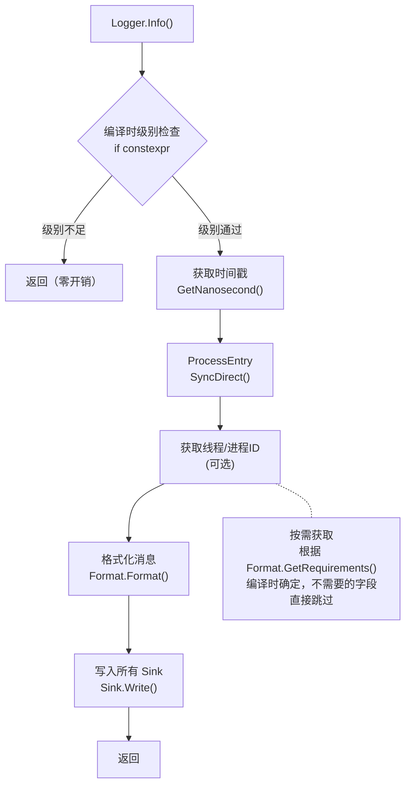
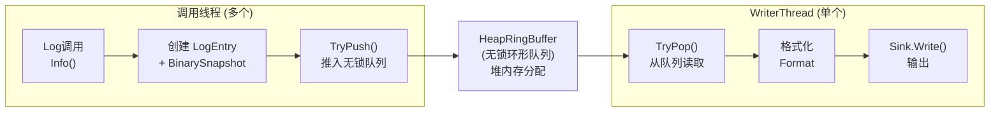
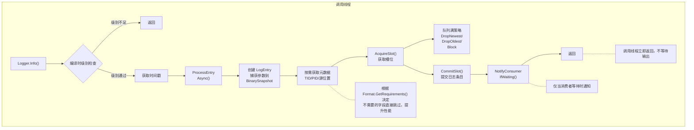
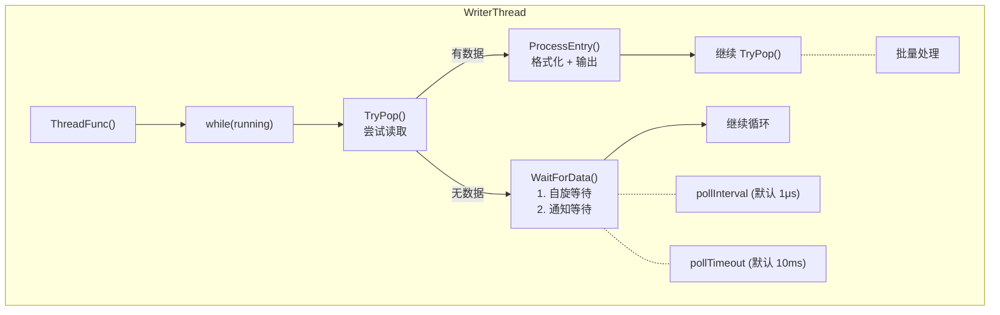
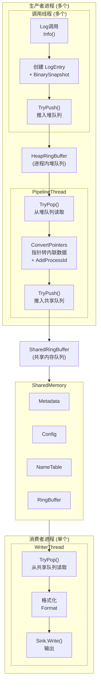
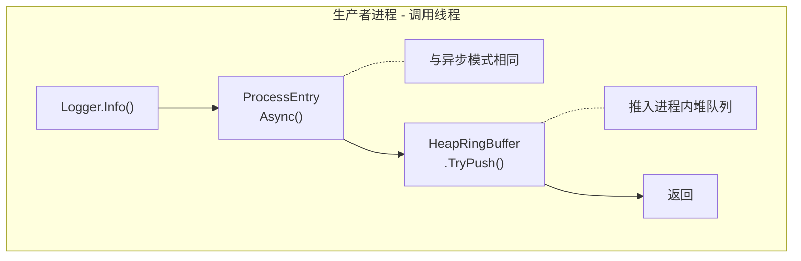
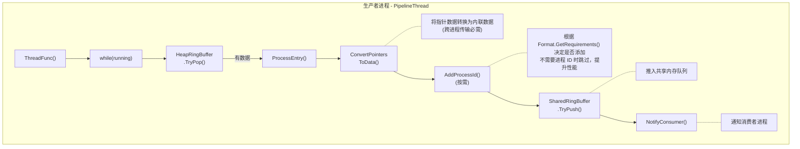
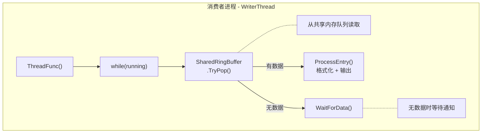

# onePlog

高性能 C++17 多进程日志系统

## 特性

- **三种运行模式**：同步、异步、多进程
- **零拷贝**：静态字符串仅存储指针
- **无锁队列**：高并发场景下的最佳性能
- **灵活格式化**：支持控制台、文件、JSON 格式
- **多种输出目标**：控制台、文件（支持轮转）、网络
- **彩色输出**：Release 模式支持 ANSI 颜色
- **fmt 库支持**：可选使用 fmt 库进行格式化

## 项目结构

```
include/oneplog/
├── oneplog.hpp          # 主头文件（包含此文件即可使用所有功能）
├── common.hpp           # 核心类型定义（Level、Mode、ErrorCode 等）
├── logger.hpp           # Logger 类和全局 API
├── macros.hpp           # 日志宏定义
├── name_manager.hpp     # 进程名/模块名管理
├── sink.hpp             # Sink 基类（向后兼容）
├── sinks/
│   └── sink.hpp         # Sink 实现（ConsoleSink、FileSink 等）
└── internal/            # 内部实现（不建议直接使用）
    ├── binary_snapshot.hpp      # 参数捕获
    ├── log_entry.hpp            # 日志条目
    ├── heap_memory.hpp          # 堆内存环形队列
    ├── shared_memory.hpp        # 共享内存管理
    ├── format.hpp               # 格式化器
    ├── writer_thread.hpp        # 写入线程
    ├── pipeline_thread.hpp      # 管道线程（多进程模式）
    └── ...
```

## 快速开始

### 在其他项目中使用 oneplog

#### 方式 1：Git Submodule（推荐）

```bash
# 添加 submodule
git submodule add https://github.com/onePercentzcl/oneplog.git third_party/oneplog
```

**CMake：**
```cmake
add_subdirectory(third_party/oneplog)
target_link_libraries(your_target PRIVATE oneplog)
```

**XMake：**
```lua
includes("third_party/oneplog")
target("your_target")
    add_deps("oneplog")
```

#### 方式 2：CMake FetchContent

```cmake
include(FetchContent)
FetchContent_Declare(oneplog
    GIT_REPOSITORY https://github.com/onePercentzcl/oneplog.git
    GIT_TAG v0.1.3)
FetchContent_MakeAvailable(oneplog)
target_link_libraries(your_target PRIVATE oneplog)
```

#### 方式 3：XMake 远程包（推荐）

```lua
-- xmake.lua
add_rules("mode.debug", "mode.release")
set_languages("c++17")

-- 添加 onePercent 仓库
add_repositories("onePercent-repo https://github.com/onePercentzcl/xmake-repo")

-- 添加 oneplog 依赖
add_requires("oneplog")

target("your_target")
    set_kind("binary")
    add_files("src/*.cpp")
    add_packages("oneplog")
```

### 构建 oneplog 本身

使用 XMake：
```bash
xmake
```

使用 CMake：
```bash
mkdir build && cd build
cmake ..
make
```

### 基本用法

```cpp
#include <oneplog/oneplog.hpp>

int main() {
    // 一行初始化（异步模式 + 控制台输出）
    oneplog::Init();
    
    // 使用全局函数记录日志（推荐）
    oneplog::Info("Hello, {}!", "onePlog");
    oneplog::Error("Error code: {}", 42);
    oneplog::Debug("Debug message");  // Release 模式下被编译器优化掉
    
    // 或使用 log:: 静态类（旧版 API）
    log::Info("Static class style");
    
    // 使用宏
    ONEPLOG_INFO("Macro logging: {}", "test");
    
    // 刷新并关闭
    oneplog::Flush();
    oneplog::Shutdown();
    return 0;
}
```

### 自定义 Logger 实例

当需要非默认配置（如同步模式、自定义级别、启用 WFC）时，使用自定义 Logger 实例：

```cpp
#include <oneplog/oneplog.hpp>

int main() {
    // 创建同步模式 Logger（模板参数：Mode, Level, EnableWFC）
    oneplog::Logger<oneplog::Mode::Sync, oneplog::Level::Debug, false> logger;
    logger.SetSink(std::make_shared<oneplog::ConsoleSink>());
    logger.SetFormat(std::make_shared<oneplog::ConsoleFormat>());
    logger.Init();
    
    logger.Info("Custom logger message");
    logger.Debug("Debug info");
    
    logger.Shutdown();
    return 0;
}
```

### 自定义默认 Logger 类型

通过宏定义自定义全局 API 使用的默认 Logger 类型：

```cpp
// 在包含头文件之前定义
#define ONEPLOG_DEFAULT_MODE oneplog::Mode::Sync
#define ONEPLOG_DEFAULT_LEVEL oneplog::Level::Debug
#define ONEPLOG_DEFAULT_ENABLE_WFC true
#define ONEPLOG_DEFAULT_ENABLE_SHADOW_TAIL false  // 低竞争场景可禁用
#include <oneplog/oneplog.hpp>

int main() {
    oneplog::Init();  // 使用自定义的默认类型
    oneplog::Info("Now using Sync mode with Debug level");
    oneplog::Shutdown();
    return 0;
}
```

## 日志级别

| 级别 | 全称 | 4字符 | 1字符 | 颜色 |
|------|------|-------|-------|------|
| Trace | trace | TRAC | T | 无 |
| Debug | debug | DBUG | D | 蓝色 |
| Info | info | INFO | I | 绿色 |
| Warn | warn | WARN | W | 黄色 |
| Error | error | ERRO | E | 红色 |
| Critical | critical | CRIT | C | 紫色 |

## 进程名/模块名管理

onePlog 支持为日志设置进程名和模块名，便于在多进程、多线程环境中识别日志来源。

### 设计原则

- **进程名和模块名属于进程/线程，而不是 Logger 对象**
- 进程名是全局常量，应在程序启动时设置一次
- 模块名是线程局部变量，每个线程可以设置自己的模块名

### 设置进程名

```cpp
#include <oneplog/oneplog.hpp>

int main() {
    // 方式 1：通过配置设置进程名
    oneplog::LoggerConfig config;
    config.processName = "my_app";
    oneplog::Init(config);
    
    // 方式 2：使用全局函数设置（推荐）
    oneplog::SetProcessName("my_app");
    
    // 方式 3：使用 NameManager 设置
    oneplog::NameManager<>::SetProcessName("my_app");
    
    // 获取进程名
    std::string name = oneplog::GetProcessName();
    
    log::Info("Process name: {}", name);
    
    oneplog::Shutdown();
    return 0;
}
```

### 设置模块名

每个线程可以设置自己的模块名。在 Async/MProc 模式下，`SetModuleName()` 会自动将模块名注册到全局表，无需额外调用：

```cpp
#include <oneplog/oneplog.hpp>
#include <thread>

int main() {
    oneplog::LoggerConfig config;
    config.processName = "my_app";
    oneplog::Init(config);
    
    // 主线程设置模块名（自动注册到全局表）
    oneplog::SetModuleName("main");
    log::Info("Main thread message");
    
    // 工作线程设置不同的模块名（自动注册到全局表）
    std::thread worker([]() {
        oneplog::SetModuleName("worker");  // 自动注册，无需调用 RegisterModuleName()
        log::Info("Worker thread message");
    });
    worker.join();
    
    oneplog::Shutdown();
    return 0;
}
```

### 模块名继承

使用 `ThreadWithModuleName` 创建线程时，子线程会自动继承父线程的模块名：

```cpp
#include <oneplog/oneplog.hpp>

int main() {
    oneplog::Init();
    
    // 设置父线程模块名
    oneplog::SetModuleName("supervisor");
    
    // 子线程自动继承 "supervisor" 模块名
    auto childThread = oneplog::ThreadWithModuleName<>::Create([]() {
        // GetModuleName() 返回 "supervisor"
        log::Info("Child module: {}", oneplog::GetModuleName());
    });
    childThread.join();
    
    // 也可以为子线程指定特定的模块名
    auto namedThread = oneplog::ThreadWithModuleName<>::CreateWithName("custom_module", []() {
        log::Info("Custom module: {}", oneplog::GetModuleName());
    });
    namedThread.join();
    
    oneplog::Shutdown();
    return 0;
}
```

### 三种模式下的名称存储

| 模式 | 进程名存储 | 模块名存储 | 说明 |
|------|-----------|-----------|------|
| Sync | 全局变量 | thread_local | Sink 可直接访问 |
| Async | 全局变量 | thread_local + 堆上 TID-模块名表 | WriterThread 通过 TID 查表 |
| MProc | 全局变量 + 共享内存 | thread_local + 共享内存 | 消费者进程通过共享内存查表 |

### 名称查找优化

onePlog 针对不同平台实现了优化的名称查找表：

| 平台 | 查找表类型 | 时间复杂度 | 说明 |
|------|-----------|-----------|------|
| Linux | DirectMappingTable | O(1) | 使用 TID 作为数组索引直接映射 |
| macOS/Windows | ArrayMappingTable | O(n) | 使用线性搜索的数组映射 |

编译期自动选择最优实现，无需手动配置。

#### 编译期配置选项

可通过宏定义自定义名称查找行为：

```cpp
// 自定义最大名称长度（默认 15，Linux TASK_COMM_LEN - 1）
#define ONEPLOG_MAX_NAME_LENGTH 31

// 禁用优化查找表（使用原始实现）
#define ONEPLOG_USE_OPTIMIZED_LOOKUP 0
```

#### 性能提升

在 Apple M4 Pro (macOS) 上的测试结果：

| 测试场景 | 优化前 | 优化后 | 提升 |
|----------|--------|--------|------|
| 4线程名称查找 | 33.83 M ops/s | 40.29 M ops/s | +19.1% |
| 4线程异步日志 | 6.78 M ops/s | 7.69 M ops/s | +13.4% |
| 多进程模式 | 30.82 K ops/s | 32.46 K ops/s | +5.3% |

注意：Linux 平台使用 O(1) 直接映射，性能提升更显著。

## 运行模式

onePlog 支持三种运行模式，每种模式有不同的数据流和控制流：

- **同步模式 (Sync)**：日志直接在调用线程中输出，适合调试
- **异步模式 (Async)**：日志通过无锁队列传递给后台线程，高性能
- **多进程模式 (MProc)**：多个进程共享同一个日志输出

### 同步模式 (Sync)

同步模式下，日志在调用线程中直接格式化并输出，无后台线程。

#### 数据流程图



> 注意: 同步模式不使用 BinarySnapshot，直接对参数进行格式化

#### 控制流程图



#### 关键特性

- **零后台线程**：无 WriterThread、无 PipelineThread
- **零队列开销**：无 HeapRingBuffer、无 SharedRingBuffer
- **直接格式化**：不使用 BinarySnapshot，直接调用 fmt::format
- **栈缓冲区**：使用 `fmt::memory_buffer` 避免堆分配
- **按需获取元数据**：根据 Format.GetRequirements() 决定是否获取 TID/PID 等
- **适用场景**：调试、低吞吐量、需要即时输出

---

### 异步模式 (Async)

异步模式下，调用线程将日志条目推入无锁队列，后台 WriterThread 负责格式化和输出。

#### 数据流程图



#### 控制流程图





#### 关键特性

- **无锁队列**：HeapRingBuffer 使用 CAS 操作，高并发性能
- **批量处理**：WriterThread 连续读取多条日志，减少上下文切换
- **通知优化**：仅当消费者等待时才发送通知信号
- **Shadow Tail**：生产者缓存 tail 位置，减少原子读取
- **按需获取元数据**：生产者根据 Format.GetRequirements() 决定是否获取 TID/PID/源位置
- **适用场景**：高吞吐量、低延迟要求、单进程多线程

---

### 多进程模式 (MProc)

多进程模式下，多个生产者进程通过共享内存将日志传递给消费者进程。

#### 数据流程图



#### 控制流程图







#### 关键特性

- **两级队列**：HeapRingBuffer (进程内) + SharedRingBuffer (跨进程)
- **指针转换**：PipelineThread 将指针数据转换为内联数据
- **按需添加进程ID**：PipelineThread 根据 Format.GetRequirements() 决定是否添加 PID
- **共享内存结构**：
  - `SharedMemoryMetadata`: 魔数、版本、偏移量
  - `SharedLoggerConfig`: 日志级别配置
  - `ProcessThreadNameTable`: 进程/线程名称映射表
  - `SharedRingBuffer`: 日志条目队列
- **进程隔离**：生产者进程崩溃不影响消费者进程
- **适用场景**：多进程架构、微服务、需要集中日志收集

---

### 三种模式对比

| 特性 | 同步模式 | 异步模式 | 多进程模式 |
|------|----------|----------|------------|
| 后台线程 | 无 | WriterThread | PipelineThread + WriterThread |
| 队列 | 无 | HeapRingBuffer | HeapRingBuffer + SharedRingBuffer |
| 内存 | 栈缓冲区 | 堆内存 | 堆内存 + 共享内存 |
| 延迟 | 高（阻塞调用线程） | 低（立即返回） | 低（立即返回） |
| 吞吐量 | 低 | 高 | 中等 |
| 跨进程 | 否 | 否 | 是 |
| 适用场景 | 调试、低吞吐量 | 高性能单进程 | 多进程架构 |

## 格式化器

### 控制台格式化器 (ConsoleFormat)

Debug 模式输出：
```
[15:20:23:123] [INFO] [进程名:PID] [模块名:TID] 消息
```

Release 模式输出（带颜色）：
```
[15:20:23] [INFO] [进程名] [模块名] 消息
```

### 文件格式化器 (FileFormat)

输出完整信息，包括文件名、行号、函数名。

### JSON 格式化器 (JsonFormat)

输出 JSON 格式，适合数据库存储和日志分析。

## 多进程使用

### Fork 子进程

在 fork 子进程时，子进程需要创建自己的日志器：

```cpp
#include <oneplog/oneplog.hpp>
#include <unistd.h>
#include <sys/wait.h>

void RunChildProcess(int childId) {
    // 子进程使用同步模式初始化
    oneplog::LoggerConfig config;
    config.mode = oneplog::Mode::Sync;
    oneplog::Init(config);

    // 设置进程名称以便识别
    auto format = std::make_shared<oneplog::ConsoleFormat>();
    format->SetProcessName("child" + std::to_string(childId));
    oneplog::SetFormat(format);

    // 记录日志
    log::Info("[Child {}] Message", childId);
    log::Flush();
}

int main() {
    // 父进程使用同步模式初始化
    oneplog::LoggerConfig config;
    config.mode = oneplog::Mode::Sync;
    oneplog::Init(config);

    auto format = std::make_shared<oneplog::ConsoleFormat>();
    format->SetProcessName("parent");
    oneplog::SetFormat(format);

    pid_t pid = fork();

    if (pid == 0) {
        // 子进程 - 重新初始化
        oneplog::Shutdown();
        RunChildProcess(0);
        _exit(0);  // 使用 _exit 避免刷新父进程缓冲区
    } else if (pid > 0) {
        // 父进程
        log::Info("[Parent] Message");
        
        int status;
        waitpid(pid, &status, 0);
    }

    log::Flush();
    return 0;
}
```

### Exec 子进程（非 fork）

使用 `posix_spawn` 或 `exec` 启动独立子进程时，每个进程独立初始化日志器：

```cpp
#include <oneplog/oneplog.hpp>
#include <spawn.h>
#include <sys/wait.h>

extern char** environ;

// 子进程入口（通过命令行参数判断）
void RunAsChild(int childId) {
    oneplog::LoggerConfig config;
    config.mode = oneplog::Mode::Sync;
    oneplog::Init(config);

    auto format = std::make_shared<oneplog::ConsoleFormat>();
    format->SetProcessName("child" + std::to_string(childId));
    oneplog::SetFormat(format);

    log::Info("[Child {}] Started, PID={}", childId, getpid());
    log::Flush();
}

// 父进程入口
void RunAsParent(const char* programPath) {
    oneplog::LoggerConfig config;
    config.mode = oneplog::Mode::Sync;
    oneplog::Init(config);

    auto format = std::make_shared<oneplog::ConsoleFormat>();
    format->SetProcessName("parent");
    oneplog::SetFormat(format);

    log::Info("[Parent] Starting, PID={}", getpid());

    // 使用 posix_spawn 启动子进程
    pid_t pid;
    char* argv[] = {
        const_cast<char*>(programPath),
        const_cast<char*>("child"),
        const_cast<char*>("0"),
        nullptr
    };

    if (posix_spawn(&pid, programPath, nullptr, nullptr, argv, environ) == 0) {
        log::Info("[Parent] Spawned child with PID={}", pid);
        
        int status;
        waitpid(pid, &status, 0);
    }

    log::Flush();
}

int main(int argc, char* argv[]) {
    if (argc >= 3 && strcmp(argv[1], "child") == 0) {
        RunAsChild(atoi(argv[2]));
    } else {
        RunAsParent(argv[0]);
    }
    return 0;
}
```

### 多进程注意事项

1. **Fork 后必须重新创建日志器**：fork 后子进程继承父进程的内存，但后台线程不会被继承
2. **使用 `_exit()` 退出子进程**：避免刷新父进程的 I/O 缓冲区
3. **设置进程名称**：使用 `ConsoleFormat::SetProcessName()` 区分不同进程的日志
4. **同步模式更安全**：多进程场景建议使用同步模式，避免竞争条件

## 构建选项

### XMake 选项

| 选项 | 说明 | 默认值 |
|------|------|--------|
| `shared` | 构建动态库 | false |
| `headeronly` | 仅头文件模式 | false |
| `tests` | 构建测试 | false |
| `examples` | 构建示例 | false |
| `use_fmt` | 使用 fmt 库 | true |

### CMake 选项

| 选项 | 说明 | 默认值 |
|------|------|--------|
| `ONEPLOG_BUILD_SHARED` | 构建动态库 | OFF |
| `ONEPLOG_HEADER_ONLY` | 仅头文件模式 | OFF |
| `ONEPLOG_BUILD_TESTS` | 构建测试 | OFF |
| `ONEPLOG_BUILD_EXAMPLES` | 构建示例 | OFF |
| `ONEPLOG_USE_FMT` | 使用 fmt 库 | OFF |

### 编译宏

#### 模式选择宏

| 宏 | 说明 |
|------|------|
| `ONEPLOG_SYNC_ONLY` | 仅编译同步模式代码 |
| `ONEPLOG_ASYNC_ONLY` | 仅编译异步模式代码 |
| `ONEPLOG_MPROC_ONLY` | 仅编译多进程模式代码 |

注意：这三个宏互斥，不能同时定义。

#### 编译时日志级别

使用 `ONEPLOG_ACTIVE_LEVEL` 宏可以在编译时完全移除低于指定级别的日志代码：

| 值 | 级别 | 说明 |
|------|------|------|
| 0 | Trace | 默认，启用所有级别 |
| 1 | Debug | 移除 Trace |
| 2 | Info | 移除 Trace, Debug |
| 3 | Warn | 移除 Trace, Debug, Info |
| 4 | Error | 移除 Trace, Debug, Info, Warn |
| 5 | Critical | 仅保留 Critical |
| 6 | Off | 禁用所有日志 |

示例：
```cpp
// 在包含头文件之前定义
#define ONEPLOG_ACTIVE_LEVEL 3  // 仅 Warn 及以上级别会被编译
#include <oneplog/oneplog.hpp>
```

或在 CMake 中：
```cmake
target_compile_definitions(your_target PRIVATE ONEPLOG_ACTIVE_LEVEL=3)
```

## 示例程序

| 示例 | 说明 |
|------|------|
| `sync_example` | 同步模式示例 |
| `async_example` | 异步模式示例 |
| `mproc_example` | Fork 多进程示例 |
| `exec_example` | Exec 子进程示例 |
| `wfc_example` | WFC（等待完成）示例 |
| `multithread_example` | 多进程多线程示例 |
| `benchmark` | 性能基准测试 |
| `stress_test` | 压力测试 |

运行示例：
```bash
xmake run sync_example
xmake run async_example
xmake run mproc_example
xmake run exec_example
xmake run wfc_example
xmake run multithread_example
xmake run benchmark
```

### 压力测试

压力测试程序用于测试 onePlog 在高负载下的性能和稳定性：

```bash
# 基本压力测试（8线程，每线程10万消息）
xmake run stress_test

# 自定义线程数和消息数
xmake run stress_test -- -t 16 -m 500000

# 持续时间模式（运行30秒）
xmake run stress_test -- -t 8 -d 30

# 延迟测试
xmake run stress_test -- -l 100000

# 突发测试
xmake run stress_test -- -b 10000
```

压力测试选项：
- `-t <threads>`: 线程数（默认 8）
- `-m <messages>`: 每线程消息数（默认 100000）
- `-d <seconds>`: 持续时间秒数（覆盖 -m）
- `-l <iterations>`: 运行延迟测试
- `-b <size>`: 运行突发测试
- `-c`: 使用 ConsoleSink（默认使用 NullSink）
- `-v`: 详细输出

## 性能测试

在 Apple M4 Pro (14 核) macOS 上的测试结果：

### 组件性能

| 测试项 | 吞吐量 | 平均延迟 | P99 延迟 |
|--------|--------|----------|----------|
| BinarySnapshot 捕获 | 3475 万 ops/sec | 15 ns | 42 ns |
| HeapRingBuffer 入队/出队 | 2662 万 ops/sec | 25 ns | 125 ns |
| 格式化 | 277 万 ops/sec | 336 ns | 459 ns |

### FastLoggerV2 与 spdlog 性能对比

FastLoggerV2 是重新设计的高性能日志器，使用编译期配置和 SinkBindingList 实现零虚函数调用开销。

使用相同输出格式（仅消息）进行公平对比，结果为多次运行的平均值 ± 标准差：

| 测试项 | onePlog FastLoggerV2 | spdlog | 对比 |
|--------|---------------------|--------|------|
| 同步模式（Null Sink） | 1658 万 ± 45 万 ops/sec | 1652 万 ± 44 万 ops/sec | +0.4% |
| 同步模式（File Sink） | 1036 万 ± 14 万 ops/sec | 860 万 ± 20 万 ops/sec | +20% |
| 异步模式（Null Sink） | 1797 万 ± 10 万 ops/sec | 469 万 ± 20 万 ops/sec | +283% |
| 异步模式（File Sink） | 1796 万 ± 61 万 ops/sec | 480 万 ± 4 万 ops/sec | +274% |

**关键优化**：
- 编译期配置：通过 `FastLoggerConfig` 模板参数在编译时确定所有配置
- SinkBindingList：多 Sink 绑定，编译期计算元数据需求并集
- 条件通知：使用 `NotifyConsumerIfWaiting()` 仅在消费者等待时发送通知，避免不必要的系统调用
- 按需获取元数据：根据 Format 需求决定是否获取 TID/PID 等

运行性能测试：
```bash
# 编译（需要 fmt 库）
clang++ -std=c++17 -O3 -I include -I /opt/homebrew/opt/fmt/include \
    -DONEPLOG_USE_FMT -DFMT_HEADER_ONLY \
    -o benchmark_compare example/benchmark_compare.cpp -lpthread

# 运行（与 spdlog 对比需要 -DHAS_SPDLOG 和 spdlog 头文件）
./benchmark_compare -i 100000 -r 5
```

### WFC 编译时开销测试

测试启用 WFC 编译时标志（`EnableWFC=true`）但不使用 WFC 方法时的性能开销（100 次运行平均值 ± 标准差）：

| 测试项 | WFC 禁用 | WFC 启用 | 开销 |
|--------|----------|----------|------|
| 异步模式（单线程） | 2810 万 ± 417 万 ops/sec | 2876 万 ± 495 万 ops/sec | +2.4%（噪声） |
| 异步模式（4线程） | 1337 万 ± 133 万 ops/sec | 1309 万 ± 120 万 ops/sec | -2.1%（噪声） |
| 多进程模式（单线程） | 1540 万 ± 319 万 ops/sec | 1635 万 ± 354 万 ops/sec | +6.2%（噪声） |
| 多进程模式（4线程） | 1012 万 ± 102 万 ops/sec | 1020 万 ± 122 万 ops/sec | 无显著差异 |

**注意**：当前实现中，消费者线程（WriterThread）在读取每条日志时都会检查 WFC 标志位（`IsWFCEnabled()`），无论 `EnableWFC` 模板参数是 `true` 还是 `false`。这是因为 `RingBufferBase` 不知道模板参数。

**为什么开销很小**：
- 原子读取（`atomic<uint8_t>::load`）在现代 CPU 上非常快（~1-2 纳秒）
- CPU 分支预测器对几乎总是 `false` 的分支预测很好
- `wfc` 字段与 `state` 字段在同一缓存行，读取 `state` 时已加载

**结论**：WFC 编译时标志在不使用 WFC 方法时开销可忽略不计。

运行 WFC 开销测试：
```bash
cd example
xmake -P . -m release
./build/macosx/arm64/release/benchmark_wfc_overhead -r 100
```

命令行参数：
- `-i <iterations>`: 每次测试的迭代次数（默认 500000）
- `-t <threads>`: 多线程测试的线程数（默认 4）
- `-r <runs>`: 运行次数，用于计算平均值和标准差（默认 100）

## 开发进度

- [x] 项目基础设施
- [x] 核心类型定义（Level、Mode、SlotState、ErrorCode）
- [x] BinarySnapshot 实现
- [x] LogEntry 实现（SourceLocation、LogEntryDebug、LogEntryRelease）
- [x] HeapRingBuffer 实现（无锁环形队列、WFC 支持、通知机制、队列满策略）
- [x] SharedRingBuffer 实现（共享内存环形队列，继承自 RingBufferBase）
- [x] SharedMemory 管理器（元数据、配置、进程/线程名称表）
- [x] Format 实现（ConsoleFormat、FileFormat、JsonFormat、PatternFormat）
- [x] Sink 实现（ConsoleSink、FileSink、NetworkSink）
- [x] PipelineThread 实现（多进程模式管道线程）
- [x] WriterThread 实现（日志输出线程）
- [x] Logger 实现（Sync/Async/MProc 模式、WFC 支持）
- [x] 模板化 Logger 实现（编译时模式/级别选择、零开销抽象）
- [x] 全局 API（DefaultLogger、便捷函数、进程/模块名称）
- [x] 宏定义（ONEPLOG_TRACE/DEBUG/INFO/WARN/ERROR/CRITICAL、WFC、条件日志、编译时禁用）
- [x] MemoryPool 实现（无锁内存池、预分配、分配/释放）
- [x] 示例代码（同步模式、异步模式、多进程模式、Exec 子进程、WFC）
- [x] 目录结构重组（sinks/、internal/ 目录，内部实现移至 oneplog::internal 命名空间）

## 模板化日志器

onePlog 使用模板化的 `Logger` 类，允许在编译时指定运行模式、最小日志级别、WFC 功能和 Shadow Tail 优化，实现零开销抽象。

### 模板参数

```cpp
template<Mode M = Mode::Async, Level L = kDefaultLevel, bool EnableWFC = false, bool EnableShadowTail = true>
class Logger;
```

- `M`: 运行模式（`Mode::Sync`、`Mode::Async`、`Mode::MProc`）
- `L`: 编译时最小日志级别（低于此级别的日志调用被编译器优化掉）
- `EnableWFC`: 是否启用 WFC（Wait For Completion）功能
- `EnableShadowTail`: 是否启用 Shadow Tail 优化（默认启用，低竞争场景可禁用以降低开销）

### 类型别名

```cpp
// 预定义的类型别名
oneplog::SyncLogger<>           // 同步模式，默认级别
oneplog::AsyncLogger<>          // 异步模式，默认级别
oneplog::MProcLogger<>          // 多进程模式，默认级别

oneplog::DebugLogger            // 异步模式，Debug 级别
oneplog::ReleaseLogger          // 异步模式，Info 级别
oneplog::DebugLoggerWFC         // 异步模式，Debug 级别，启用 WFC
oneplog::ReleaseLoggerWFC       // 异步模式，Info 级别，启用 WFC
```

### 编译时级别过滤

模板参数 `L` 指定编译时最小日志级别。低于此级别的日志调用会被编译器完全优化掉：

```cpp
// 最小级别为 Warn
oneplog::Logger<oneplog::Mode::Async, oneplog::Level::Warn> logger;

logger.Trace("...");    // 编译为空操作
logger.Debug("...");    // 编译为空操作
logger.Info("...");     // 编译为空操作
logger.Warn("...");     // 正常记录
logger.Error("...");    // 正常记录
logger.Critical("..."); // 正常记录
```

### WFC 功能

WFC（Wait For Completion）功能可以在编译时启用或禁用：

```cpp
// 启用 WFC
oneplog::Logger<oneplog::Mode::Async, oneplog::Level::Debug, true> logger;
logger.InfoWFC("This will wait for completion");

// 禁用 WFC（默认）
oneplog::Logger<oneplog::Mode::Async, oneplog::Level::Debug, false> logger2;
logger2.InfoWFC("This degrades to normal Info()");  // 降级为普通日志
```

## 许可证

MIT License
