# 异步模式流程图文档 / Async Mode Flow Diagrams

本文档详细描述 oneplog 日志库异步模式（Async Mode）的控制流程和数据流程。

This document describes the control flow and data flow of oneplog's asynchronous logging mode in detail.

## 概述 / Overview

异步模式是 oneplog 的高性能运行模式。在此模式下，日志消息首先被捕获到 LogEntry 并推入 HeapRingBuffer，由后台消费者线程负责格式化和写入 Sink。

Async mode is oneplog's high-performance operating mode. In this mode, log messages are first captured into LogEntry and pushed to HeapRingBuffer, then a background consumer thread handles formatting and writing to Sinks.

**特点 / Features:**
- 低延迟：生产者线程快速返回 / Low latency: producer thread returns quickly
- 高吞吐量：批量处理日志 / High throughput: batch processing
- 无锁设计：使用原子操作 / Lock-free design: uses atomic operations
- ShadowTail 优化：减少缓存行争用 / ShadowTail optimization: reduces cache line contention

## 编译期元数据需求机制 / Compile-time Metadata Requirements

oneplog 使用 `if constexpr` 在编译期决定是否需要获取各种元数据。如果 Format 不需要某个元数据，相应的获取代码**不会被编译到最终二进制文件中**。

oneplog uses `if constexpr` to determine at compile-time whether to acquire various metadata. If a Format doesn't need certain metadata, the corresponding acquisition code **will not be compiled into the final binary**.

### 元数据需求配置 / Metadata Requirements Configuration


```mermaid
flowchart TB
    subgraph CompileTime["编译期配置 / Compile-time Configuration"]
        Format["Format 类型定义 Requirements"]
        
        subgraph Requirements["StaticFormatRequirements"]
            R1["kNeedsTimestamp: bool"]
            R2["kNeedsLevel: bool"]
            R3["kNeedsThreadId: bool"]
            R4["kNeedsProcessId: bool"]
            R5["kNeedsSourceLocation: bool"]
        end
        
        SinkBinding["SinkBinding<Sink, Format>"]
        SinkBindingList["SinkBindingList<Bindings...>"]
        
        subgraph Union["需求并集 (编译期计算)"]
            U1["kNeedsTimestamp = (B1::kNeedsTimestamp || B2::kNeedsTimestamp || ...)"]
            U2["kNeedsLevel = (B1::kNeedsLevel || B2::kNeedsLevel || ...)"]
            U3["kNeedsThreadId = (B1::kNeedsThreadId || B2::kNeedsThreadId || ...)"]
            U4["kNeedsProcessId = (B1::kNeedsProcessId || B2::kNeedsProcessId || ...)"]
            U5["kNeedsSourceLocation = (B1::kNeedsSourceLocation || B2::kNeedsSourceLocation || ...)"]
        end
    end
    
    Format --> Requirements
    Requirements --> SinkBinding
    SinkBinding --> SinkBindingList
    SinkBindingList --> Union
    
    style CompileTime fill:#e8f5e9
```

### 编译期代码生成 / Compile-time Code Generation

```cpp
// 异步模式：timestamp 总是需要（用于日志排序）
// Async mode: timestamp is always needed (for log ordering)
entry.timestamp = internal::GetNanosecondTimestamp();
entry.level = LogLevel;

// 编译期决定：如果 kNeedsThreadId 为 false，整个 if 块不会生成代码
// Compile-time decision: if kNeedsThreadId is false, the entire if block generates no code
if constexpr (kNeedsThreadId) {
    entry.threadId = internal::GetCurrentThreadId();   // 仅当需要时才编译
}
if constexpr (kNeedsProcessId) {
    entry.processId = internal::GetCurrentProcessId(); // 仅当需要时才编译
}
// kNeedsSourceLocation 用于 __FILE__, __LINE__, __func__ 等
```

## 控制流程图 / Control Flow Diagram

### 普通日志 (OUT) vs WFC 日志流程对比 / Normal Log (OUT) vs WFC Log Flow Comparison


```mermaid
flowchart TB
    subgraph NormalLog["普通日志 (OUT) - 非阻塞"]
        N1["Info('message', args...)"]
        N2["LogImplAsync<Level>()"]
        N3["创建 LogEntry"]
        N4["编译期条件获取元数据"]
        N5["TryPush(entry)"]
        N6["NotifyConsumerIfWaiting()"]
        N7["立即返回<br/>(不等待消费者)"]
        
        N1 --> N2 --> N3 --> N4 --> N5 --> N6 --> N7
    end
    
    subgraph WFCLog["WFC 日志 - 等待完成"]
        W1["InfoWFC('message', args...)"]
        W2["LogImplWFC<Level>()"]
        W3["创建 LogEntry"]
        W4["编译期条件获取元数据"]
        W5["TryPushWFC(entry)<br/>启用 WFC 标记"]
        W6["NotifyConsumer()"]
        W7["WaitForCompletion(slot, timeout)<br/>阻塞等待消费者处理完成"]
        W8["返回<br/>(日志已写入 Sink)"]
        
        W1 --> W2 --> W3 --> W4 --> W5 --> W6 --> W7 --> W8
    end
    
    style N7 fill:#c8e6c9
    style W7 fill:#fff9c4
    style W8 fill:#c8e6c9
```

### 生产者线程和消费者线程的交互 / Producer and Consumer Thread Interaction

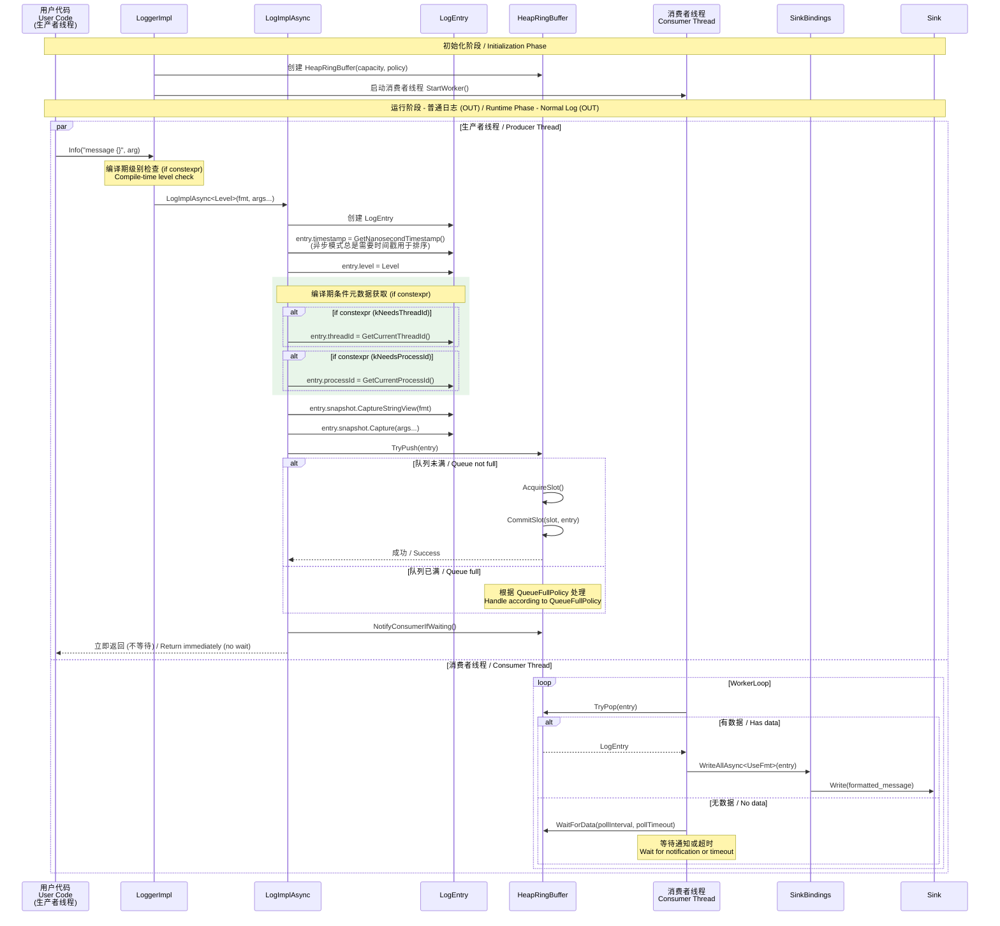
```mermaid
sequenceDiagram
    participant User as 用户代码<br/>User Code<br/>(生产者线程)
    participant Logger as LoggerImpl
    participant LogImplAsync as LogImplAsync
    participant Entry as LogEntry
    participant Buffer as HeapRingBuffer
    participant Consumer as 消费者线程<br/>Consumer Thread
    participant SinkBindings as SinkBindings
    participant Sink as Sink

    Note over User,Sink: 初始化阶段 / Initialization Phase
    Logger->>Buffer: 创建 HeapRingBuffer(capacity, policy)
    Logger->>Consumer: 启动消费者线程 StartWorker()
    
    Note over User,Sink: 运行阶段 - 普通日志 (OUT) / Runtime Phase - Normal Log (OUT)
    
    par 生产者线程 / Producer Thread
        User->>Logger: Info("message {}", arg)
        
        Note over Logger: 编译期级别检查 (if constexpr)<br/>Compile-time level check
        
        Logger->>LogImplAsync: LogImplAsync<Level>(fmt, args...)
        
        LogImplAsync->>Entry: 创建 LogEntry
        LogImplAsync->>Entry: entry.timestamp = GetNanosecondTimestamp()<br/>(异步模式总是需要时间戳用于排序)
        LogImplAsync->>Entry: entry.level = Level
        
        rect rgb(232, 245, 233)
            Note over LogImplAsync,Entry: 编译期条件元数据获取 (if constexpr)
            alt if constexpr (kNeedsThreadId)
                LogImplAsync->>Entry: entry.threadId = GetCurrentThreadId()
            end
            
            alt if constexpr (kNeedsProcessId)
                LogImplAsync->>Entry: entry.processId = GetCurrentProcessId()
            end
        end
        
        LogImplAsync->>Entry: entry.snapshot.CaptureStringView(fmt)
        LogImplAsync->>Entry: entry.snapshot.Capture(args...)
        
        LogImplAsync->>Buffer: TryPush(entry)
        
        alt 队列未满 / Queue not full
            Buffer->>Buffer: AcquireSlot()
            Buffer->>Buffer: CommitSlot(slot, entry)
            Buffer-->>LogImplAsync: 成功 / Success
        else 队列已满 / Queue full
            Note over Buffer: 根据 QueueFullPolicy 处理<br/>Handle according to QueueFullPolicy
        end
        
        LogImplAsync->>Buffer: NotifyConsumerIfWaiting()
        LogImplAsync-->>User: 立即返回 (不等待) / Return immediately (no wait)
        
    and 消费者线程 / Consumer Thread
        loop WorkerLoop
            Consumer->>Buffer: TryPop(entry)
            
            alt 有数据 / Has data
                Buffer-->>Consumer: LogEntry
                Consumer->>SinkBindings: WriteAllAsync<UseFmt>(entry)
                SinkBindings->>Sink: Write(formatted_message)
            else 无数据 / No data
                Consumer->>Buffer: WaitForData(pollInterval, pollTimeout)
                Note over Consumer: 等待通知或超时<br/>Wait for notification or timeout
            end
        end
    end
```

### WFC 日志详细流程 / WFC Log Detailed Flow

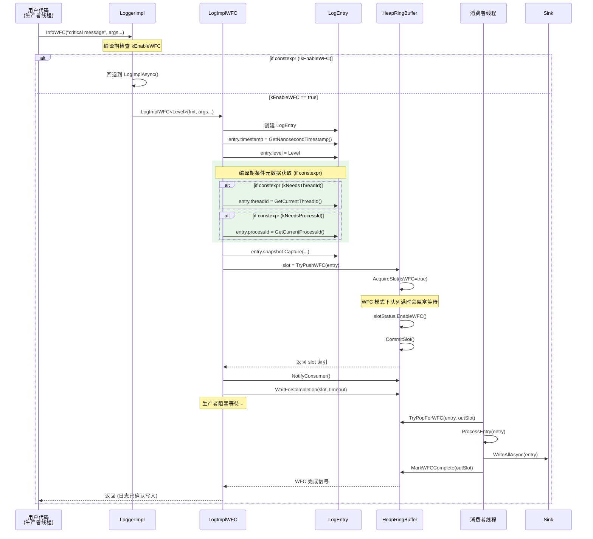
```mermaid
sequenceDiagram
    participant User as 用户代码<br/>(生产者线程)
    participant Logger as LoggerImpl
    participant LogImplWFC as LogImplWFC
    participant Entry as LogEntry
    participant Buffer as HeapRingBuffer
    participant Consumer as 消费者线程
    participant Sink as Sink

    User->>Logger: InfoWFC("critical message", args...)
    
    Note over Logger: 编译期检查 kEnableWFC
    
    alt if constexpr (!kEnableWFC)
        Logger->>Logger: 回退到 LogImplAsync()
    else kEnableWFC == true
        Logger->>LogImplWFC: LogImplWFC<Level>(fmt, args...)
        
        LogImplWFC->>Entry: 创建 LogEntry
        LogImplWFC->>Entry: entry.timestamp = GetNanosecondTimestamp()
        LogImplWFC->>Entry: entry.level = Level
        
        rect rgb(232, 245, 233)
            Note over LogImplWFC,Entry: 编译期条件元数据获取 (if constexpr)
            alt if constexpr (kNeedsThreadId)
                LogImplWFC->>Entry: entry.threadId = GetCurrentThreadId()
            end
            alt if constexpr (kNeedsProcessId)
                LogImplWFC->>Entry: entry.processId = GetCurrentProcessId()
            end
        end
        
        LogImplWFC->>Entry: entry.snapshot.Capture(...)
        
        LogImplWFC->>Buffer: slot = TryPushWFC(entry)
        Buffer->>Buffer: AcquireSlot(isWFC=true)
        Note over Buffer: WFC 模式下队列满时会阻塞等待
        Buffer->>Buffer: slotStatus.EnableWFC()
        Buffer->>Buffer: CommitSlot()
        Buffer-->>LogImplWFC: 返回 slot 索引
        
        LogImplWFC->>Buffer: NotifyConsumer()
        
        LogImplWFC->>Buffer: WaitForCompletion(slot, timeout)
        Note over LogImplWFC: 生产者阻塞等待...
        
        Consumer->>Buffer: TryPopForWFC(entry, outSlot)
        Consumer->>Consumer: ProcessEntry(entry)
        Consumer->>Sink: WriteAllAsync(entry)
        Consumer->>Buffer: MarkWFCComplete(outSlot)
        
        Buffer-->>LogImplWFC: WFC 完成信号
        LogImplWFC-->>User: 返回 (日志已确认写入)
    end
```

### 完整的日志写入流程 / Complete Log Write Flow

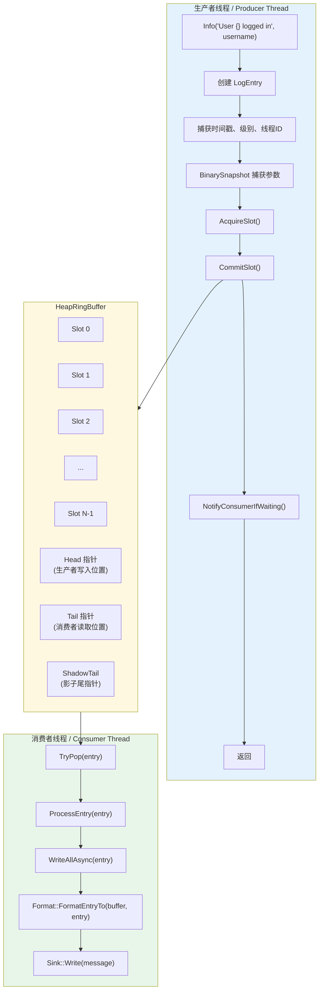
```mermaid
flowchart TB
    subgraph Producer["生产者线程 / Producer Thread"]
        P1["Info('User {} logged in', username)"]
        P2["创建 LogEntry"]
        P3["捕获时间戳、级别、线程ID"]
        P4["BinarySnapshot 捕获参数"]
        P5["AcquireSlot()"]
        P6["CommitSlot()"]
        P7["NotifyConsumerIfWaiting()"]
        P8["返回"]
        
        P1 --> P2 --> P3 --> P4 --> P5 --> P6 --> P7 --> P8
    end
    
    subgraph Buffer["HeapRingBuffer"]
        B1["Slot 0"]
        B2["Slot 1"]
        B3["Slot 2"]
        B4["..."]
        B5["Slot N-1"]
        
        Head["Head 指针<br/>(生产者写入位置)"]
        Tail["Tail 指针<br/>(消费者读取位置)"]
        Shadow["ShadowTail<br/>(影子尾指针)"]
    end
    
    subgraph Consumer["消费者线程 / Consumer Thread"]
        C1["TryPop(entry)"]
        C2["ProcessEntry(entry)"]
        C3["WriteAllAsync(entry)"]
        C4["Format::FormatEntryTo(buffer, entry)"]
        C5["Sink::Write(message)"]
        
        C1 --> C2 --> C3 --> C4 --> C5
    end
    
    P6 --> Buffer
    Buffer --> C1
    
    style Producer fill:#e3f2fd
    style Buffer fill:#fff8e1
    style Consumer fill:#e8f5e9
```

## 数据流程图 / Data Flow Diagram

### HeapRingBuffer 入队到出队处理 / HeapRingBuffer Enqueue to Dequeue

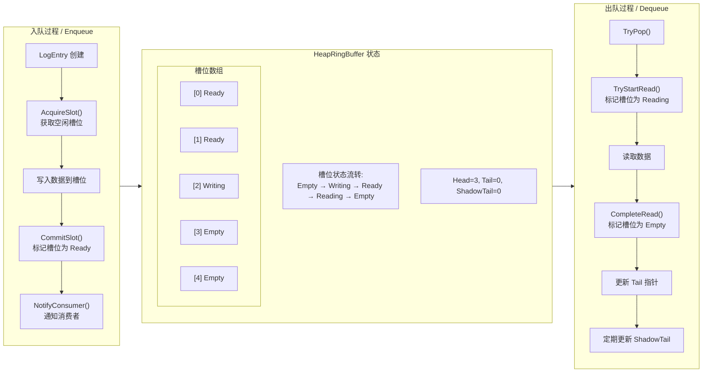
```mermaid
flowchart LR
    subgraph Enqueue["入队过程 / Enqueue"]
        direction TB
        E1["LogEntry 创建"]
        E2["AcquireSlot()<br/>获取空闲槽位"]
        E3["写入数据到槽位"]
        E4["CommitSlot()<br/>标记槽位为 Ready"]
        E5["NotifyConsumer()<br/>通知消费者"]
        
        E1 --> E2 --> E3 --> E4 --> E5
    end
    
    subgraph RingBuffer["HeapRingBuffer 状态"]
        direction TB
        States["槽位状态流转:<br/>Empty → Writing → Ready → Reading → Empty"]
        
        subgraph Slots["槽位数组"]
            S0["[0] Ready"]
            S1["[1] Ready"]
            S2["[2] Writing"]
            S3["[3] Empty"]
            S4["[4] Empty"]
        end
        
        Pointers["Head=3, Tail=0, ShadowTail=0"]
    end
    
    subgraph Dequeue["出队过程 / Dequeue"]
        direction TB
        D1["TryPop()"]
        D2["TryStartRead()<br/>标记槽位为 Reading"]
        D3["读取数据"]
        D4["CompleteRead()<br/>标记槽位为 Empty"]
        D5["更新 Tail 指针"]
        D6["定期更新 ShadowTail"]
        
        D1 --> D2 --> D3 --> D4 --> D5 --> D6
    end
    
    Enqueue --> RingBuffer --> Dequeue
```

### 槽位状态机 / Slot State Machine

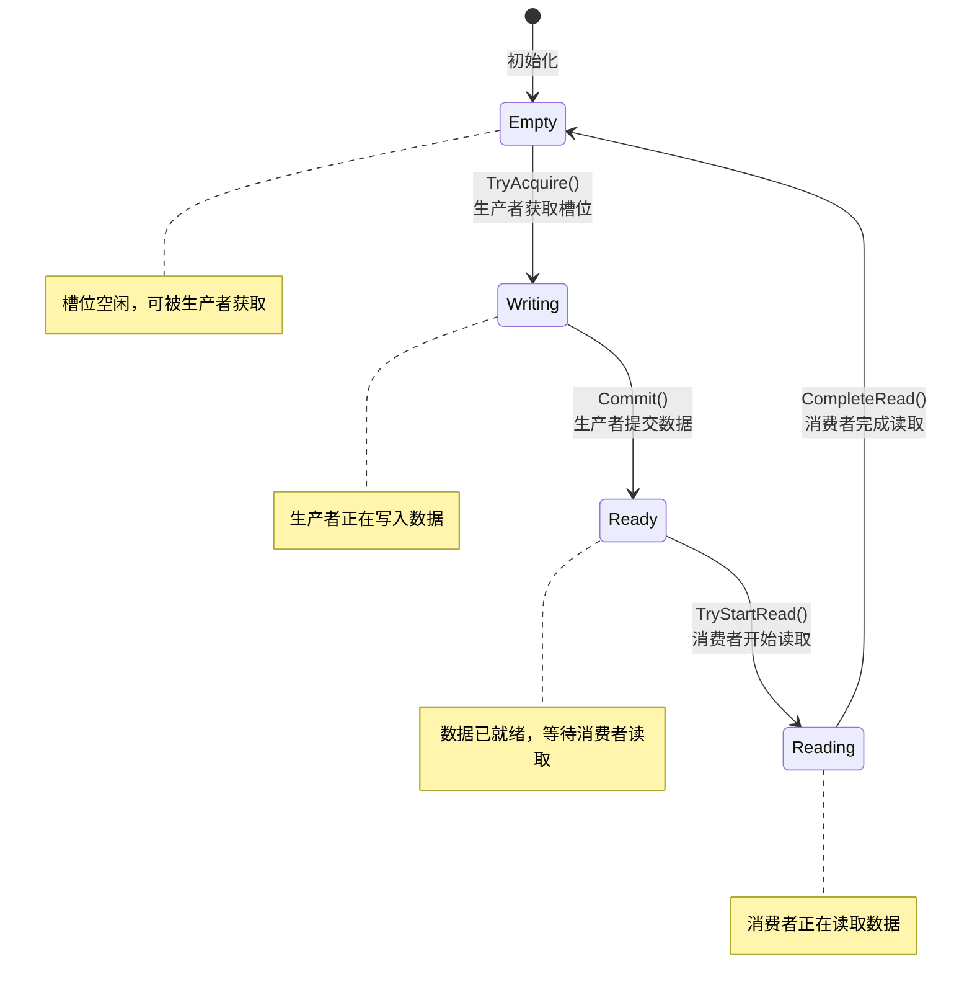
```mermaid
stateDiagram-v2
    [*] --> Empty: 初始化
    
    Empty --> Writing: TryAcquire()<br/>生产者获取槽位
    Writing --> Ready: Commit()<br/>生产者提交数据
    Ready --> Reading: TryStartRead()<br/>消费者开始读取
    Reading --> Empty: CompleteRead()<br/>消费者完成读取
    
    note right of Empty: 槽位空闲，可被生产者获取
    note right of Writing: 生产者正在写入数据
    note right of Ready: 数据已就绪，等待消费者读取
    note right of Reading: 消费者正在读取数据
```

## HeapRingBuffer 无锁操作机制 / Lock-free Operation Mechanism

### 原子操作和内存序 / Atomic Operations and Memory Ordering

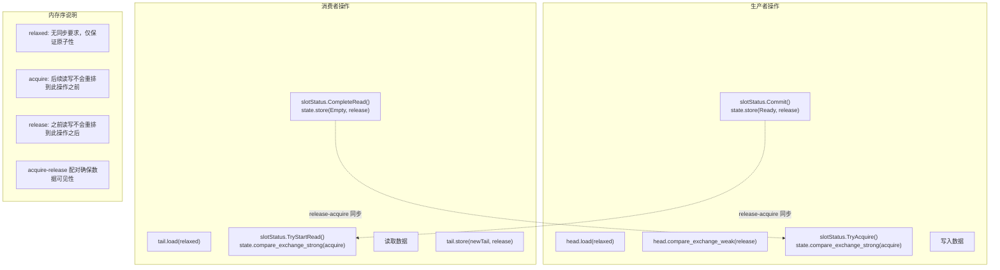
```mermaid
flowchart TB
    subgraph Producer["生产者操作"]
        PA1["head.load(relaxed)"]
        PA2["head.compare_exchange_weak(release)"]
        PA3["slotStatus.TryAcquire()<br/>state.compare_exchange_strong(acquire)"]
        PA4["写入数据"]
        PA5["slotStatus.Commit()<br/>state.store(Ready, release)"]
    end
    
    subgraph Consumer["消费者操作"]
        CA1["tail.load(relaxed)"]
        CA2["slotStatus.TryStartRead()<br/>state.compare_exchange_strong(acquire)"]
        CA3["读取数据"]
        CA4["slotStatus.CompleteRead()<br/>state.store(Empty, release)"]
        CA5["tail.store(newTail, release)"]
    end
    
    subgraph MemoryOrder["内存序说明"]
        MO1["relaxed: 无同步要求，仅保证原子性"]
        MO2["acquire: 后续读写不会重排到此操作之前"]
        MO3["release: 之前读写不会重排到此操作之后"]
        MO4["acquire-release 配对确保数据可见性"]
    end
    
    PA5 -.->|"release-acquire 同步"| CA2
    CA4 -.->|"release-acquire 同步"| PA3
```

### 缓存行对齐 / Cache Line Alignment

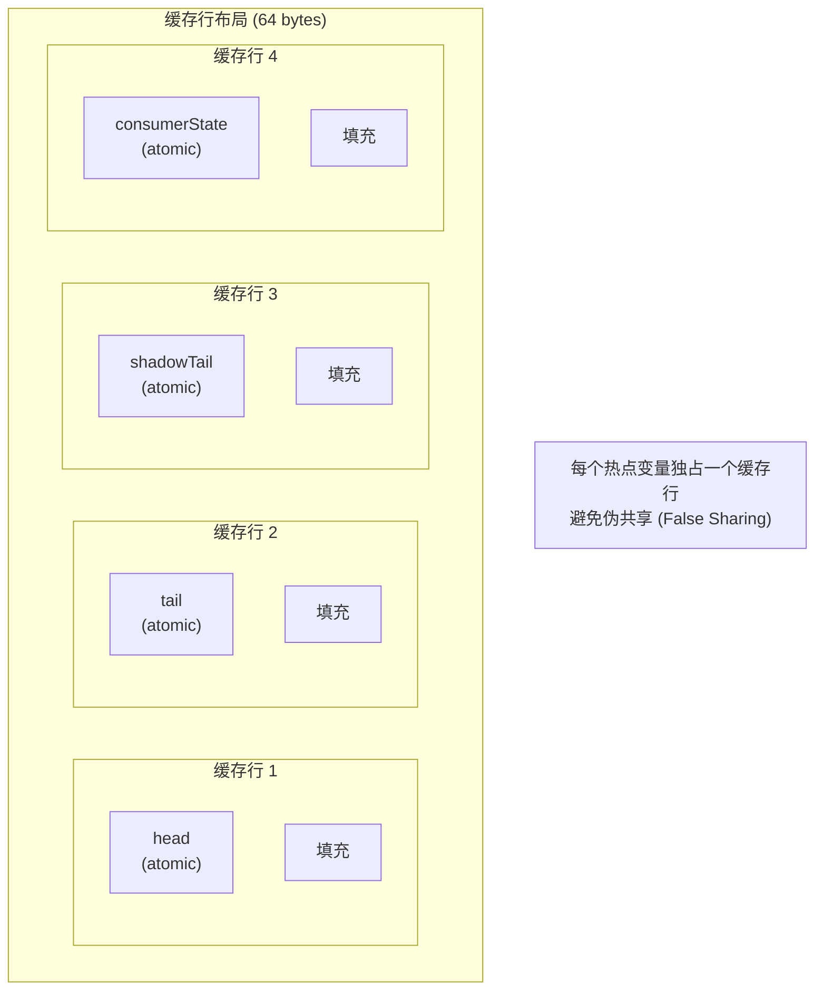
```mermaid
flowchart TB
    subgraph CacheLine["缓存行布局 (64 bytes)"]
        direction LR
        
        subgraph Line1["缓存行 1"]
            Head["head<br/>(atomic<size_t>)"]
            Pad1["填充"]
        end
        
        subgraph Line2["缓存行 2"]
            Tail["tail<br/>(atomic<size_t>)"]
            Pad2["填充"]
        end
        
        subgraph Line3["缓存行 3"]
            ShadowTail["shadowTail<br/>(atomic<size_t>)"]
            Pad3["填充"]
        end
        
        subgraph Line4["缓存行 4"]
            ConsumerState["consumerState<br/>(atomic<ConsumerState>)"]
            Pad4["填充"]
        end
    end
    
    Note1["每个热点变量独占一个缓存行<br/>避免伪共享 (False Sharing)"]
```

## ShadowTail 优化工作原理 / ShadowTail Optimization

### 问题背景 / Problem Background

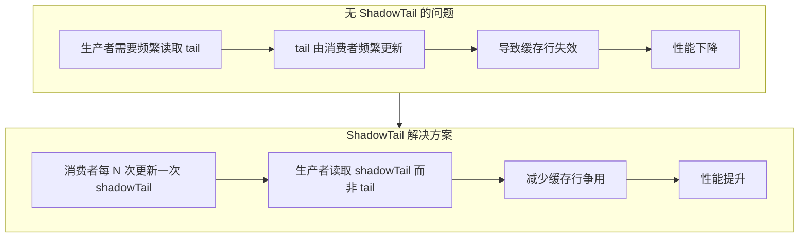
```mermaid
flowchart TB
    subgraph Problem["无 ShadowTail 的问题"]
        P1["生产者需要频繁读取 tail"]
        P2["tail 由消费者频繁更新"]
        P3["导致缓存行失效"]
        P4["性能下降"]
        
        P1 --> P2 --> P3 --> P4
    end
    
    subgraph Solution["ShadowTail 解决方案"]
        S1["消费者每 N 次更新一次 shadowTail"]
        S2["生产者读取 shadowTail 而非 tail"]
        S3["减少缓存行争用"]
        S4["性能提升"]
        
        S1 --> S2 --> S3 --> S4
    end
    
    Problem --> Solution
```

### ShadowTail 工作流程 / ShadowTail Workflow

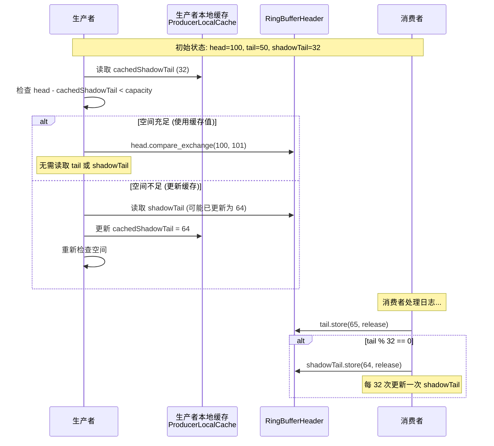
```mermaid
sequenceDiagram
    participant Producer as 生产者
    participant Cache as 生产者本地缓存<br/>ProducerLocalCache
    participant Header as RingBufferHeader
    participant Consumer as 消费者

    Note over Producer,Consumer: 初始状态: head=100, tail=50, shadowTail=32

    Producer->>Cache: 读取 cachedShadowTail (32)
    Producer->>Producer: 检查 head - cachedShadowTail < capacity
    
    alt 空间充足 (使用缓存值)
        Producer->>Header: head.compare_exchange(100, 101)
        Note over Producer: 无需读取 tail 或 shadowTail
    else 空间不足 (更新缓存)
        Producer->>Header: 读取 shadowTail (可能已更新为 64)
        Producer->>Cache: 更新 cachedShadowTail = 64
        Producer->>Producer: 重新检查空间
    end
    
    Note over Consumer: 消费者处理日志...
    Consumer->>Header: tail.store(65, release)
    
    alt tail % 32 == 0
        Consumer->>Header: shadowTail.store(64, release)
        Note over Consumer: 每 32 次更新一次 shadowTail
    end
```

### ShadowTail 更新间隔 / ShadowTail Update Interval

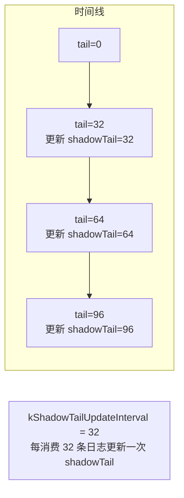
```mermaid
flowchart LR
    subgraph Timeline["时间线"]
        T0["tail=0"]
        T32["tail=32<br/>更新 shadowTail=32"]
        T64["tail=64<br/>更新 shadowTail=64"]
        T96["tail=96<br/>更新 shadowTail=96"]
        
        T0 --> T32 --> T64 --> T96
    end
    
    Note1["kShadowTailUpdateInterval = 32<br/>每消费 32 条日志更新一次 shadowTail"]
```

## QueueFullPolicy 各策略处理流程 / QueueFullPolicy Strategies

### 策略概览 / Strategy Overview

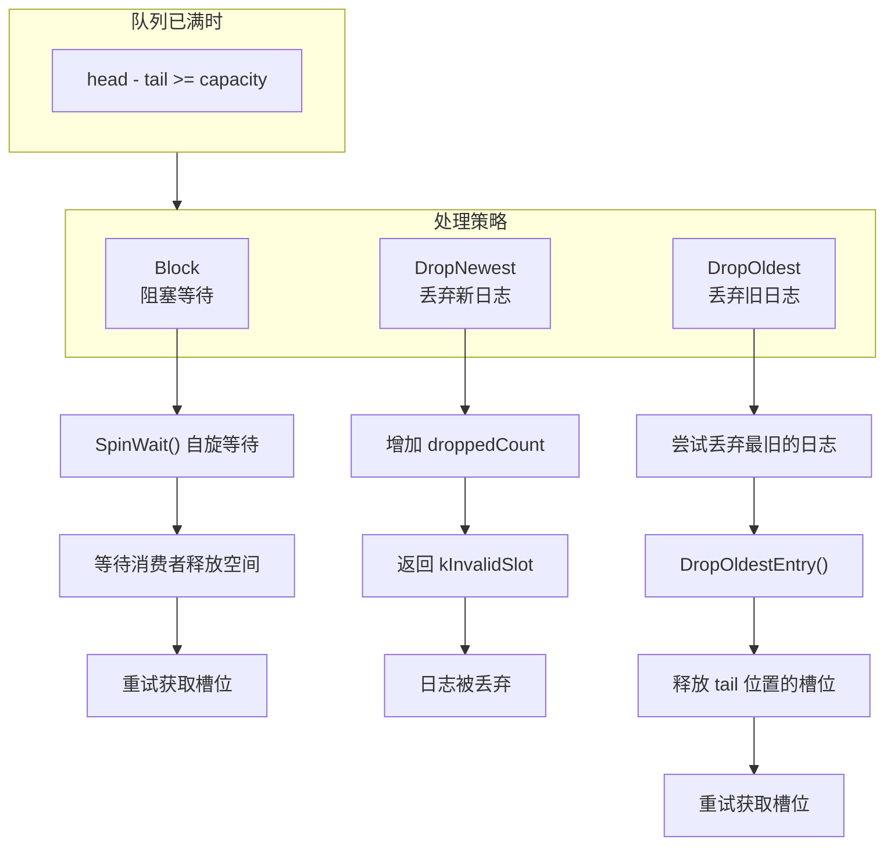
```mermaid
flowchart TB
    subgraph QueueFull["队列已满时"]
        Check["head - tail >= capacity"]
    end
    
    subgraph Policies["处理策略"]
        Block["Block<br/>阻塞等待"]
        DropNewest["DropNewest<br/>丢弃新日志"]
        DropOldest["DropOldest<br/>丢弃旧日志"]
    end
    
    QueueFull --> Policies
    
    Block --> B1["SpinWait() 自旋等待"]
    B1 --> B2["等待消费者释放空间"]
    B2 --> B3["重试获取槽位"]
    
    DropNewest --> DN1["增加 droppedCount"]
    DN1 --> DN2["返回 kInvalidSlot"]
    DN2 --> DN3["日志被丢弃"]
    
    DropOldest --> DO1["尝试丢弃最旧的日志"]
    DO1 --> DO2["DropOldestEntry()"]
    DO2 --> DO3["释放 tail 位置的槽位"]
    DO3 --> DO4["重试获取槽位"]
```

### Block 策略详细流程 / Block Strategy Detail

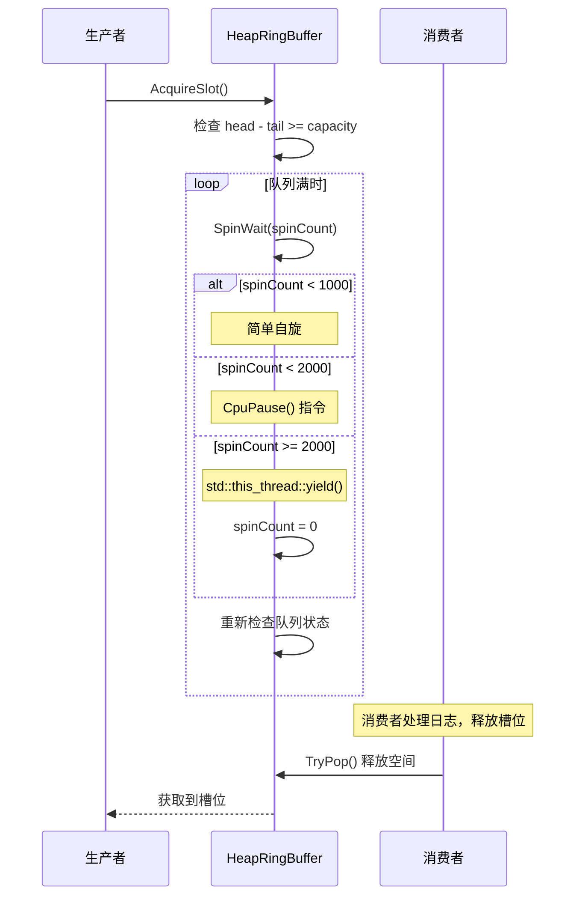
```mermaid
sequenceDiagram
    participant Producer as 生产者
    participant Buffer as HeapRingBuffer
    participant Consumer as 消费者

    Producer->>Buffer: AcquireSlot()
    Buffer->>Buffer: 检查 head - tail >= capacity
    
    loop 队列满时
        Buffer->>Buffer: SpinWait(spinCount)
        
        alt spinCount < 1000
            Note over Buffer: 简单自旋
        else spinCount < 2000
            Note over Buffer: CpuPause() 指令
        else spinCount >= 2000
            Note over Buffer: std::this_thread::yield()
            Buffer->>Buffer: spinCount = 0
        end
        
        Buffer->>Buffer: 重新检查队列状态
    end
    
    Note over Consumer: 消费者处理日志，释放槽位
    Consumer->>Buffer: TryPop() 释放空间
    
    Buffer-->>Producer: 获取到槽位
```

### DropNewest 策略详细流程 / DropNewest Strategy Detail

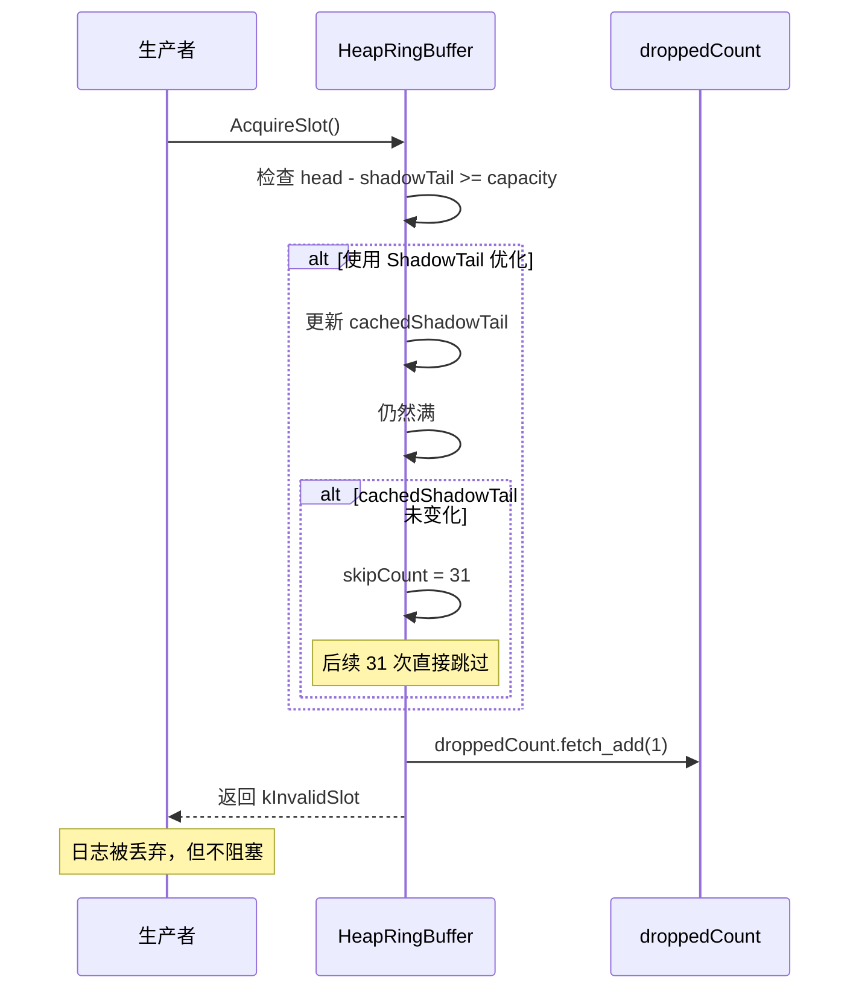
```mermaid
sequenceDiagram
    participant Producer as 生产者
    participant Buffer as HeapRingBuffer
    participant Counter as droppedCount

    Producer->>Buffer: AcquireSlot()
    Buffer->>Buffer: 检查 head - shadowTail >= capacity
    
    alt 使用 ShadowTail 优化
        Buffer->>Buffer: 更新 cachedShadowTail
        Buffer->>Buffer: 仍然满
        
        alt cachedShadowTail 未变化
            Buffer->>Buffer: skipCount = 31
            Note over Buffer: 后续 31 次直接跳过
        end
    end
    
    Buffer->>Counter: droppedCount.fetch_add(1)
    Buffer-->>Producer: 返回 kInvalidSlot
    
    Note over Producer: 日志被丢弃，但不阻塞
```

### DropOldest 策略详细流程 / DropOldest Strategy Detail

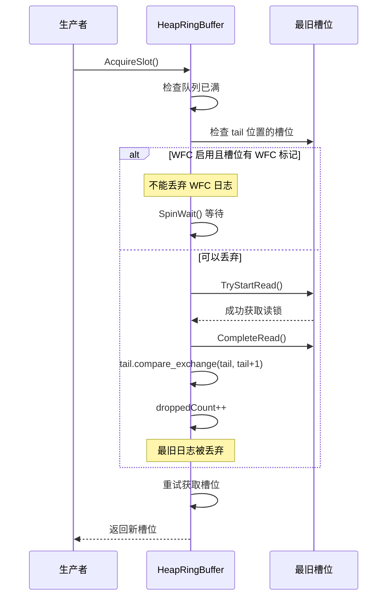
```mermaid
sequenceDiagram
    participant Producer as 生产者
    participant Buffer as HeapRingBuffer
    participant OldSlot as 最旧槽位

    Producer->>Buffer: AcquireSlot()
    Buffer->>Buffer: 检查队列已满
    
    Buffer->>OldSlot: 检查 tail 位置的槽位
    
    alt WFC 启用且槽位有 WFC 标记
        Note over Buffer: 不能丢弃 WFC 日志
        Buffer->>Buffer: SpinWait() 等待
    else 可以丢弃
        Buffer->>OldSlot: TryStartRead()
        OldSlot-->>Buffer: 成功获取读锁
        Buffer->>OldSlot: CompleteRead()
        Buffer->>Buffer: tail.compare_exchange(tail, tail+1)
        Buffer->>Buffer: droppedCount++
        Note over Buffer: 最旧日志被丢弃
    end
    
    Buffer->>Buffer: 重试获取槽位
    Buffer-->>Producer: 返回新槽位
```

## WFC (Wait For Completion) 支持 / WFC Support

### 普通日志 vs WFC 日志对比 / Normal Log vs WFC Log Comparison

| 特性 | 普通日志 (OUT) | WFC 日志 |
|------|---------------|----------|
| API | `Info()`, `Debug()`, etc. | `InfoWFC()`, `DebugWFC()`, etc. |
| 返回时机 | 入队后立即返回 | 日志写入 Sink 后返回 |
| 阻塞行为 | 非阻塞 | 阻塞等待完成 |
| 队列满处理 | 根据 Policy 处理 | 始终阻塞等待 |
| 适用场景 | 普通日志 | 关键日志、审计日志 |
| 编译期要求 | 无 | `kEnableWFC = true` |

### WFC 工作流程 / WFC Workflow

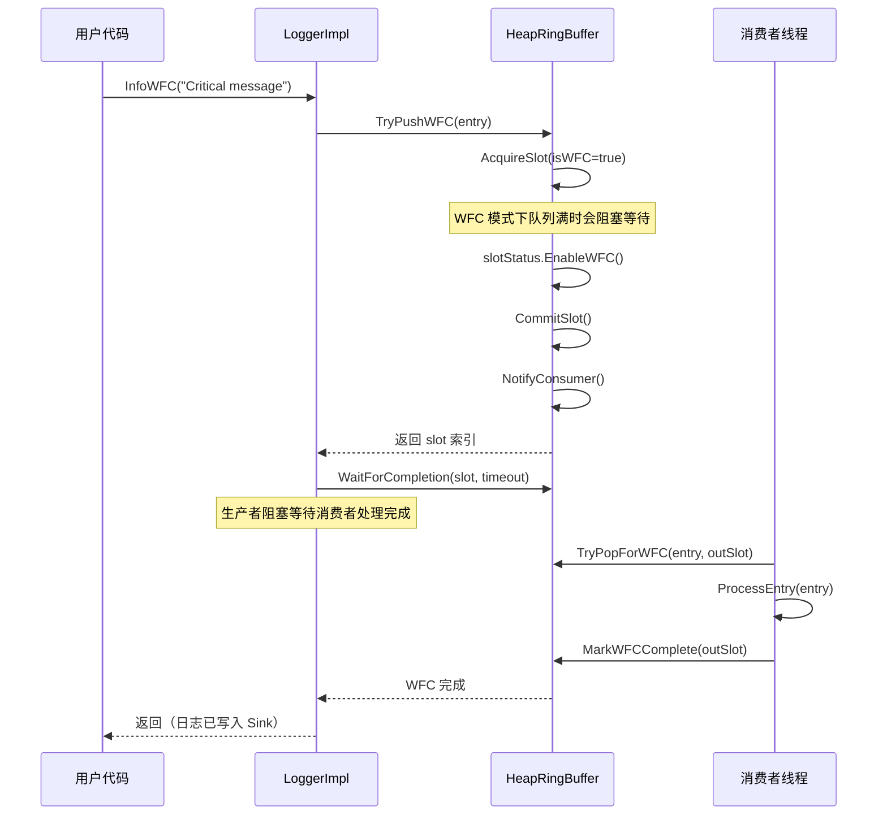
```mermaid
sequenceDiagram
    participant User as 用户代码
    participant Logger as LoggerImpl
    participant Buffer as HeapRingBuffer
    participant Consumer as 消费者线程

    User->>Logger: InfoWFC("Critical message")
    Logger->>Buffer: TryPushWFC(entry)
    
    Buffer->>Buffer: AcquireSlot(isWFC=true)
    Note over Buffer: WFC 模式下队列满时会阻塞等待
    
    Buffer->>Buffer: slotStatus.EnableWFC()
    Buffer->>Buffer: CommitSlot()
    Buffer->>Buffer: NotifyConsumer()
    
    Buffer-->>Logger: 返回 slot 索引
    
    Logger->>Buffer: WaitForCompletion(slot, timeout)
    
    Note over Logger: 生产者阻塞等待消费者处理完成
    
    Consumer->>Buffer: TryPopForWFC(entry, outSlot)
    Consumer->>Consumer: ProcessEntry(entry)
    Consumer->>Buffer: MarkWFCComplete(outSlot)
    
    Buffer-->>Logger: WFC 完成
    Logger-->>User: 返回（日志已写入 Sink）
```

### WFC 状态流转 / WFC State Transitions

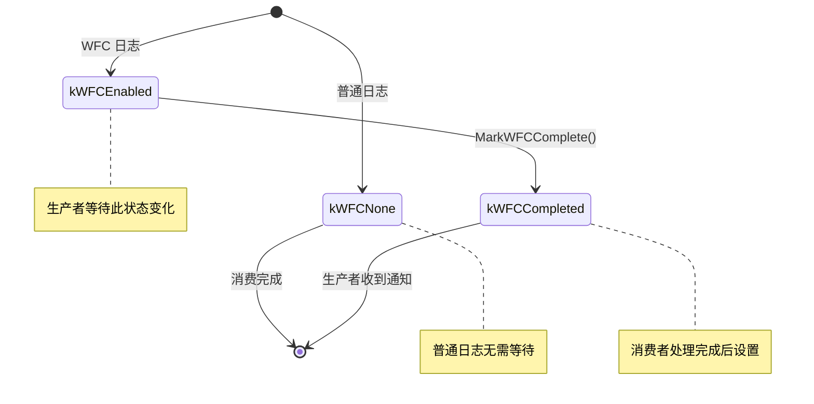
```mermaid
stateDiagram-v2
    [*] --> kWFCNone: 普通日志
    [*] --> kWFCEnabled: WFC 日志
    
    kWFCNone --> [*]: 消费完成
    
    kWFCEnabled --> kWFCCompleted: MarkWFCComplete()
    kWFCCompleted --> [*]: 生产者收到通知
    
    note right of kWFCNone: 普通日志无需等待
    note right of kWFCEnabled: 生产者等待此状态变化
    note right of kWFCCompleted: 消费者处理完成后设置
```

## 通知机制 / Notification Mechanism

### 平台特定实现 / Platform-specific Implementation

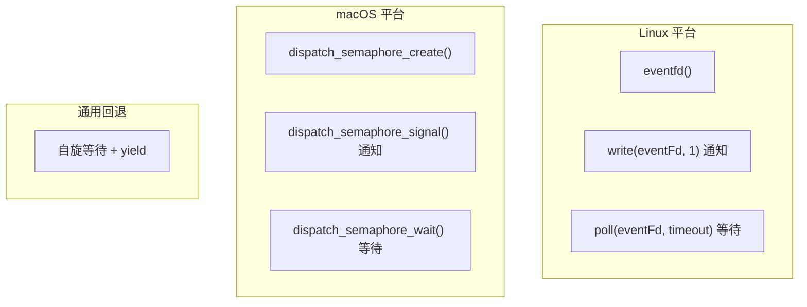
```mermaid
flowchart TB
    subgraph Linux["Linux 平台"]
        L1["eventfd()"]
        L2["write(eventFd, 1) 通知"]
        L3["poll(eventFd, timeout) 等待"]
    end
    
    subgraph macOS["macOS 平台"]
        M1["dispatch_semaphore_create()"]
        M2["dispatch_semaphore_signal() 通知"]
        M3["dispatch_semaphore_wait() 等待"]
    end
    
    subgraph Fallback["通用回退"]
        F1["自旋等待 + yield"]
    end
```

### 消费者等待流程 / Consumer Wait Flow

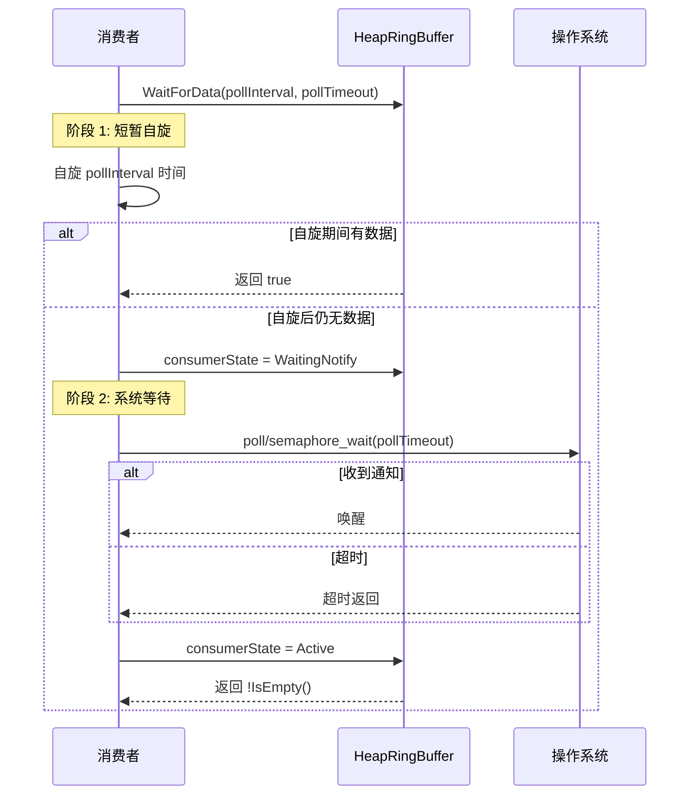
```mermaid
sequenceDiagram
    participant Consumer as 消费者
    participant Buffer as HeapRingBuffer
    participant OS as 操作系统

    Consumer->>Buffer: WaitForData(pollInterval, pollTimeout)
    
    Note over Consumer: 阶段 1: 短暂自旋
    Consumer->>Consumer: 自旋 pollInterval 时间
    
    alt 自旋期间有数据
        Buffer-->>Consumer: 返回 true
    else 自旋后仍无数据
        Consumer->>Buffer: consumerState = WaitingNotify
        
        Note over Consumer: 阶段 2: 系统等待
        Consumer->>OS: poll/semaphore_wait(pollTimeout)
        
        alt 收到通知
            OS-->>Consumer: 唤醒
        else 超时
            OS-->>Consumer: 超时返回
        end
        
        Consumer->>Buffer: consumerState = Active
        Buffer-->>Consumer: 返回 !IsEmpty()
    end
```

## 性能特点 / Performance Characteristics

| 特性 / Feature | 异步模式 / Async Mode |
|----------------|----------------------|
| 生产者延迟 / Producer Latency | 极低（仅入队）/ Very low (enqueue only) |
| 吞吐量 / Throughput | 高（批量处理）/ High (batch processing) |
| 内存使用 / Memory | 固定（队列容量）/ Fixed (queue capacity) |
| 线程安全 / Thread Safety | 无锁设计 / Lock-free design |
| 日志丢失 / Log Loss | 取决于策略 / Depends on policy |
| 适用场景 / Use Case | 高性能、生产环境 / High-performance, production |

## 相关需求 / Related Requirements

- 需求 2.1: 创建异步模式的控制流程图
- 需求 2.2: 创建异步模式的数据流程图
- 需求 2.3: 标注 HeapRingBuffer 的无锁操作机制
- 需求 2.4: 说明 ShadowTail 优化的工作原理
- 需求 2.5: 说明 QueueFullPolicy 各策略的处理流程
- 需求 2.6: 使用 Mermaid 格式创建可渲染的流程图
