# 多进程模式流程图文档 / Multi-Process Mode Flow Diagrams

本文档详细描述 oneplog 日志库多进程模式（MProc Mode）的控制流程和数据流程。

This document describes the control flow and data flow of oneplog's multi-process logging mode in detail.

## 概述 / Overview

多进程模式是 oneplog 的跨进程日志聚合模式。在此模式下，多个生产者进程可以将日志写入共享内存中的 SharedRingBuffer，由消费者进程统一处理和输出。

MProc mode is oneplog's cross-process log aggregation mode. In this mode, multiple producer processes can write logs to SharedRingBuffer in shared memory, which is then processed and output by a consumer process.

**特点 / Features:**
- 跨进程日志聚合 / Cross-process log aggregation
- 共享内存通信 / Shared memory communication
- 进程/模块名称注册 / Process/module name registration
- 配置同步 / Configuration synchronization

## 编译期元数据需求机制 / Compile-time Metadata Requirements

oneplog 使用 `if constexpr` 在编译期决定是否需要获取各种元数据。如果 Format 不需要某个元数据，相应的获取代码**不会被编译到最终二进制文件中**。

oneplog uses `if constexpr` to determine at compile-time whether to acquire various metadata. If a Format doesn't need certain metadata, the corresponding acquisition code **will not be compiled into the final binary**.

### 元数据需求配置 / Metadata Requirements Configuration

```mermaid
flowchart TB
    subgraph CompileTime["编译期配置 / Compile-time Configuration"]
        Format["Format 类型定义 Requirements"]
        
        subgraph Requirements["StaticFormatRequirements"]
            R1["kNeedsTimestamp: bool"]
            R2["kNeedsLevel: bool"]
            R3["kNeedsThreadId: bool"]
            R4["kNeedsProcessId: bool"]
            R5["kNeedsSourceLocation: bool"]
        end
        
        SinkBinding["SinkBinding<Sink, Format>"]
        SinkBindingList["SinkBindingList<Bindings...>"]
        
        subgraph Union["需求并集 (编译期计算)"]
            U1["kNeedsTimestamp = (B1::kNeedsTimestamp || B2::kNeedsTimestamp || ...)"]
            U2["kNeedsLevel = (B1::kNeedsLevel || B2::kNeedsLevel || ...)"]
            U3["kNeedsThreadId = (B1::kNeedsThreadId || B2::kNeedsThreadId || ...)"]
            U4["kNeedsProcessId = (B1::kNeedsProcessId || B2::kNeedsProcessId || ...)"]
            U5["kNeedsSourceLocation = (B1::kNeedsSourceLocation || B2::kNeedsSourceLocation || ...)"]
        end
    end
    
    Format --> Requirements
    Requirements --> SinkBinding
    SinkBinding --> SinkBindingList
    SinkBindingList --> Union
    
    style CompileTime fill:#e8f5e9
```

### 编译期代码生成 / Compile-time Code Generation

```cpp
// 多进程模式：timestamp 总是需要（用于日志排序）
// MProc mode: timestamp is always needed (for log ordering)
entry.timestamp = internal::GetNanosecondTimestamp();
entry.level = LogLevel;

// 编译期决定：如果 kNeedsThreadId 为 false，整个 if 块不会生成代码
// Compile-time decision: if kNeedsThreadId is false, the entire if block generates no code
if constexpr (kNeedsThreadId) {
    entry.threadId = internal::GetCurrentThreadId();   // 仅当需要时才编译
}
if constexpr (kNeedsProcessId) {
    entry.processId = internal::GetCurrentProcessId(); // 仅当需要时才编译
}
// 注意：MProc 模式下 PipelineThread 会在转发时添加 processId
// Note: In MProc mode, PipelineThread adds processId during forwarding
```

## 架构概览 / Architecture Overview

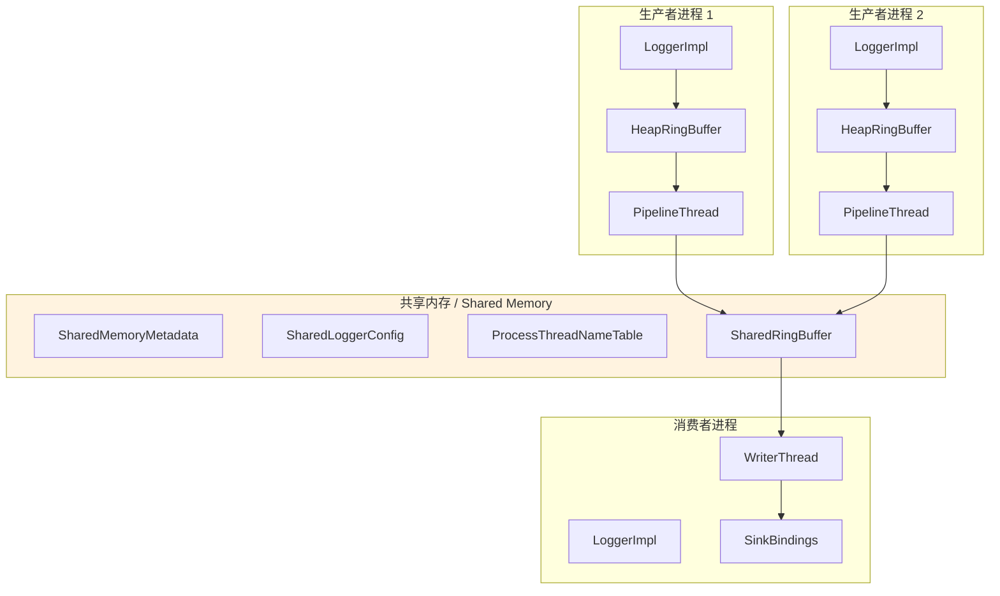

## 控制流程图 / Control Flow Diagram

### 普通日志 (OUT) vs WFC 日志流程对比 / Normal Log (OUT) vs WFC Log Flow Comparison

```mermaid
flowchart TB
    subgraph NormalLog["普通日志 (OUT) - 非阻塞"]
        N1["Info('message', args...)"]
        N2["LogImplAsync<Level>()"]
        N3["创建 LogEntry + 编译期条件元数据"]
        N4["HeapRingBuffer.TryPush()"]
        N5["立即返回<br/>(不等待 PipelineThread 或消费者)"]
        
        N1 --> N2 --> N3 --> N4 --> N5
    end
    
    subgraph WFCLog["WFC 日志 - 等待完成"]
        W1["InfoWFC('message', args...)"]
        W2["LogImplWFC<Level>()"]
        W3["创建 LogEntry + 编译期条件元数据"]
        W4["HeapRingBuffer.TryPushWFC()"]
        W5["等待 HeapRingBuffer 处理完成"]
        W6["(注意: MProc 模式下 WFC 仅等待到 HeapRingBuffer)"]
        
        W1 --> W2 --> W3 --> W4 --> W5 --> W6
    end
    
    style N5 fill:#c8e6c9
    style W5 fill:#fff9c4
```

### 生产者进程、消费者进程和 PipelineThread 的交互 / Interaction Between Producer, Consumer and PipelineThread

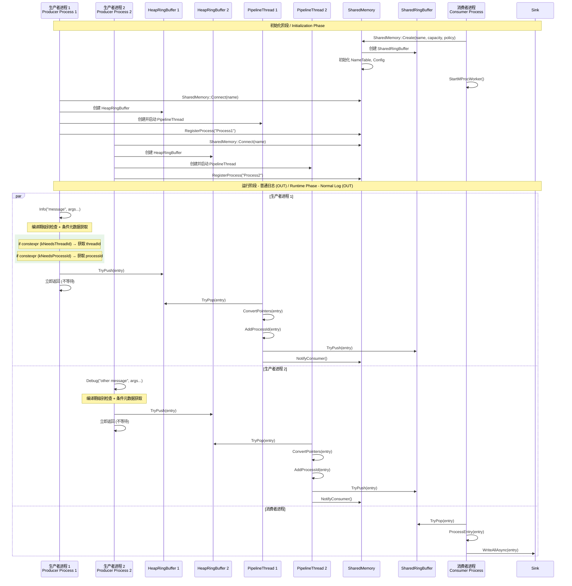

### 初始化流程详解 / Detailed Initialization Flow

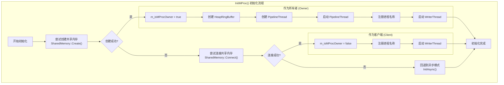

## 数据流程图 / Data Flow Diagram

### HeapRingBuffer → SharedRingBuffer → Sink 完整流程 / Complete Data Flow

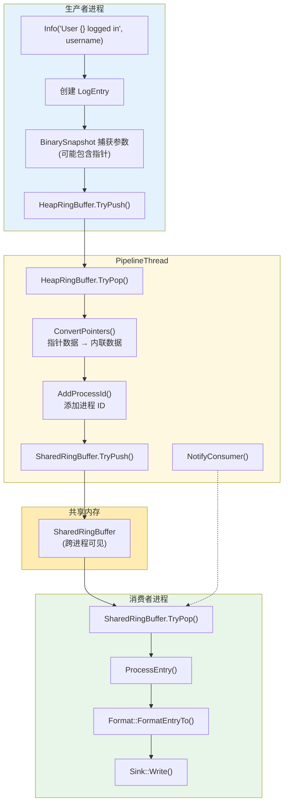

### 指针转换过程 / Pointer Conversion Process

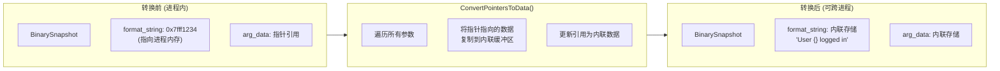

## 共享内存的创建、附加和同步机制 / Shared Memory Creation, Attachment and Synchronization

### 共享内存布局 / Shared Memory Layout

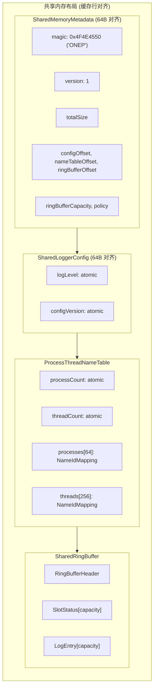

### 创建和连接流程 / Create and Connect Flow

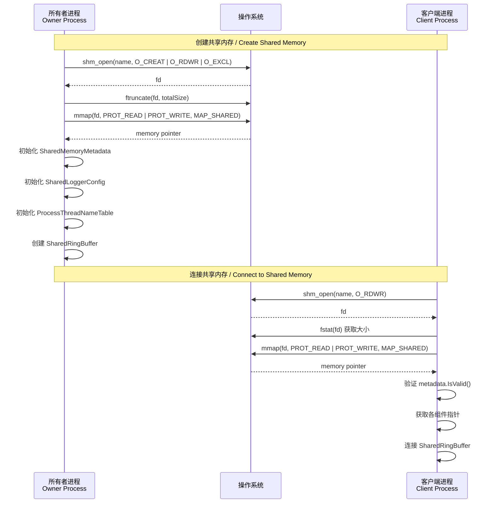

### 同步机制 / Synchronization Mechanism

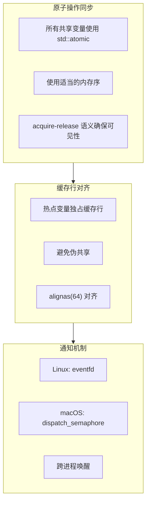

## ProcessThreadNameTable 的名称注册和查找机制 / Name Registration and Lookup

### 名称注册流程 / Name Registration Flow

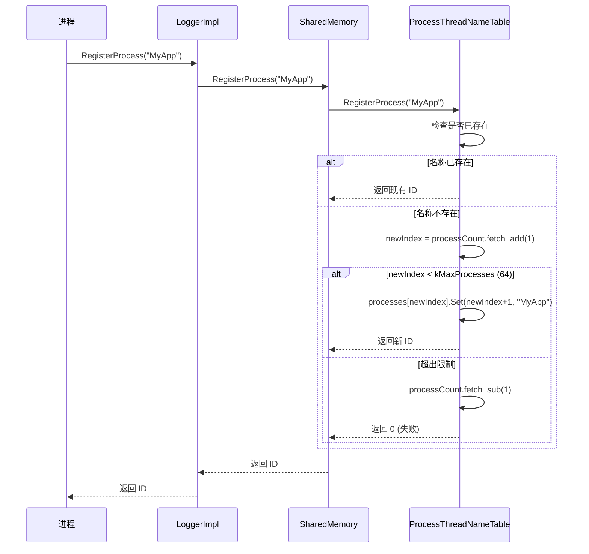

### NameIdMapping 结构 / NameIdMapping Structure

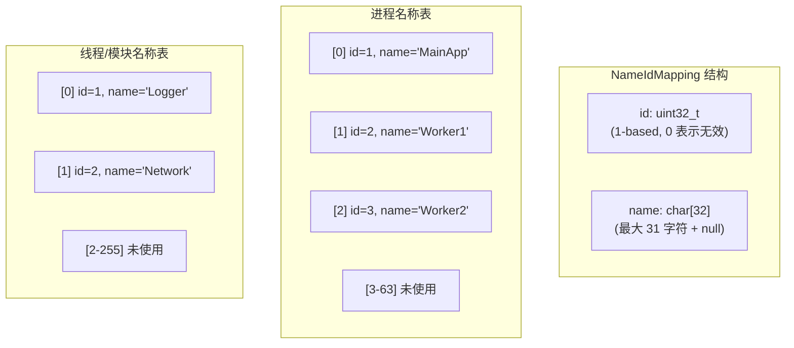

### 名称查找流程 / Name Lookup Flow

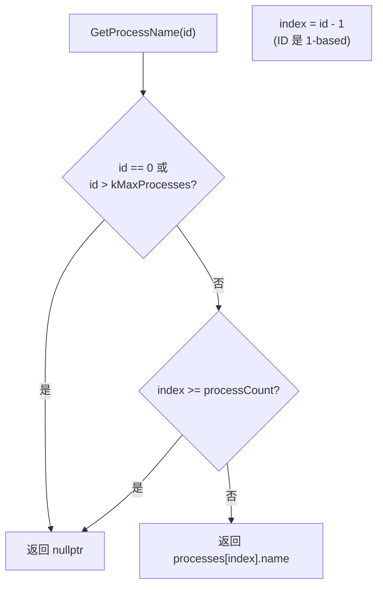

## SharedLoggerConfig 的配置同步方式 / Configuration Synchronization

### 配置结构 / Configuration Structure

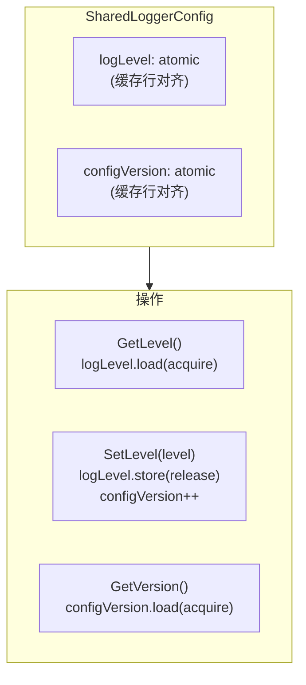

### 配置同步流程 / Configuration Sync Flow

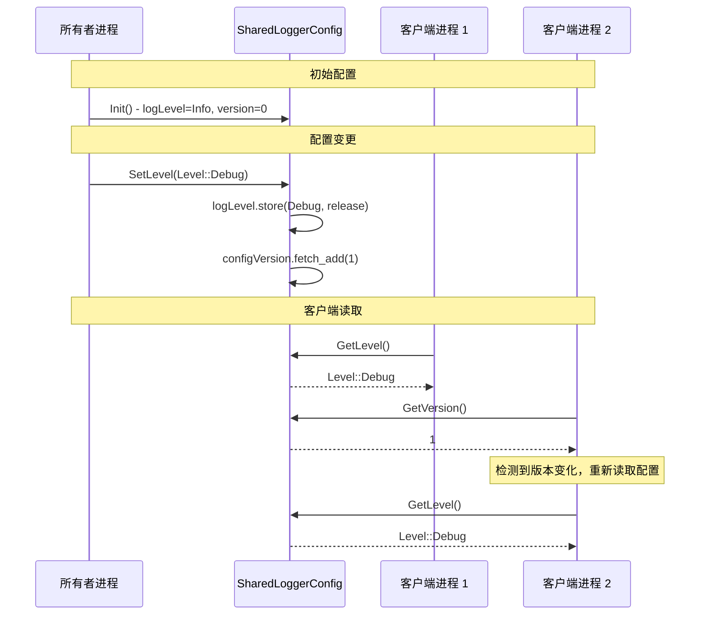

### 配置版本检测 / Configuration Version Detection

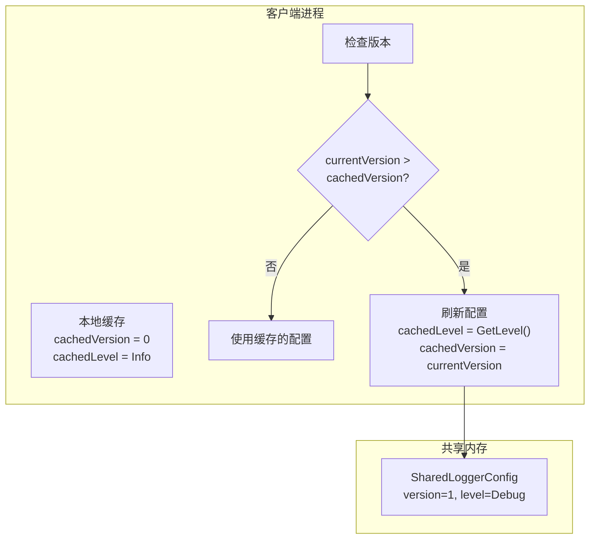

## PipelineThread 工作机制 / PipelineThread Mechanism

### PipelineThread 职责 / PipelineThread Responsibilities


### PipelineThread 主循环 / PipelineThread Main Loop

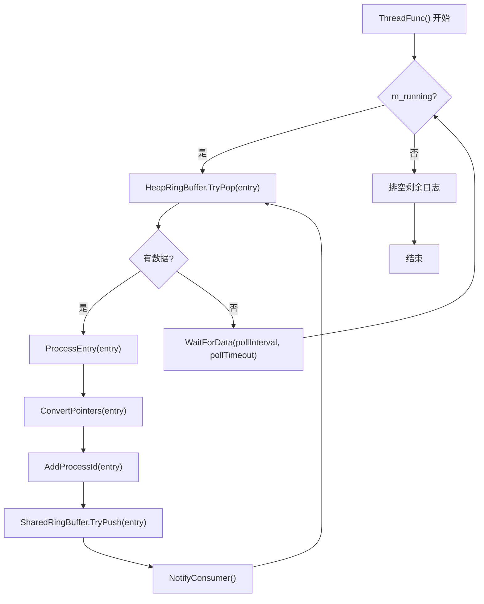

## WFC 在多进程模式下的行为 / WFC Behavior in MProc Mode

### WFC 限制说明 / WFC Limitations

在多进程模式下，WFC 的等待范围仅限于 HeapRingBuffer，不会等待 SharedRingBuffer 或最终 Sink 写入完成。

In MProc mode, WFC waiting scope is limited to HeapRingBuffer only, it does NOT wait for SharedRingBuffer or final Sink write completion.

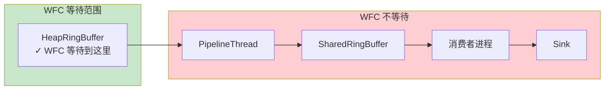

### WFC 多进程模式流程 / WFC MProc Mode Flow

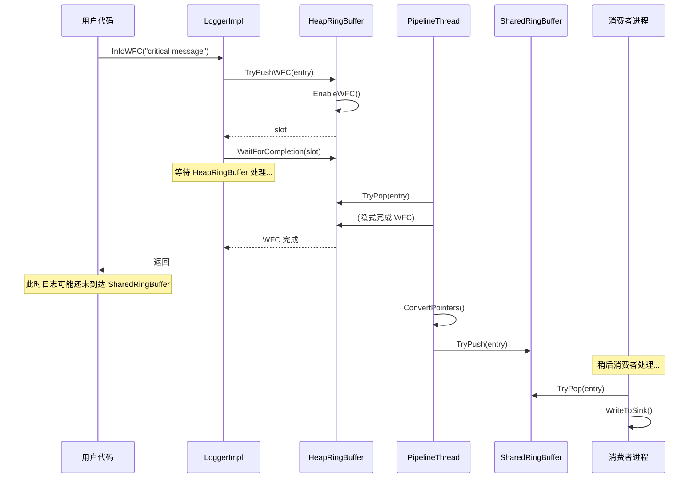

## 错误处理和回退机制 / Error Handling and Fallback

### 共享内存创建失败处理 / Shared Memory Creation Failure Handling

```mermaid
flowchart TB
    Start["InitMProc()"]
    
    Create["SharedMemory::Create()"]
    CreateOK{"创建成功?"}
    
    Connect["SharedMemory::Connect()"]
    ConnectOK{"连接成功?"}
    
    Fallback["回退到异步模式<br/>InitAsync()"]
    Warning["输出警告信息"]
    
    OwnerInit["作为所有者初始化"]
    ClientInit["作为客户端初始化"]
    
    End["初始化完成"]
    
    Start --> Create
    Create --> CreateOK
    
    CreateOK -->|是| OwnerInit --> End
    CreateOK -->|否| Connect
    
    Connect --> ConnectOK
    ConnectOK -->|是| ClientInit --> End
    ConnectOK -->|否| Warning --> Fallback --> End
    
    style Fallback fill:#ffcdd2
    style Warning fill:#fff9c4
```

## 性能特点 / Performance Characteristics

| 特性 / Feature | 多进程模式 / MProc Mode |
|----------------|------------------------|
| 跨进程通信 / IPC | 共享内存（最快）/ Shared memory (fastest) |
| 延迟 / Latency | 中等（两级队列）/ Medium (two-level queue) |
| 吞吐量 / Throughput | 高（批量传输）/ High (batch transfer) |
| 内存使用 / Memory | 共享内存 + 进程内队列 / Shared + per-process |
| 进程数限制 / Process Limit | 64 个进程 / 64 processes |
| 模块数限制 / Module Limit | 256 个模块 / 256 modules |
| 适用场景 / Use Case | 微服务、多进程应用 / Microservices, multi-process apps |

## 相关需求 / Related Requirements

- 需求 3.1: 创建多进程模式的控制流程图
- 需求 3.2: 创建多进程模式的数据流程图
- 需求 3.3: 标注共享内存的创建、附加和同步机制
- 需求 3.4: 说明 ProcessThreadNameTable 的名称注册和查找机制
- 需求 3.5: 说明 SharedLoggerConfig 的配置同步方式
- 需求 3.6: 使用 Mermaid 格式创建可渲染的流程图
