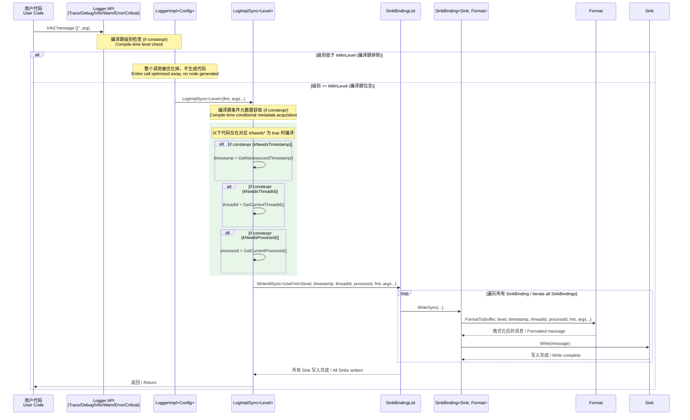
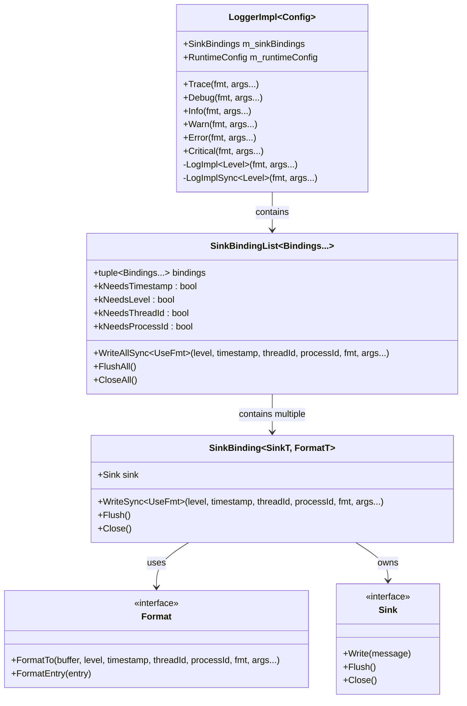
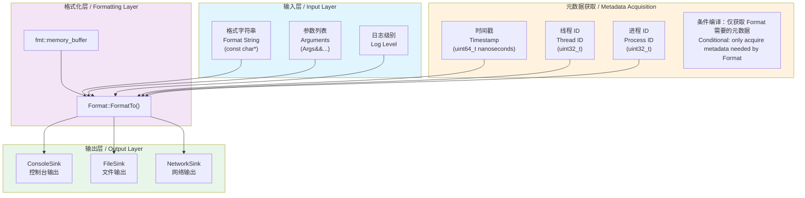
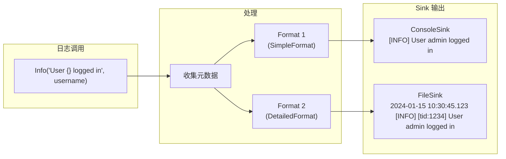
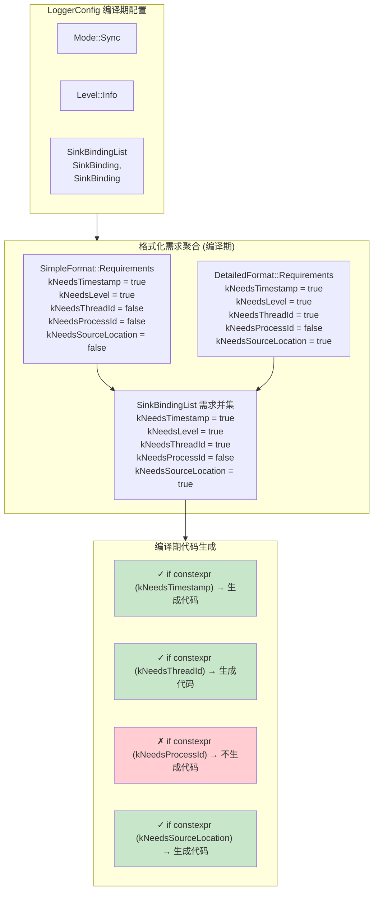
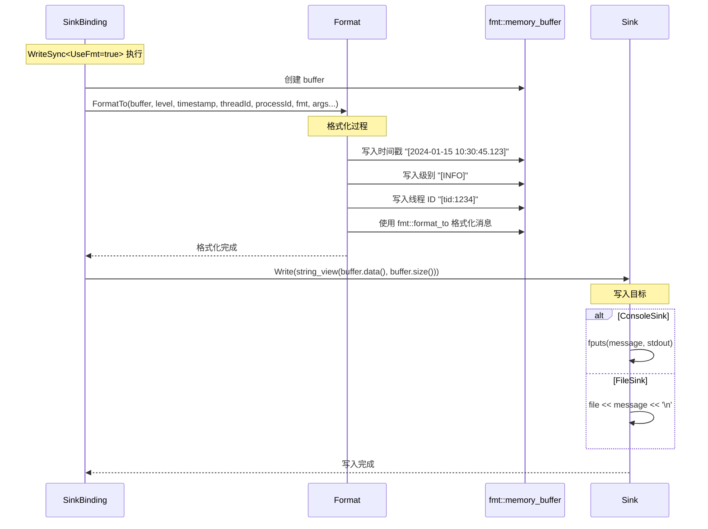
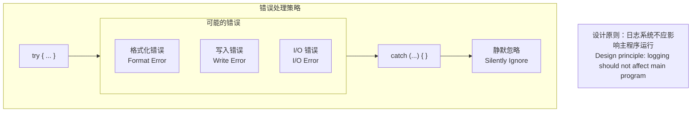

# 同步模式流程图文档 / Sync Mode Flow Diagrams

本文档详细描述 oneplog 日志库同步模式（Sync Mode）的控制流程和数据流程。

This document describes the control flow and data flow of oneplog's synchronous logging mode in detail.

## 概述 / Overview

同步模式是 oneplog 最简单的运行模式。在此模式下，日志消息在调用线程中直接格式化并写入 Sink，无需后台线程或队列缓冲。

Sync mode is the simplest operating mode of oneplog. In this mode, log messages are formatted and written to Sinks directly in the calling thread, without background threads or queue buffering.

**特点 / Features:**
- 零延迟：日志立即写入 / Zero latency: logs are written immediately
- 简单可靠：无并发复杂性 / Simple and reliable: no concurrency complexity
- 适用于低吞吐量场景 / Suitable for low-throughput scenarios

## 编译期元数据需求机制 / Compile-time Metadata Requirements

oneplog 使用 `if constexpr` 在编译期决定是否需要获取各种元数据。如果 Format 不需要某个元数据，相应的获取代码**不会被编译到最终二进制文件中**。

oneplog uses `if constexpr` to determine at compile-time whether to acquire various metadata. If a Format doesn't need certain metadata, the corresponding acquisition code **will not be compiled into the final binary**.

### 元数据需求配置 / Metadata Requirements Configuration

```mermaid
flowchart TB
    subgraph CompileTime["编译期配置 / Compile-time Configuration"]
        Format["Format 类型定义 Requirements"]
        
        subgraph Requirements["StaticFormatRequirements"]
            R1["kNeedsTimestamp: bool"]
            R2["kNeedsLevel: bool"]
            R3["kNeedsThreadId: bool"]
            R4["kNeedsProcessId: bool"]
            R5["kNeedsSourceLocation: bool"]
        end
        
        SinkBinding["SinkBinding<Sink, Format>"]
        SinkBindingList["SinkBindingList<Bindings...>"]
        
        subgraph Union["需求并集 (编译期计算)"]
            U1["kNeedsTimestamp = (B1::kNeedsTimestamp || B2::kNeedsTimestamp || ...)"]
            U2["kNeedsLevel = (B1::kNeedsLevel || B2::kNeedsLevel || ...)"]
            U3["kNeedsThreadId = (B1::kNeedsThreadId || B2::kNeedsThreadId || ...)"]
            U4["kNeedsProcessId = (B1::kNeedsProcessId || B2::kNeedsProcessId || ...)"]
            U5["kNeedsSourceLocation = (B1::kNeedsSourceLocation || B2::kNeedsSourceLocation || ...)"]
        end
    end
    
    Format --> Requirements
    Requirements --> SinkBinding
    SinkBinding --> SinkBindingList
    SinkBindingList --> Union
    
    style CompileTime fill:#e8f5e9
```



### 编译期代码生成 / Compile-time Code Generation

```cpp
// 编译期决定：如果 kNeedsTimestamp 为 false，整个 if 块不会生成代码
// Compile-time decision: if kNeedsTimestamp is false, the entire if block generates no code
if constexpr (kNeedsTimestamp) {
    timestamp = internal::GetNanosecondTimestamp();  // 仅当需要时才编译
}
if constexpr (kNeedsThreadId) {
    threadId = internal::GetCurrentThreadId();       // 仅当需要时才编译
}
if constexpr (kNeedsProcessId) {
    processId = internal::GetCurrentProcessId();     // 仅当需要时才编译
}
// kNeedsSourceLocation 用于 __FILE__, __LINE__, __func__ 等
```

## 控制流程图 / Control Flow Diagram

### 日志调用完整调用链 / Complete Call Chain from Log Call to Sink Output



### 关键类交互方式 / Key Class Interactions



## 数据流程图 / Data Flow Diagram

### 日志数据从格式化到输出的流转 / Log Data Flow from Formatting to Output



### 多 Sink 并行输出流程 / Multi-Sink Parallel Output Flow



## LoggerImpl、SinkBindings、Format 交互详解 / Detailed Interaction

### 编译期配置传递 / Compile-time Configuration Propagation



### WriteSync 方法执行流程 / WriteSync Method Execution Flow



## 错误处理 / Error Handling

同步模式下的错误处理策略：



## 性能特点 / Performance Characteristics

| 特性 / Feature | 同步模式 / Sync Mode |
|----------------|---------------------|
| 延迟 / Latency | 取决于 Sink I/O / Depends on Sink I/O |
| 吞吐量 / Throughput | 受 I/O 限制 / I/O bound |
| 内存使用 / Memory | 最小（无队列）/ Minimal (no queue) |
| 线程安全 / Thread Safety | 由 Sink 保证 / Guaranteed by Sink |
| 日志丢失 / Log Loss | 无 / None |
| 适用场景 / Use Case | 调试、低频日志 / Debug, low-frequency logging |

## 相关需求 / Related Requirements

- 需求 1.1: 创建同步模式的控制流程图
- 需求 1.2: 创建同步模式的数据流程图
- 需求 1.3: 标注关键类和方法的调用关系
- 需求 1.4: 说明 LoggerImpl、SinkBindings、Format 之间的交互方式
- 需求 1.5: 使用 Mermaid 格式创建可渲染的流程图
